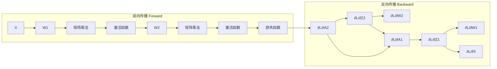
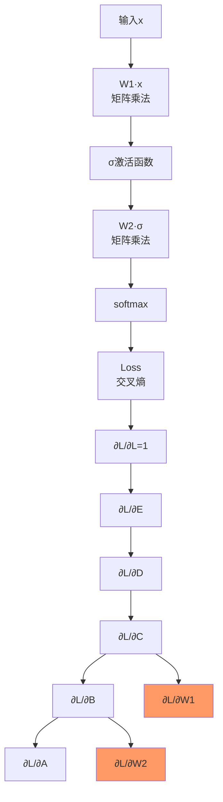

# 链式法则 (Chain Rule)

## 计算图示意





## 一维链式法则

### 基本形式
若 $y = f(g(x))$，则：
$$\frac{dy}{dx} = \frac{dy}{dg} \cdot \frac{dg}{dx} = f'(g(x)) \cdot g'(x)$$

### 扩展形式
若 $y = f(u_1, u_2, ..., u_n)$，且 $u_i = g_i(x)$：
$$\frac{dy}{dx} = \sum_{i=1}^n \frac{\partial y}{\partial u_i} \cdot \frac{du_i}{dx}$$

---

## 多元链式法则

### 情况1：链式传播
若 $\mathbf{y} = g(\mathbf{x})$，$z = f(\mathbf{y})$：
$$\frac{\partial z}{\partial x_j} = \sum_{i=1}^m \frac{\partial z}{\partial y_i} \cdot \frac{\partial y_i}{\partial x_j}$$

或向量形式：
$$\nabla_{\mathbf{x}} z = \mathbf{J}_{\mathbf{y}}^{\mathbf{z}} \cdot \nabla_{\mathbf{y}} z$$

其中 $\mathbf{J}_{\mathbf{y}}^{\mathbf{z}} = \frac{\partial \mathbf{y}}{\partial \mathbf{x}}$ 是雅可比矩阵。

### 情况2：多层嵌套
若 $z = f(g(h(\mathbf{x})))$：
$$\frac{\partial z}{\partial x_k} = \sum_j \frac{\partial z}{\partial y_j} \cdot \frac{\partial y_j}{\partial u_i} \cdot \frac{\partial u_i}{\partial x_k}$$

---

## 计算图 (Computational Graph)

链式法则在计算图中表现为**反向传播**。

### 前向传播
信号从输入流向前向输出：
$$\mathbf{x} \xrightarrow{f_1} \mathbf{u}^{(1)} \xrightarrow{f_2} \mathbf{u}^{(2)} \cdots \xrightarrow{f_L} \mathbf{y}$$

### 反向传播
梯度从输出反向流回输入：
$$\frac{\partial \mathcal{L}}{\partial \mathbf{u}^{(L-1)}} = \frac{\partial \mathbf{u}^{(L)}}{\partial \mathbf{u}^{(L-1)}} \cdot \frac{\partial \mathcal{L}}{\partial \mathbf{u}^{(L)}}$$

---

## 逐元素函数的链式法则

对于逐元素操作 $y = \sigma(x)$（$\sigma$是标量函数）：
$$\frac{\partial \mathcal{L}}{\partial x_i} = \frac{\partial \mathcal{L}}{\partial y_i} \cdot \sigma'(x_i)$$

### 例子：Sigmoid
$$\sigma(x) = \frac{1}{1 + e^{-x}}, \quad \sigma'(x) = \sigma(x)(1 - \sigma(x))$$

```python
# 前向
y = torch.sigmoid(x)

# 反向
dL/dx = dL/dy * y * (1 - y)
```

### 例子：ReLU
$$\text{ReLU}(x) = \max(0, x), \quad \text{ReLU}'(x) = \begin{cases} 1 & x > 0 \\ 0 & x \leq 0 \end{cases}$$

```python
# 前向
y = F.relu(x)

# 反向（简化表示）
dL/dx = dL/dy * (x > 0).float()
```

### 例子：Tanh
$$\tanh(x) = \frac{e^x - e^{-x}}{e^x + e^{-x}}, \quad \tanh'(x) = 1 - \tanh^2(x)$$

---

## Softmax的导数

### 问题
$$\frac{\partial}{\partial z_j} \text{softmax}(\mathbf{z})_i = ?$$

### 结果
$$\frac{\partial \text{softmax}(\mathbf{z})_i}{\partial z_j} = \text{softmax}(\mathbf{z})_i (\delta_{ij} - \text{softmax}(\mathbf{z})_j)$$

其中 $\delta_{ij}$ 是Kronecker delta（$i=j$时为1，否则为0）。

### 代码实现
```python
def softmax_ Jacobian(p):
    """
    p: softmax输出，shape (n,)
    返回: Jacobian矩阵，shape (n, n)
    """
    n = p.shape[0]
    # diag(p) - outer(p, p)
    return torch.diag(p) - p.unsqueeze(1) * p.unsqueeze(0)
```

---

## 矩阵乘法的导数

### 情形：$\mathbf{Y} = \mathbf{X}\mathbf{W}$

假设 $\mathbf{X} \in \mathbb{R}^{b \times m}$，$\mathbf{W} \in \mathbb{R}^{m \times n}$，$\mathbf{Y} \in \mathbb{R}^{b \times n}$。

损失 $\mathcal{L}$ 对 $\mathbf{W}$ 的梯度：
$$\frac{\partial \mathcal{L}}{\partial \mathbf{W}} = \mathbf{X}^T \cdot \frac{\partial \mathcal{L}}{\partial \mathbf{Y}}$$

损失 $\mathcal{L}$ 对 $\mathbf{X}$ 的梯度：
$$\frac{\partial \mathcal{L}}{\partial \mathbf{X}} = \frac{\partial \mathcal{L}}{\partial \mathbf{Y}} \cdot \mathbf{W}^T$$

### 维度验证
```
X: (b, m)     dL/dY: (b, n)     W: (m, n)
              ↓
dL/dW = X.T @ dL/dY  -> (m, n)
dL/dX = dL/dY @ W.T  -> (b, m)
```

---

## 批归一化的梯度

### 前向传播
$$\mu = \frac{1}{m}\sum_i x_i, \quad \sigma^2 = \frac{1}{m}\sum_i (x_i - \mu)^2$$
$$\hat{x}_i = \frac{x_i - \mu}{\sqrt{\sigma^2 + \epsilon}}$$
$$y_i = \gamma \hat{x}_i + \beta$$

### 反向传播
输入梯度 $\frac{\partial \mathcal{L}}{\partial y_i}$ 需要反向传播到：
- $\frac{\partial \mathcal{L}}{\partial \gamma} = \sum_i \frac{\partial \mathcal{L}}{\partial y_i} \hat{x}_i$
- $\frac{\partial \mathcal{L}}{\partial \beta} = \sum_i \frac{\partial \mathcal{L}}{\partial y_i}$
- $\frac{\partial \mathcal{L}}{\partial x_i}$（较复杂，涉及均值和方差的梯度）

---

## 交叉熵 + Softmax的梯度

这是一个**重要组合**，常用于分类网络。

### 前向传播
$$\mathbf{a} = \mathbf{x}\mathbf{W} + \mathbf{b}, \quad \mathbf{p} = \text{softmax}(\mathbf{a})$$
$$\mathcal{L} = -\sum_i y_i \log p_i$$

### 梯度结果
$$\frac{\partial \mathcal{L}}{\partial \mathbf{a}} = \mathbf{p} - \mathbf{y}$$

其中 $\mathbf{y}$ 是 one-hot 编码的真实标签。

### 意义
**交叉熵+Softmax的梯度就是"预测概率减去真实标签"**，非常简洁！

### PyTorch验证
```python
import torch
import torch.nn.functional as F

x = torch.randn(4, 10)  # logits
y = torch.randint(0, 10, (4,))  # target class indices

loss = F.cross_entropy(x, y, reduction='none')
loss.backward()

# 验证：梯度 = softmax - one_hot
with torch.no_grad():
    p = F.softmax(x, dim=-1)
    one_hot = F.one_hot(y, num_classes=10).float()
    grad_check = p - one_hot

print(torch.allclose(x.grad, grad_check))  # True
```
