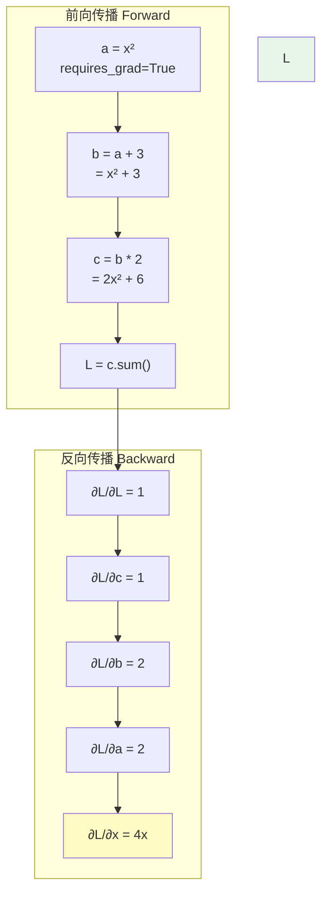

# 自动微分 (Automatic Differentiation)

## PyTorch 计算图示例



## 背景

### 数值微分
$$f'(x) \approx \frac{f(x + \epsilon) - f(x - \epsilon)}{2\epsilon}$$

- **问题**：精度与效率矛盾（$\epsilon$太小舍入误差，$\epsilon$太大截断误差）
- **复杂度**：$O(n)$ 函数评估，对多维输入不可行

### 符号微分
基于符号规则的精确求导
- **问题**：表达式膨胀（expression swell）
- 不适合数值计算

### 自动微分
结合数值和符号，但避免其缺点：
- **前向模式**：适合少量输入
- **反向模式**：适合少量输出（神经网络正是这种情况！）

---

## 反向模式自动微分

### 核心思想
利用链式法则，从输出向输入反向传播梯度。

### 计算图
任何函数都可以分解为基本操作的组合，构成有向无环图（DAG）。

### 前向传播
按拓扑顺序计算每个中间变量：
```
x1 -> [+] -> x3 -> [*] -> x5 -> loss
x2 -> [/] -> x4 ->      ↑
```

### 反向传播
从输出开始，反向应用链式法则：
$$\frac{\partial \mathcal{L}}{\partial x_i} = \sum_{j} \frac{\partial \mathcal{L}}{\partial x_j} \cdot \frac{\partial x_j}{\partial x_i}$$

---

## PyTorch的自动微分

### `requires_grad`

```python
import torch

x = torch.tensor([1.0, 2.0], requires_grad=True)
y = x ** 2
z = y.sum()  # z = x1^2 + x2^2
```

### 反向传播

```python
z.backward()  # 计算梯度
print(x.grad)  # dz/dx = [2, 4]
```

### 等价手动求导
$$z = x_1^2 + x_2^2, \quad \frac{\partial z}{\partial x_i} = 2x_i$$

---

## 计算图构建

### PyTorch动态图
每次前向传播都会构建新的计算图。

```python
x = torch.tensor(1.0, requires_grad=True)
y = x * 2
z = y ** 2
w = z * 3

w.backward()
print(x.grad)  # dz/dw * dw/dz * dz/dx = 1 * 6 * 2 = 12
```

**验证**：
$$w = 3z^2 = 3(2x)^2 = 12x^2, \quad \frac{dw}{dx} = 24x = 24$$

### 静态图（TensorFlow/FuncTorch）
先定义图结构，再执行。

---

## 雅可比向量积 (Jacobian-Vector Product)

### 问题
有时我们不想/不能构建完整的雅可比矩阵（太大）。

### JVP
$$\mathbf{J}_{f}(\mathbf{x}) \cdot \mathbf{v} = \frac{\partial f}{\partial \mathbf{x}} \mathbf{v}$$

```python
# ▶ JVP: 雅可比向量积
x = torch.randn(5, requires_grad=True)

# 定义函数 f(x) = [x^2, x^3, ...]
f = torch.stack([x**i for i in range(1, 6)])
v = torch.randn(5)

jvp = torch.autograd.grad(f, x, v, retain_graph=True)[0]
print(f"JVP shape: {jvp.shape}")  # (5,)
```

### VJP (反向模式)
$$\mathbf{v}^T \cdot \mathbf{J}_f(\mathbf{x}) = \frac{\partial \mathcal{L}}{\partial \mathbf{x}} \cdot \mathbf{v}^T$$

这正是 `torch.autograd.grad()` 在反向传播中计算的。

---

## 高阶导数

### 二阶导数
```python
# ▶ 高阶导数示例
import torch

x = torch.tensor([1.0, 2.0], requires_grad=True)
y = x ** 3
z = y.sum()

# 一阶导
z.backward(create_graph=True)
print(f"一阶导: {x.grad}")  # tensor([3., 12.])

# 二阶导: 清除后重新计算
x.grad.zero_()
z.backward(create_graph=True)
grad1 = x.grad.clone()
grad1.sum().backward()
print(f"二阶导: {x.grad}")  # tensor([6., 12.])
```

### Hessian向量积
```python
def hessian_vector_product(f, params, v):
    """计算 H(f) @ v，不显式构建H"""
    grad = torch.autograd.grad(f, params, create_graph=True)[0]
    return torch.autograd.grad(grad, params, v)[0]
```

---

## 反向传播的工程实现

### 叶子节点 vs 非叶子节点
```python
# ▶ 叶子节点 vs 非叶子节点
import torch

a = torch.tensor(1.0, requires_grad=True)  # 叶子
b = a * 2                                    # 非叶子
c = b.sum()
c.backward()

print(f"a.grad: {a.grad}")  # tensor(2.)
print(f"b.grad: {b.grad}")  # None

# retain_grad() 可保存中间节点梯度
b.retain_grad()
c2 = (a * 3).sum()
c2.backward()
print(f"b.grad (retained): {b.grad}")  # tensor(1.)
```

### `retain_grad()`
```python
b.retain_grad()
c.backward()
print(b.grad)  # 1
```

---

## 功能隔离：`torch.no_grad()`

### 推理时
```python
# ▶ no_grad vs requires_grad
import torch

x = torch.randn(5, requires_grad=True)
y = x ** 2
z = y.sum()

# 需要梯度
z.backward()
print(f"x.grad: {x.grad}")  # 有值

# 推理模式
x2 = torch.randn(5, requires_grad=False)
print(f"x2.requires_grad: {x2.requires_grad}")  # False

# no_grad 上下文
with torch.no_grad():
    x3 = x2 + 1
    print(f"x3.requires_grad: {x3.requires_grad}")  # False
```

---

## 自定义autograd函数

### `torch.autograd.Function`

```python
# ▶ 自定义 ReLU (autograd.Function)
class MyReLU(torch.autograd.Function):
    @staticmethod
    def forward(ctx, input):
        ctx.save_for_backward(input)
        return input.clamp(min=0)
    
    @staticmethod
    def backward(ctx, grad_output):
        input, = ctx.saved_tensors
        return grad_output * (input > 0).float()

# 测试
x = torch.tensor([1.0, -2.0, 0.5], requires_grad=True)
y = MyReLU.apply(x)
y.sum().backward()
print(f"x: {x}")
print(f"y: {y}")
print(f"x.grad: {x.grad}")  # [1, 0, 1]
```

### 用途
- 实现自定义激活函数
- 量化/剪枝的反向传播
- 特殊算子的梯度定义

---

## 常见陷阱

### 1. 原地操作 (In-place Operation)
```python
# 错误！
x.data.add_(1)  # 可能破坏计算图

# 正确
x = x + 1  # 或 x.copy_(x + 1)
```

### 2. 梯度累积
```python
# 每个batch后要清零
optimizer.zero_grad()
loss.backward()
optimizer.step()
```

### 3. 悬挂节点
```python
# 叶子节点被意外替换
x = torch.tensor(1.0, requires_grad=True)
x = x + 1  # x现在是新节点，原来的x.grad无法访问
```

### 4. NaN/Inf
```python
# 检查
print(torch.isnan(x.grad).any())
print(torch.isinf(x.grad).any())

# 可能原因
# - 学习率过大
# - 除零
# - 梯度爆炸
```
