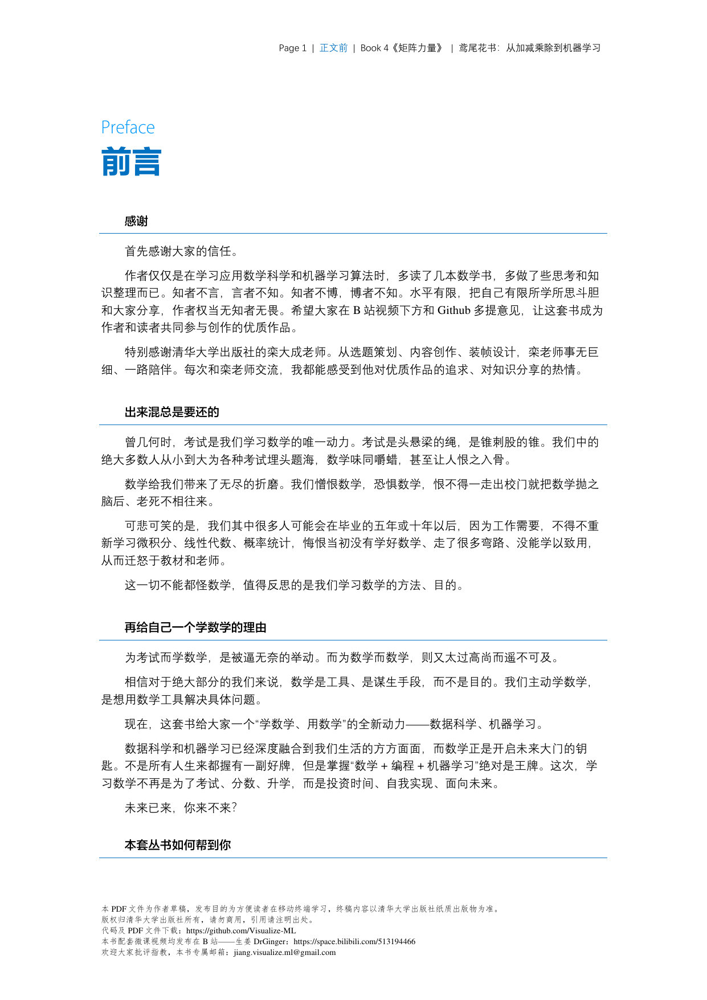
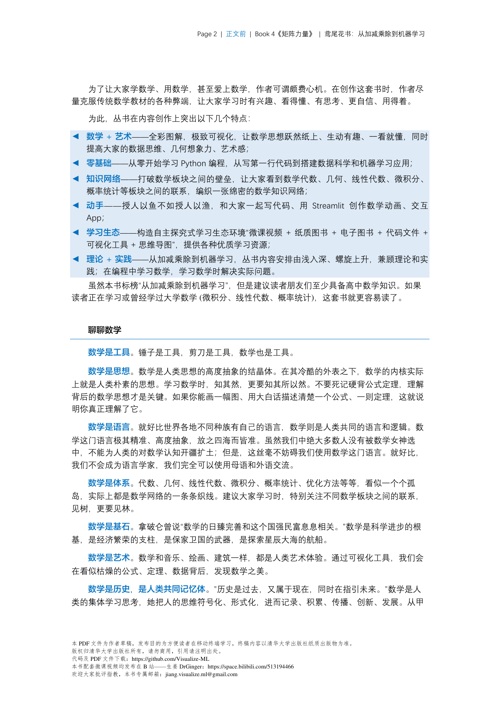
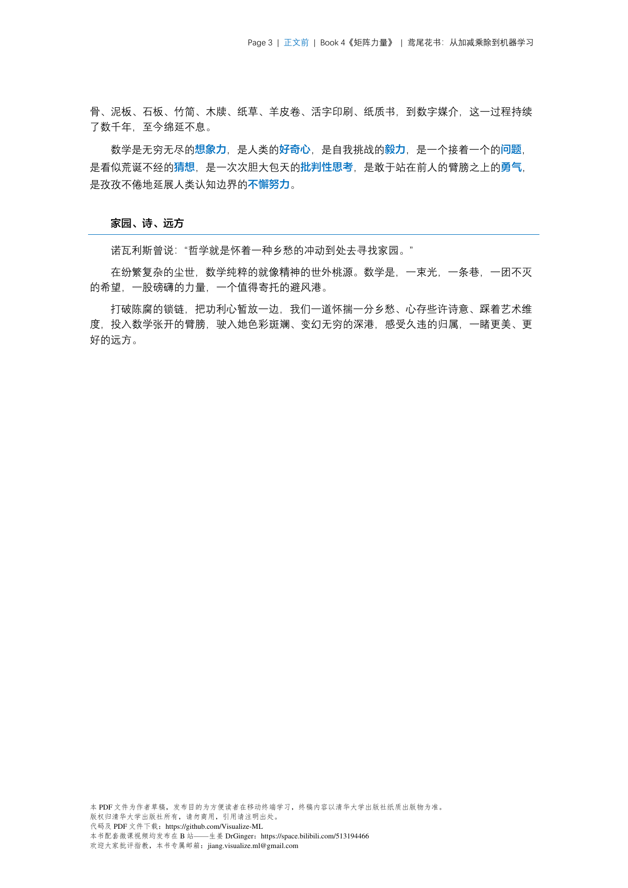
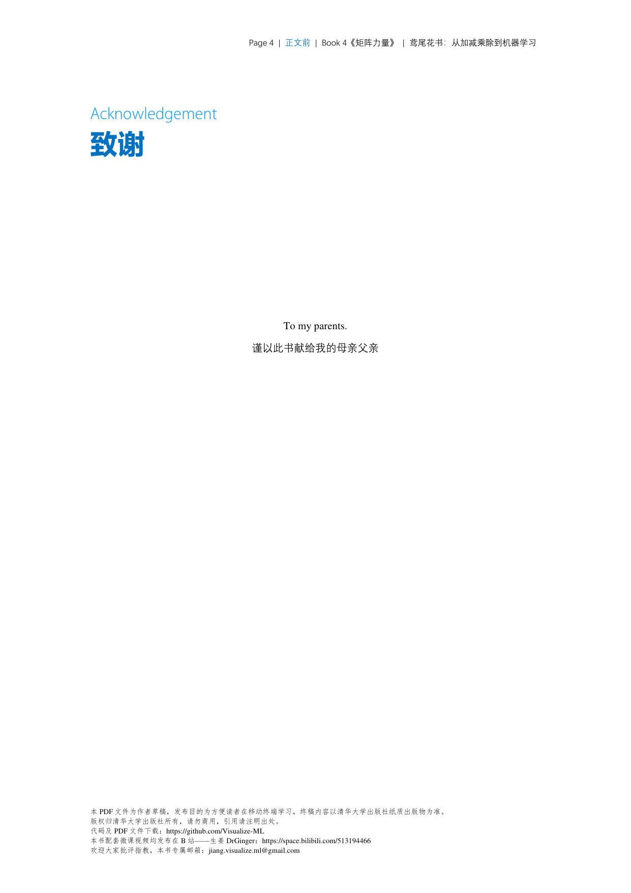
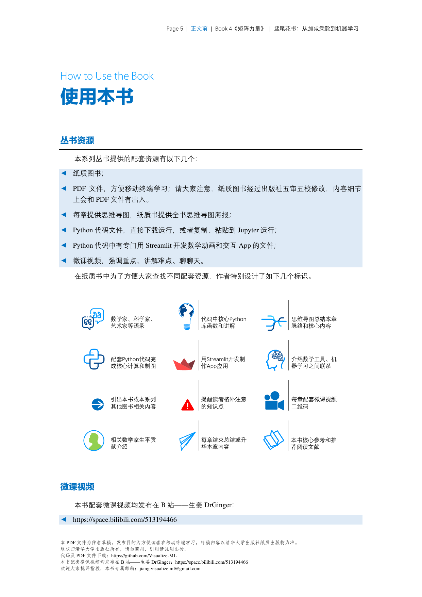

# 线性代数 - 深度学习索引

本文件夹收录深度学习与大模型中常用的线性代数知识点。

## 核心概念

| 章节 | 主题 |
|------|------|
| [[1_向量与矩阵]] | 向量、矩阵、张量基础运算 |
| [[2_矩阵运算]] | 乘法、转置、逆、迹 |
| [[3_线性方程组]] | 求解与最小二乘 |
| [[4_特征值与特征向量]] | 谱分解、幂迭代 |
| [[5_矩阵分解]] | SVD、LU、Cholesky |
| [[6_范数与距离]] | L1/L2/Frobenius范数 |
| [[7_特殊矩阵]] | 对称、正定、正交 |
| [[8_应用：Attention机制]] | Transformer核心数学 |

## 应用场景

- **Attention Score**: $S = QK^T$，矩阵乘法
- **Embedding**: 向量空间表示
- **RNN/LSTM**: 循环矩阵、张量运算
- **卷积神经网络**: 多维张量运算
- **PCA/SVD**: 降维与表示学习

---

> 本知识库由 AI 助手整理，服务于深度学习数学基础学习。

## 📊 图解（来源：《矩阵力量》Book4）

### Ch00

