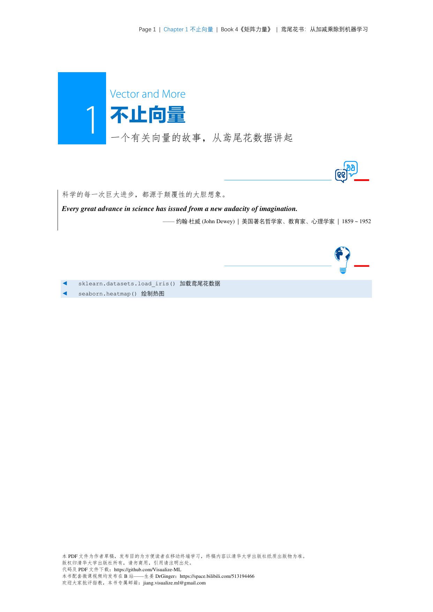
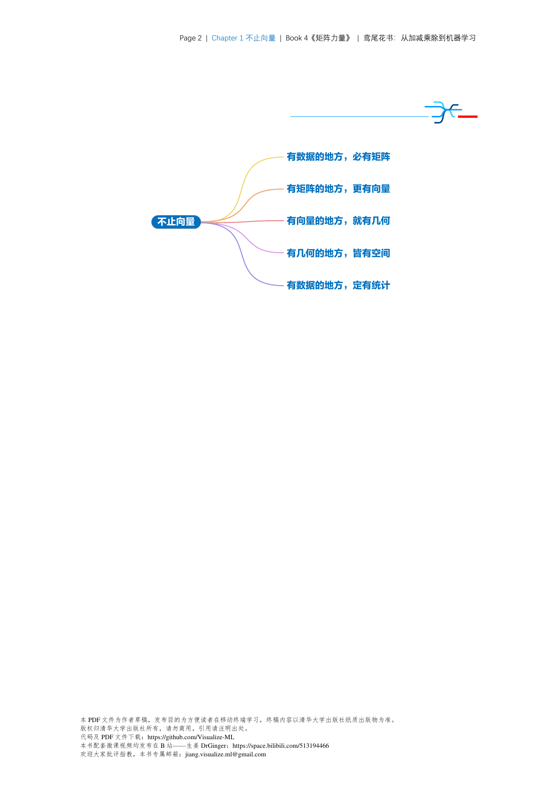
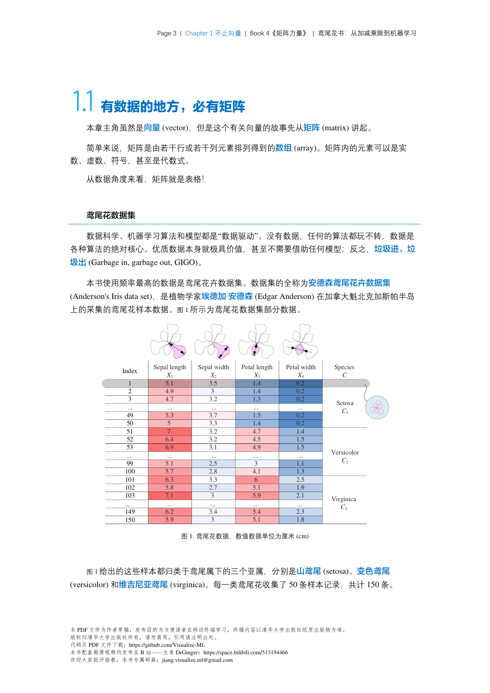
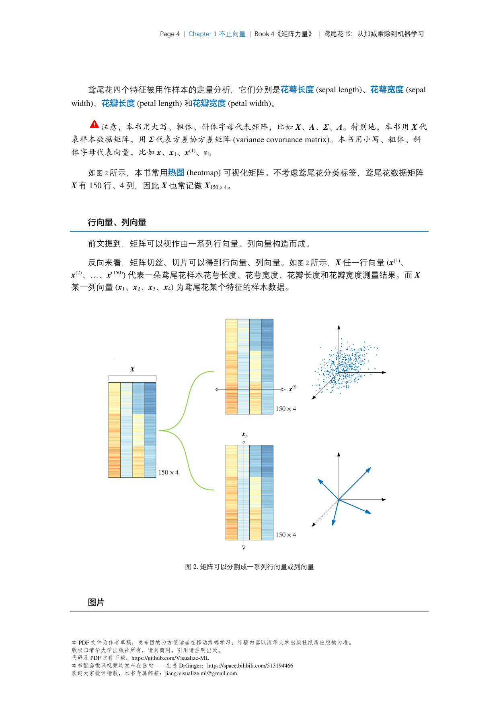
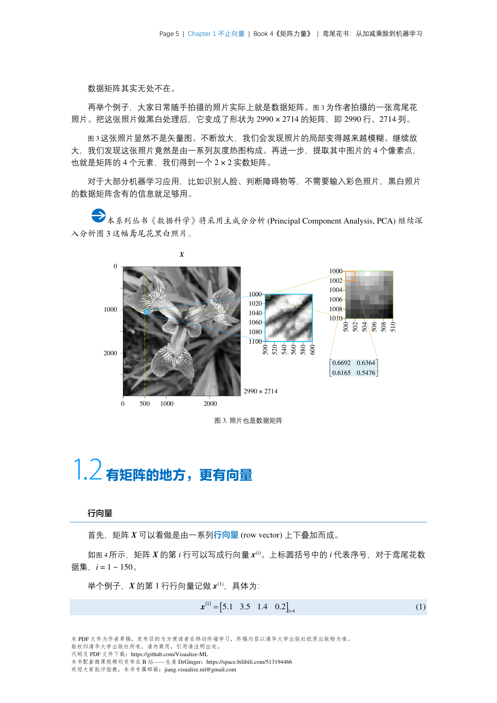

# 向量与矩阵

## 向量 (Vector)

向量是有大小和方向的量，在深度学习中常用于表示特征、Embedding等。

### 基本定义
- **列向量**: $\mathbf{x} = [x_1, x_2, ..., x_n]^T \in \mathbb{R}^n$
- **行向量**: $\mathbf{x}^T = [x_1, x_2, ..., x_n]$
- **维度**: 向量中元素的个数

### 向量运算
| 运算 | 公式 | 说明 |
|------|------|------|
| 加减 | $\mathbf{a} \pm \mathbf{b}$ | 对应元素相加减 |
| 数乘 | $c\mathbf{a}$ | 每个元素乘以标量$c$ |
| 点积 | $\mathbf{a} \cdot \mathbf{b} = \mathbf{a}^T\mathbf{b} = \sum_i a_i b_i$ | 两向量相乘得到标量 |
| Hadamard积 | $\mathbf{a} \odot \mathbf{b}$ | 对应元素相乘 |

### 点积的几何意义
$$\mathbf{a} \cdot \mathbf{b} = \|\mathbf{a}\|\|\mathbf{b}\|\cos\theta$$

- $\theta = 0°$: 平行，$\mathbf{a} \cdot \mathbf{b} = \|\mathbf{a}\|\|\mathbf{b}\|$
- $\theta = 90°$: 垂直，$\mathbf{a} \cdot \mathbf{b} = 0$
- $\theta = 180°$: 反向，$\mathbf{a} \cdot \mathbf{b} = -\|\mathbf{a}\|\|\mathbf{b}\|$

---

## 矩阵 (Matrix)

矩阵是二维数组，在深度学习中用于表示权重、变换等。

### 基本定义
- **维度**: $\mathbf{A} \in \mathbb{R}^{m \times n}$，$m$行$n$列
- **元素**: $A_{ij}$ 表示第$i$行第$j$列
- **行向量**: $\mathbf{A}_{i,:}$ 或 $\mathbf{A}_{i*}$
- **列向量**: $\mathbf{A}_{:,j}$ 或 $\mathbf{A}_{*j}$

### 特殊矩阵
| 类型 | 符号 | 定义 |
|------|------|------|
| 方阵 | $\mathbf{A} \in \mathbb{R}^{n \times n}$ | 行数=列数 |
| 对角矩阵 | $\text{diag}(d_1, ..., d_n)$ | 非对角元素为0 |
| 单位矩阵 | $\mathbf{I}_n$ | 对角线为1 |
| 零矩阵 | $\mathbf{0}$ | 所有元素为0 |
| 转置 | $\mathbf{A}^T$ | 行变列 |
| 对称矩阵 | $\mathbf{A} = \mathbf{A}^T$ | 关于主对角线对称 |

### 矩阵加法
$$\mathbf{C} = \mathbf{A} + \mathbf{B}, \quad C_{ij} = A_{ij} + B_{ij}$$

### 标量乘法
$$c\mathbf{A}, \quad (c\mathbf{A})_{ij} = c \cdot A_{ij}$$

---

## 张量 (Tensor)

张量是$n$维数组的泛化，深度学习中的核心数据结构。

### 维度说明
| 张量维度 | 日常说法 | 例子 |
|----------|----------|------|
| 0维 | 标量 | $5$ |
| 1维 | 向量 | $[1, 2, 3]$ |
| 2维 | 矩阵 | $m \times n$ 表格 |
| 3维 | 3D张量 | 彩色图像 $(H, W, C)$ |
| 4维 | 4D张量 | Batch $(N, H, W, C)$ |
| 5维 | 5D张量 | Video Batch $(B, T, H, W, C)$ |

### 张量运算
- **逐元素运算**: $\mathbf{Y} = f(\mathbf{X})$
- **矩阵乘法**: $\mathbf{C}_{ij} = \sum_k \mathbf{A}_{ik}\mathbf{B}_{kj}$
- **批量矩阵乘法**: $\mathbf{C}_{bij} = \sum_k \mathbf{A}_{bik}\mathbf{B}_{bkj}$（用于Attention计算）

### PyTorch/Python 表示
```python
# ▶ 张量创建示例
import torch

# 向量
x = torch.tensor([1.0, 2.0, 3.0])  # shape: (3,)
print(x.shape)  # 输出: torch.Size([3])

# 矩阵
A = torch.randn(512, 768)  # 典型Transformer隐藏层
print(A.shape)  # 输出: torch.Size([512, 768])

# 3D张量 - Batch矩阵
batch_A = torch.randn(32, 512, 768)  # 32个样本
print(batch_A.shape)  # 输出: torch.Size([32, 512, 768])

# 4D张量 - Image Batch
images = torch.randn(16, 3, 224, 224)  # 16张RGB图像
print(images.shape)  # 输出: torch.Size([16, 3, 224, 224])
```

## 📊 图解（来源：《矩阵力量》Book4）

### Ch01










