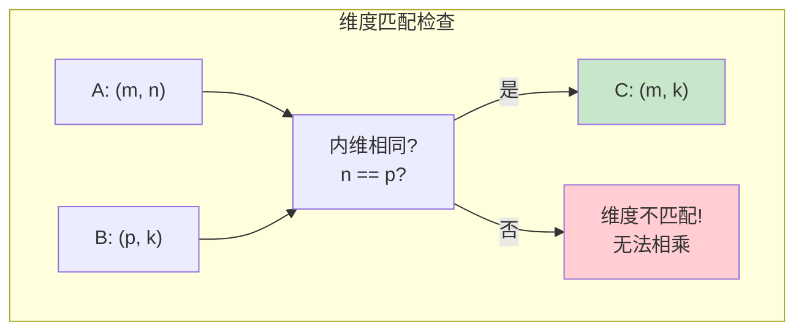
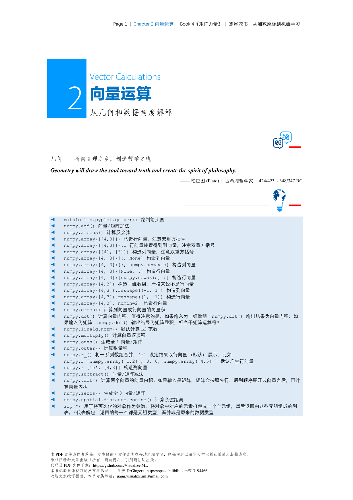
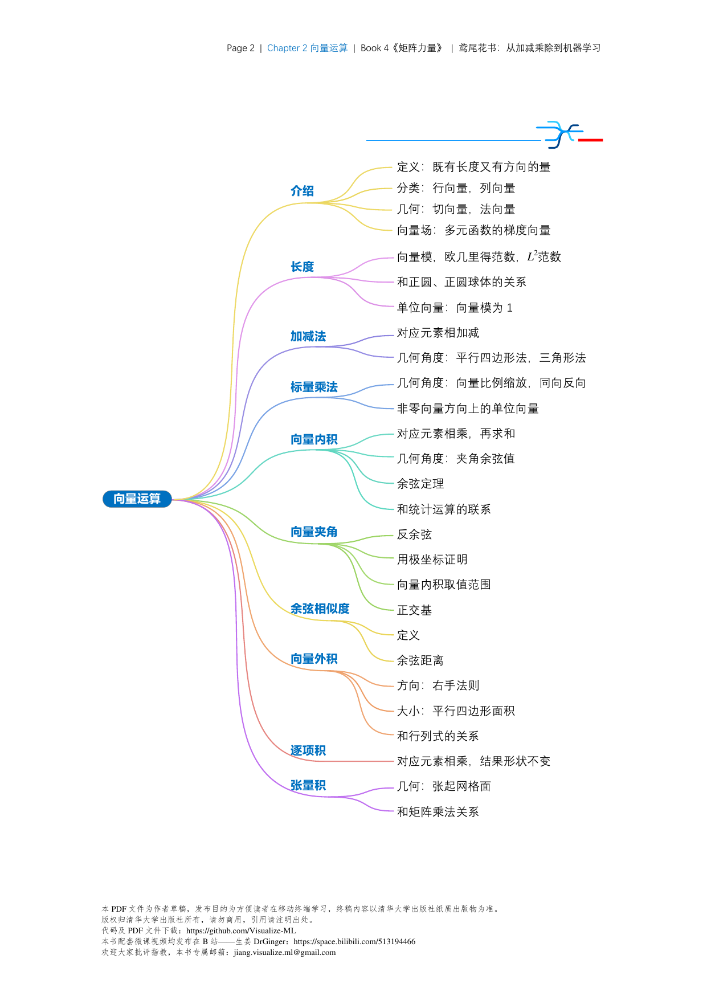
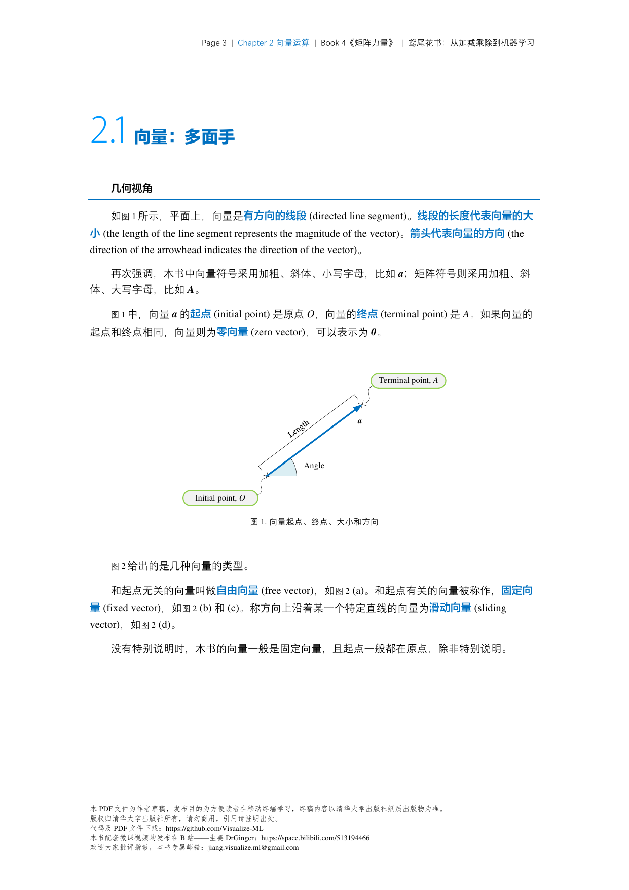
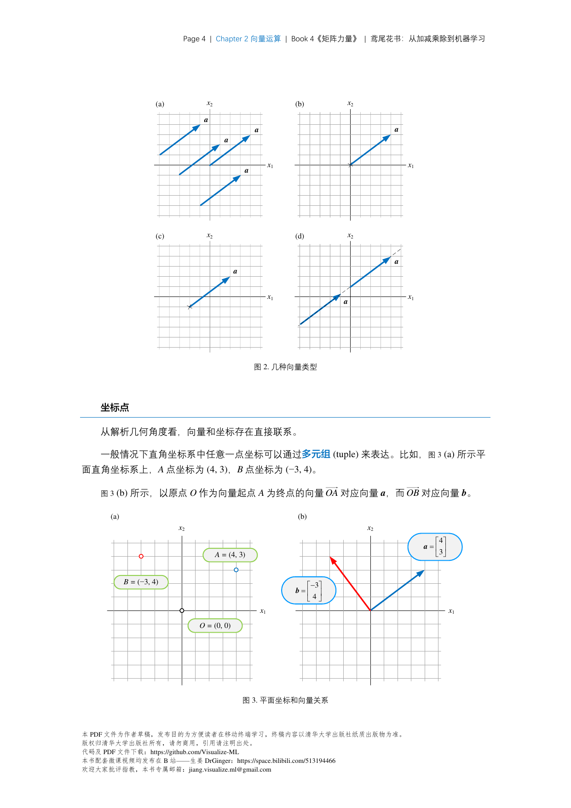
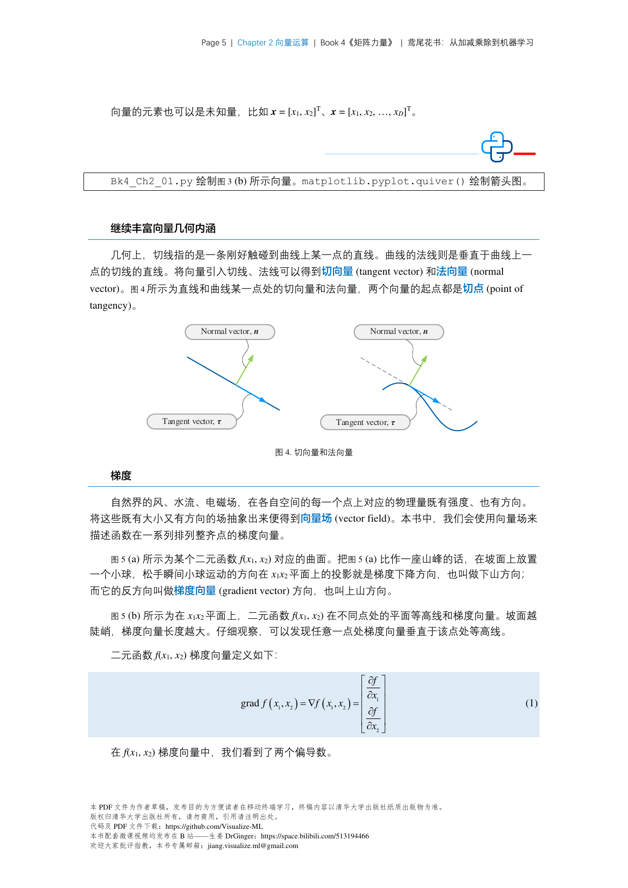

# 矩阵运算

## 矩阵乘法可视化

```mermaid
flowchart LR
    subgraph "A ∈ R^{m×n}"
        A11[A₁₁] --> A1R["第i行"]
        A12[A₁₂] --> A1R
        A21[A₂₁] --> A2R["第j行"]
        A22[A₂₂] --> A2R
    end
    
    subgraph "B ∈ R^{n×p}"
        B11[B₁₁] --> B1C["第j列"]
        B21[B₂₁] --> B1C
        B12[B₁₂] --> B2C["第k列"]
        B22[B₂₂] --> B2C
    end
    
    A1R --> DOT1[C_{ij} = Σ
    第i行·第j列]
    A2R --> DOT2[C_{ik} = Σ
    第j行·第k列]
    B1C --> DOT1
    B2C --> DOT2
```



## 矩阵乘法 (Matrix Multiplication)

### 基本乘法
$$\mathbf{C} = \mathbf{A}\mathbf{B}$$

- $\mathbf{A} \in \mathbb{R}^{m \times n}$，$\mathbf{B} \in \mathbb{R}^{n \times p}$
- $\mathbf{C} \in \mathbb{R}^{m \times p}$
- $C_{ij} = \sum_{k=1}^{n} A_{ik} B_{kj}$

### 运算性质
| 性质 | 公式 |
|------|------|
| 结合律 | $(\mathbf{A}\mathbf{B})\mathbf{C} = \mathbf{A}(\mathbf{B}\mathbf{C})$ |
| 分配律 | $\mathbf{A}(\mathbf{B} + \mathbf{C}) = \mathbf{A}\mathbf{B} + \mathbf{A}\mathbf{C}$ |
| 转置 | $(\mathbf{A}\mathbf{B})^T = \mathbf{B}^T \mathbf{A}^T$ |
| 单位矩阵 | $\mathbf{A}\mathbf{I} = \mathbf{I}\mathbf{A} = \mathbf{A}$ |

### ⚠️ 注意
- **不满足交换律**: $\mathbf{A}\mathbf{B} \neq \mathbf{B}\mathbf{A}$（一般情况）
- **维度匹配**: 内维必须相同

### 代码实现
```python
# ▶ 矩阵乘法 vs 逐元素乘法
import torch
import numpy as np

A = torch.randn(3, 4)
B = torch.randn(4, 5)

# 矩阵乘法 (matmul)
C = A @ B              # 推荐写法
print(C.shape)  # 输出: torch.Size([3, 5])

# 逐元素乘法 (Hadamard) - 需要同shape
A2 = torch.randn(3, 4)
B2 = torch.randn(3, 4)
C2 = A2 * B2
print(C2.shape)  # 输出: torch.Size([3, 4])
```

---

## 转置 (Transpose)

转置矩阵：将矩阵的行和列互换。

$$\mathbf{A} \in \mathbb{R}^{m \times n} \Rightarrow \mathbf{A}^T \in \mathbb{R}^{n \times m}$$

### 性质
$$(\mathbf{A}^T)^T = \mathbf{A}$$
$$(\mathbf{A} + \mathbf{B})^T = \mathbf{A}^T + \mathbf{B}^T$$
$$(\mathbf{A}\mathbf{B})^T = \mathbf{B}^T \mathbf{A}^T$$

---

## 逆矩阵 (Inverse)

### 定义
$\mathbf{A}^{-1}$ 满足：$\mathbf{A}\mathbf{A}^{-1} = \mathbf{A}^{-1}\mathbf{A} = \mathbf{I}$

### 存在条件
- $\mathbf{A}$ 必须是方阵
- $\mathbf{A}$ 必须是满秩 (rank = n)
- $\det(\mathbf{A}) \neq 0$

### 性质
$$(\mathbf{A}^{-1})^{-1} = \mathbf{A}$$
$$(\mathbf{A}\mathbf{B})^{-1} = \mathbf{B}^{-1}\mathbf{A}^{-1}$$
$$(\mathbf{A}^T)^{-1} = (\mathbf{A}^{-1})^T$$

### 计算（仅供了解，代码用现成库）
```python
# ▶ 矩阵求逆、行列式、秩
A = torch.randn(3, 3)
print(torch.linalg.inv(A).shape)       # 输出: torch.Size([3, 3])
print(torch.linalg.det(A))             # 输出: tensor(...)
print(torch.linalg.matrix_rank(A))     # 输出: tensor(3) 或更小
```

### 在深度学习中的应用
- **线性方程组求解**: $\mathbf{Ax} = \mathbf{b} \Rightarrow \mathbf{x} = \mathbf{A}^{-1}\mathbf{b}$
- **高斯-牛顿法**: 近似求逆
- **网络权重更新**: 某些优化算法涉及矩阵求逆

---

## 迹 (Trace)

迹是方阵对角线元素之和。

$$\text{tr}(\mathbf{A}) = \sum_{i=1}^{n} A_{ii}$$

### 性质
$$\text{tr}(\mathbf{A}) = \text{tr}(\mathbf{A}^T)$$
$$\text{tr}(\mathbf{A} + \mathbf{B}) = \text{tr}(\mathbf{A}) + \text{tr}(\mathbf{B})$$
$$\text{tr}(\mathbf{A}\mathbf{B}) = \text{tr}(\mathbf{B}\mathbf{A})$$
$$\text{tr}(\mathbf{A}\mathbf{B}\mathbf{C}) = \text{tr}(\mathbf{B}\mathbf{C}\mathbf{A}) = \text{tr}(\mathbf{C}\mathbf{A}\mathbf{B})$$

### 循环性质的应用
这个性质在深度学习中非常有用，例如：
- Frobenius范数：$\|\mathbf{A}\|_F^2 = \text{tr}(\mathbf{A}\mathbf{A}^T)$
- 矩阵求导：$\frac{\partial \text{tr}(\mathbf{A}\mathbf{X})}{\partial \mathbf{X}} = \mathbf{A}^T$

---

## 行列式 (Determinant)

### 定义（2x2）
$$\det(\mathbf{A}) = \begin{vmatrix} a & b \\ c & d \end{vmatrix} = ad - bc$$

### 几何意义
- $| \det(\mathbf{A}) |$ = 线性变换后单位超立方体的体积
- $\det(\mathbf{A}) > 0$: 保持定向
- $\det(\mathbf{A}) < 0$: 反转定向
- $\det(\mathbf{A}) = 0$: 奇异矩阵，不可逆

### 性质
$$\det(\mathbf{A}\mathbf{B}) = \det(\mathbf{A}) \cdot \det(\mathbf{B})$$
$$\det(\mathbf{A}^{-1}) = \frac{1}{\det(\mathbf{A})}$$
$$\det(\mathbf{A}^T) = \det(\mathbf{A})$$
$$\det(c\mathbf{A}) = c^n \det(\mathbf{A})$$

---

## Hadamard积（逐元素乘法）

$$\mathbf{C} = \mathbf{A} \odot \mathbf{B}, \quad C_{ij} = A_{ij} \cdot B_{ij}$$

### 应用
- **激活函数**: $\mathbf{y} = \sigma(\mathbf{x})$
- **门控机制**: LSTM中的遗忘门、输入门
- **掩码操作**: Attention中的mask

```python
# ▶ 逐元素乘法 (Hadamard积)
A = torch.tensor([[1, 2], [3, 4]])
B = torch.tensor([[2, 2], [2, 2]])
C = A * B
print(C)
# 输出:
# tensor([[ 2,  4],
#         [ 6,  8]])
```

## 📊 图解（来源：《矩阵力量》Book4）

### Ch02










