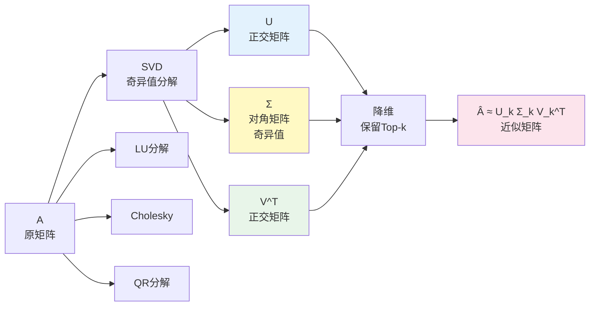

# 矩阵分解

矩阵分解将矩阵表示为多个矩阵的乘积，在深度学习中用于降维、加速计算、参数压缩等。

---

## 矩阵分解总览图



## 1. SVD（奇异值分解）

SVD是最重要的矩阵分解，适用于**任意** $m \times n$ 矩阵。

### 定义
$$\mathbf{A} = \mathbf{U}\mathbf{\Sigma}\mathbf{V}^T$$

其中：
- $\mathbf{U} \in \mathbb{R}^{m \times m}$：正交矩阵（左奇异向量）
- $\mathbf{\Sigma} \in \mathbb{R}^{m \times n}$：**对角矩阵**（奇异值）
- $\mathbf{V} \in \mathbb{R}^{n \times n}$：正交矩阵（右奇异向量）

### 奇异值性质
- $\sigma_1 \geq \sigma_2 \geq ... \geq 0$
- $\sigma_i = \sqrt{\lambda_i(\mathbf{A}^T\mathbf{A})}$
- 非零奇异值个数 = $\text{rank}(\mathbf{A})$

### 几何意义
任何矩阵 $\mathbf{A}$ 都可以看作：
1. 旋转/反射 $\mathbf{V}^T$
2. 缩放 $\mathbf{\Sigma}$
3. 旋转/反射 $\mathbf{U}$

---

## 2. SVD与特征值的关系

$$\mathbf{A}^T\mathbf{A} = \mathbf{V}\mathbf{\Sigma}^T\mathbf{U}^T\mathbf{U}\mathbf{\Sigma}\mathbf{V}^T = \mathbf{V}\mathbf{\Sigma}^T\mathbf{\Sigma}\mathbf{V}^T$$

$$\mathbf{A}\mathbf{A}^T = \mathbf{U}\mathbf{\Sigma}\mathbf{V}^T\mathbf{V}\mathbf{\Sigma}^T\mathbf{U}^T = \mathbf{U}\mathbf{\Sigma}\mathbf{\Sigma}^T\mathbf{U}^T$$

因此：
- $\mathbf{U}$ 的列是 $\mathbf{A}\mathbf{A}^T$ 的特征向量
- $\mathbf{V}$ 的列是 $\mathbf{A}^T\mathbf{A}$ 的特征向量
- $\sigma_i^2 = \lambda_i(\mathbf{A}^T\mathbf{A})$

---

## 3. 截断SVD（Truncated SVD）

保留前$k$个最大的奇异值：

$$\mathbf{A} \approx \mathbf{U}_k \mathbf{\Sigma}_k \mathbf{V}_k^T$$

### 近似误差
$$\|\mathbf{A} - \mathbf{U}_k \mathbf{\Sigma}_k \mathbf{V}_k^T\|_F^2 = \sum_{i=k+1}^{r} \sigma_i^2$$

其中 $r = \text{rank}(\mathbf{A})$

### 核心性质
**最优近似**：在Frobenius范数意义下，截断SVD是秩为$k$矩阵对原矩阵的最优近似。

---

## 4. SVD在深度学习中的应用

### 降维与表示学习
```python
import torch

def svd_pca(X, k):
    """使用SVD进行PCA降维"""
    # 中心化
    X_centered = X - X.mean(dim=0)
    # SVD
    U, S, V = torch.linalg.svd(X_centered)
    # 投影到前k个主成分
    return U[:, :k] * S[:k], V[:k, :]
```

### 模型压缩
- **权重分解**：将大权重矩阵分解为两个小矩阵
- 例子：$\mathbf{W} \approx \mathbf{U}\mathbf{\Sigma}\mathbf{V}^T$，保留前$k$个奇异值
- **MobileNet**: 使用深度可分离卷积 + SVD压缩

### 知识蒸馏
- 教师网络的logits用SVD分解，分析其结构

---

## 5. LU分解

将矩阵分解为下三角和上三角矩阵：

$$\mathbf{A} = \mathbf{L}\mathbf{U}$$

- $\mathbf{L}$：单位下三角矩阵（对角线为1）
- $\mathbf{U}$：上三角矩阵

### 存在条件
- $\mathbf{A}$ 的顺序主子式均不为0
- 若不满足，可通过置换矩阵 $\mathbf{P}$ 解决：$\mathbf{P}\mathbf{A} = \mathbf{L}\mathbf{U}$

### 用途
- 求解线性方程组 $\mathbf{Ax} = \mathbf{b}$
- 计算行列式
- 神经网络中的前向/后向传播优化

---

## 6. Cholesky分解

针对**正定矩阵**的特殊LU分解：

$$\mathbf{A} = \mathbf{L}\mathbf{L}^T$$

其中 $\mathbf{L}$ 是下三角矩阵。

### 条件
- $\mathbf{A}$ 必须是对称正定的

### 优势
- 计算效率更高（比LU分解快2倍）
- 数值更稳定

### 应用
- **高斯过程**：协方差矩阵求逆
- **卡尔曼滤波**：状态估计
- **优化算法**：Hessian矩阵近似

---

## 7. QR分解

$$\mathbf{A} = \mathbf{Q}\mathbf{R}$$

- $\mathbf{Q}$：正交矩阵（$\mathbf{Q}^T\mathbf{Q} = \mathbf{I}$）
- $\mathbf{R}$：上三角矩阵

### 用途
- **最小二乘法**：求解超定方程组
- **Gram-Schmidt正交化**
- **特征值算法**（Householder变换）

---

## 8. 张量分解（高级）

### CP分解（Canonical Polyadic）
$$\mathcal{X} \approx \sum_{r=1}^{R} \lambda_r \mathbf{a}_r \otimes \mathbf{b}_r \otimes \mathbf{c}_r$$

### Tucker分解
$$\mathcal{X} \approx \mathcal{G} \times_1 \mathbf{A} \times_2 \mathbf{B} \times_3 \mathbf{C}$$

### 应用
- **模型压缩**：Transformer的注意力矩阵压缩
- **参数高效微调**：LoRA的核心思想
- **知识蒸馏**：分解大型权重矩阵

---

## 代码实现

```python
import numpy as np
import torch

```python
# ▶ SVD、LU、Cholesky、QR 分解
import numpy as np
import torch
from scipy.linalg import lu

A = torch.randn(5, 5)
A = (A + A.T) / 2  # 作成对称矩阵

# SVD 分解
U, S, Vh = torch.linalg.svd(A)
print(f"奇异值 (前3个): {S[:3]}")

# 截断SVD (保留90%能量)
k = 3
U_k, S_k, V_k = U[:, :k], S[:k], Vh[:k, :]
A_approx = U_k @ torch.diag(S_k) @ V_k
print(f"重构误差: {(A - A_approx).norm().item():.4f}")

# LU 分解
A_np = A.numpy()
P, L, U_mat = lu(A_np)
print(f"LU分解成功: L shape={L.shape}, U shape={U_mat.shape}")

# Cholesky 分解 (需要正定矩阵)
A_pd = A @ A.T + torch.eye(5)  # 确保正定
L_chol = torch.linalg.cholesky(A_pd)
print(f"Cholesky 成功: {L_chol.shape}")

# QR 分解
Q, R_qr = torch.linalg.qr(A)
print(f"QR分解成功: Q={Q.shape}, R={R_qr.shape}")
```

---

## 参考资源

| 资源 | 链接 | 说明 |
|------|------|------|
| **The Matrix Cookbook** | [PDF](https://www.math.uwaterloo.ca/~wgilbert/31/HarderWilkiem.pdf) | 矩阵公式速查手册 ~60页 |
| **Mathematics for ML** | [mml-book.github.io](https://mml-book.github.io/) | 免费教材，矩阵分解章节 |
| **MIT Gilbert Strang** | [OCW 18.06](https://ocw.mit.edu/courses/18-06sc-linear-algebra-fall-2011/) | 视频+讲义，SVD详解 |
| **Matrix Analysis** | [Horn & Johnson](https://www.cambridge.org/core/books/matrix-analysis/EDB683D00C56FEA5582E809115B1CC1B) | 高级矩阵理论参考 |
| **鸢尾花书《矩阵力量》** | [GitHub](https://github.com/Visualize-ML/Book4_Power-of-Matrix) | Ch10数据投影、Ch11矩阵分解、Ch15/16 SVD、Ch24数据分解 |
| **鸢尾花书《统计至简》** | [GitHub](https://github.com/Visualize-ML/Book5_Essentials-of-Probability-and-Statistics) | Ch11多元高斯分布、Ch13协方差矩阵 |

## 📊 图解（来源：《矩阵力量》Book4）

### Ch07


### Ch11


### Ch12


### Ch13


### Ch24


