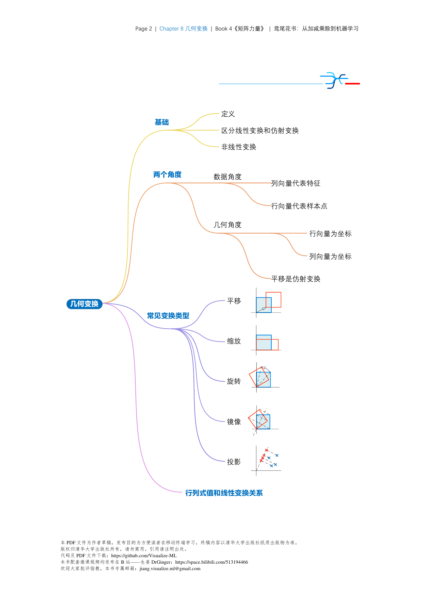
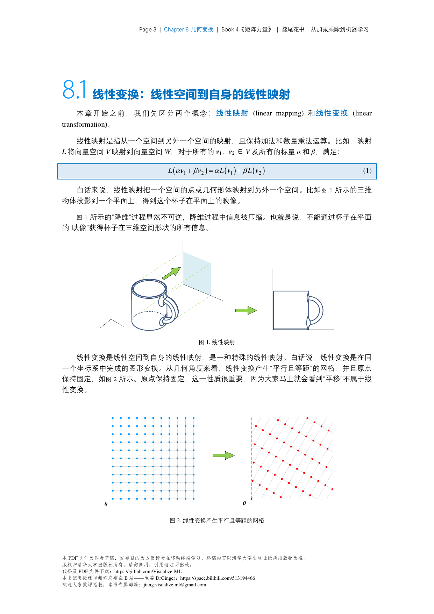
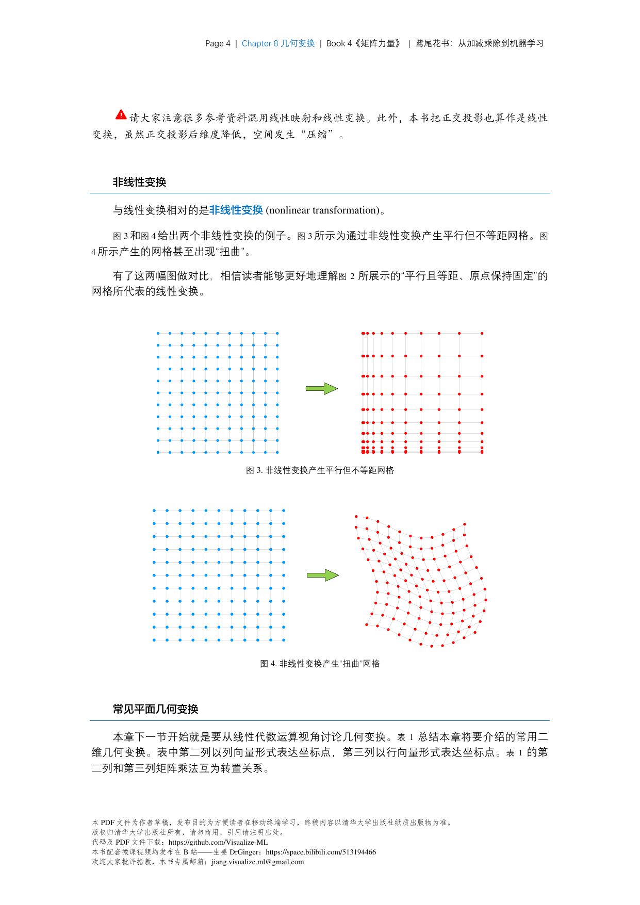
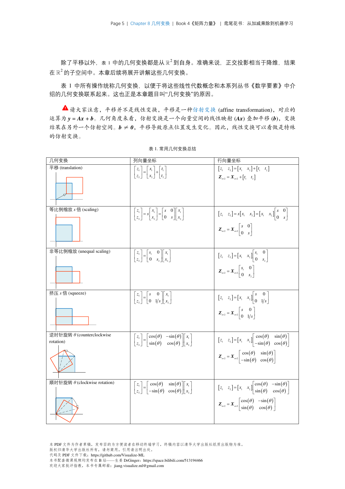

# 范数与距离

## 范数定义

范数是向量的"长度"或"大小"的数学表示。形式上，满足以下条件的函数 $\|\cdot\|$ 称为范数：

1. **正定性**：$\|\mathbf{x}\| \geq 0$，且 $\|\mathbf{x}\| = 0 \Leftrightarrow \mathbf{x} = 0$
2. **齐次性**：$\|c\mathbf{x}\| = |c|\|\mathbf{x}\|$
3. **三角不等式**：$\|\mathbf{x} + \mathbf{y}\| \leq \|\mathbf{x}\| + \|\mathbf{y}\|$

---

## 常用向量范数

### $L_1$ 范数（曼哈顿范数）
$$\|\mathbf{x}\|_1 = \sum_{i=1}^{n} |x_i|$$

**几何意义**：所有分量绝对值之和 = 路径总长度（只能沿坐标轴移动）

**应用**：
- **稀疏性正则化**：LASSO回归
- **优化问题中的$L_1$正则**：促进稀疏解
- **平均绝对误差 (MAE)**

```python
# Python计算
l1_norm = np.sum(np.abs(x))
l1_norm = torch.norm(x, p=1)
```

---

### $L_2$ 范数（欧几里得范数）
$$\|\mathbf{x}\|_2 = \sqrt{\sum_{i=1}^{n} x_i^2} = \sqrt{\mathbf{x}^T\mathbf{x}}$$

**几何意义**：点到原点的欧氏距离

**应用**：
- **均方误差 (MSE)**
- **权重衰减 (Weight Decay)**：$\mathcal{L} + \lambda\|\mathbf{w}\|_2^2$
- **余弦相似度**：$\frac{\mathbf{a} \cdot \mathbf{b}}{\|\mathbf{a}\|_2 \|\mathbf{b}\|_2}$

```python
# ▶ L1、L2、L_infinity 范数
import torch

x = torch.tensor([3.0, 4.0])
print(torch.norm(x, p=1))      # L1: 7.0
print(torch.norm(x, p=2))      # L2: 5.0
print(torch.norm(x, p=float('inf')))  # L_infinity: 4.0
```

---

### $L_p$ 范数（一般形式）
$$\|\mathbf{x}\|_p = \left(\sum_{i=1}^{n} |x_i|^p\right)^{1/p}$$

| $p$ | 名称 | 公式 |
|-----|------|------|
| 1 | L1/曼哈顿 | $\sum \|x_i\|$ |
| 2 | L2/欧几里得 | $\sqrt{\sum x_i^2}$ |
| $\infty$ | $L_\infty$/切比雪夫 | $\max_i \|x_i\|$ |

### $L_\infty$ 范数
$$\|\mathbf{x}\|_\infty = \max_i |x_i|$$

**应用**：Chebyshev激活函数、梯度裁剪

---

## 矩阵范数

### Frobenius 范数
$$\|\mathbf{A}\|_F = \sqrt{\sum_{i=1}^{m}\sum_{j=1}^{n} A_{ij}^2} = \sqrt{\text{tr}(\mathbf{A}^T\mathbf{A})}$$

**性质**：类似于向量的$L_2$范数

**应用**：
- **矩阵近似**：$\min \|\mathbf{A} - \mathbf{B}\|_F$
- **正则化**：防止权重过大
- **批归一化理论分析**

```python
# ▶ 矩阵范数：Frobenius、谱范数
A = torch.randn(3, 4)
print(torch.norm(A, p='fro'))        # Frobenius: sqrt(sum(A^2))
print(torch.linalg.svd(A).S[0])     # 谱范数: 最大奇异值
```

---

### 谱范数（Spectral Norm）
$$\|\mathbf{A}\|_2 = \sigma_{\max}(\mathbf{A}) = \sqrt{\lambda_{\max}(\mathbf{A}^T\mathbf{A})}$$

**几何意义**：$\mathbf{A}$ 作为线性变换后，单位球能膨胀的最大倍数

**应用**：
- **谱归一化 (Spectral Normalization)**：SN-GAN的核心
- **神经网络稳定性分析**
- **RBP传播界限**

```python
# ▶ 谱范数（最大奇异值）
A = torch.randn(4, 4)
U, S, Vh = torch.linalg.svd(A)
print(f"最大奇异值: {S[0]:.4f}")
print(f"奇异值: {S}")
```

---

### 核范数（Nuclear Norm）
$$\|\mathbf{A}\|_* = \sum_{i=1}^{r} \sigma_i = \text{tr}(\sqrt{\mathbf{A}^T\mathbf{A}})$$

**应用**：
- **低秩矩阵恢复**：推荐系统、图像修复
- **矩阵补全**：$\min \|\mathbf{A}\|_*$
- **鲁棒PCA**

---

## 距离度量

### 欧氏距离（$L_2$距离）
$$d(\mathbf{x}, \mathbf{y}) = \|\mathbf{x} - \mathbf{y}\|_2 = \sqrt{\sum_i (x_i - y_i)^2}$$

---

### 曼哈顿距离（$L_1$距离）
$$d(\mathbf{x}, \mathbf{y}) = \|\mathbf{x} - \mathbf{y}\|_1 = \sum_i |x_i - y_i|$$

---

### 余弦相似度
$$\cos(\theta) = \frac{\mathbf{x} \cdot \mathbf{y}}{\|\mathbf{x}\|_2 \|\mathbf{y}\|_2} = \frac{\mathbf{x}^T\mathbf{y}}{\|\mathbf{x}\|\|\mathbf{y}\|}$$

**范围**：$[-1, 1]$

**应用**：
- **词向量/Embedding相似度**
- **语义搜索**
- **对比学习**

---

### 切比雪夫距离
$$d(\mathbf{x}, \mathbf{y})_\infty = \max_i |x_i - y_i|$$

---

## 深度学习中的范数层

### Layer Norm
$$\mathbf{y} = \frac{\mathbf{x} - \mu}{\sqrt{\sigma^2 + \epsilon}} \cdot \gamma + \beta$$

其中 $\mu = \frac{1}{H}\sum_i x_i$（均值），$\sigma^2 = \frac{1}{H}\sum_i (x_i - \mu)^2$（方差）

**特点**：对单个样本的 所有特征 归一化

```python
# ▶ LayerNorm 示例
import torch
import torch.nn as nn

layer_norm = nn.LayerNorm(normalized_shape=[768])
x = torch.randn(32, 10, 768)  # (batch, seq_len, d_model)
y = layer_norm(x)
print(f"输出 shape: {y.shape}")  # torch.Size([32, 10, 768])
```

---

### Batch Norm
$$\mathbf{y} = \frac{\mathbf{x} - \mu_{\text{batch}}}{\sqrt{\sigma_{\text{batch}}^2 + \epsilon}} \cdot \gamma + \beta$$

**特点**：对batch中 所有样本 的同一特征归一化

---

### Instance Norm
$$\mathbf{y} = \frac{\mathbf{x} - \mu_{\text{instance}}}{\sqrt{\sigma_{\text{instance}}^2 + \epsilon}} \cdot \gamma + \beta$$

**用途**：风格迁移（比BatchNorm更适合）

---

### Group Norm
将通道分成$G$组，每组内做Instance Norm

```python
# ▶ GroupNorm 示例
import torch
import torch.nn as nn

group_norm = nn.GroupNorm(num_groups=4, num_channels=32)
x = torch.randn(8, 32, 24, 24)  # (batch, channels, H, W)
y = group_norm(x)
print(f"输出 shape: {y.shape}")  # torch.Size([8, 32, 24, 24])
```

---

## 梯度裁剪 (Gradient Clipping)

限制梯度范数，防止梯度爆炸：

```python
# ▶ 梯度裁剪示例
import torch.nn.utils as utils

# 创建模拟梯度
model = torch.nn.Linear(10, 2)
x = torch.randn(5, 10)
loss = model(x).sum()
loss.backward()

print(f"裁剪前梯度范数: {utils.clip_grad_norm_(model.parameters(), max_norm=1.0):.4f}")
```

**阈值选择**：通常$[1, 5]$之间，Transformer常用$1.0$

## 📊 图解（来源：《矩阵力量》Book4）

### Ch08










