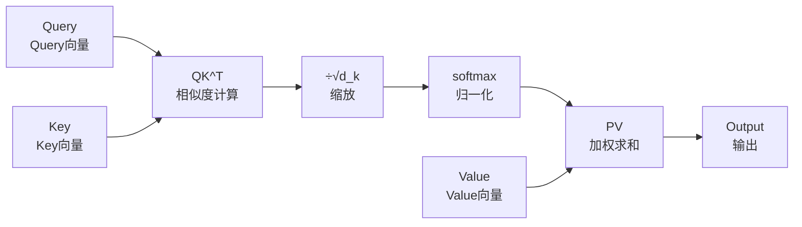
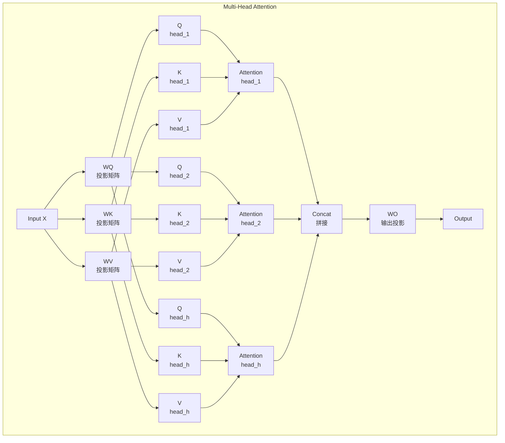

# Attention机制中的线性代数

## 计算流程图



## Attention计算流程

### 标准Scaled Dot-Product Attention

$$\text{Attention}(\mathbf{Q}, \mathbf{K}, \mathbf{V}) = \text{softmax}\left(\frac{\mathbf{Q}\mathbf{K}^T}{\sqrt{d_k}}\right)\mathbf{V}$$

### 各变量维度

| 变量 | 维度 | 含义 |
|------|------|------|
| $\mathbf{Q}$ | $(b, h, n, d_k)$ 或 $(n, d_k)$ | Query |
| $\mathbf{K}$ | $(b, h, m, d_k)$ | Key |
| $\mathbf{V}$ | $(b, h, m, d_v)$ | Value |
| $\mathbf{Q}\mathbf{K}^T$ | $(n, m)$ | Attention scores |

其中：
- $b$: batch size
- $h$: num heads
- $n$: target sequence length
- $m$: source sequence length
- $d_k$: dimension per head

---

## Step-by-Step分解

### Step 1: 计算Query-Key相似度

$$\mathbf{S} = \mathbf{Q}\mathbf{K}^T \in \mathbb{R}^{n \times m}$$

**代码**：
```python
S = torch.matmul(Q, K.transpose(-2, -1))  # (batch, heads, n, m)
```

**矩阵乘法含义**：每一行 $\mathbf{S}_i$ 表示Query $i$与所有Key的相似度。

---

### Step 2: 缩放 (Scaling)

为什么要除以 $\sqrt{d_k}$？

**原因**：避免点积值过大，导致softmax进入饱和区。

**推导**：
假设 $q$ 和 $k$ 是独立随机变量，均值为0，方差为1。
$$q \cdot k = \sum_{i=1}^{d_k} q_i k_i$$

则 $\text{Var}(q \cdot k) = d_k$（方差随 $d_k$ 增长）

除以 $\sqrt{d_k}$ 后，方差恢复到1。

**代码**：
```python
S_scaled = S / math.sqrt(d_k)
```

---

### Step 3: Softmax归一化

$$\mathbf{P} = \text{softmax}(\mathbf{S}_{scaled}) \in \mathbb{R}^{n \times m}$$

逐行softmax：
$$P_{ij} = \frac{\exp(S_{ij})}{\sum_{j=1}^{m} \exp(S_{ij})}$$

**性质**：
- 每行和为1
- 值的范围在(0,1)

**掩码处理**（可选）：
```python
# 对某些位置掩码（置为很大的负数）
mask = ...  # Boolean mask
S_scaled = S_scaled.masked_fill(mask, float('-inf'))
P = F.softmax(S_scaled, dim=-1)
```

---

### Step 4: 加权求和

$$\mathbf{O} = \mathbf{P}\mathbf{V} \in \mathbb{R}^{n \times d_v}$$

**代码**：
```python
O = torch.matmul(P, V)  # (batch, heads, n, d_v)
```

**线性代数意义**：
- $\mathbf{P}$ 的每一行是权重向量
- 输出是Value的加权平均

---

## Multi-Head Attention 结构图



## Multi-Head Attention

### 计算公式

$$\text{MultiHead}(\mathbf{Q}, \mathbf{K}, \mathbf{V}) = \text{Concat}(\text{head}_1, ..., \text{head}_h)\mathbf{W}^O$$

其中：
$$\text{head}_i = \text{Attention}(\mathbf{Q}\mathbf{W}_i^Q, \mathbf{K}\mathbf{W}_i^K, \mathbf{V}\mathbf{W}_i^V)$$

### 维度

| 变量 | 单头维度 | 多头concat后 |
|------|----------|--------------|
| $\mathbf{W}_i^Q, \mathbf{W}_i^K, \mathbf{W}_i^V$ | $d_{model} \times d_k$ | - |
| $\mathbf{W}^O$ | $h \cdot d_v \times d_{model}$ | - |
| 输出 | $(n, d_v)$ | $(n, d_{model})$ |

---

## Self-Attention（自注意力）

当 $\mathbf{Q} = \mathbf{K} = \mathbf{V} = \mathbf{X}$（输入）时：

$$\text{SelfAttention}(\mathbf{X}) = \text{softmax}\left(\frac{\mathbf{X}\mathbf{X}^T}{\sqrt{d}}\right)\mathbf{X}$$

### 性质
- **全局感受野**：每个位置可以看到所有位置
- **参数共享**：$\mathbf{W}_Q = \mathbf{W}_K = \mathbf{W}_V$（可选）
- **计算复杂度**：$O(n^2 \cdot d)$

---

## Flash Attention（高效实现）

标准实现需要 $O(n^2)$ 显存存储注意力矩阵。

Flash Attention通过**分块计算**和**在线softmax**减少显存：

$$\text{FlashAttention}(\mathbf{Q}, \mathbf{K}, \mathbf{V}) = \text{softmax}\left(\frac{\mathbf{Q}\mathbf{K}^T}{\sqrt{d_k}}\right)\mathbf{V}$$

使用 tiling 策略：
1. 将 $\mathbf{K}, \mathbf{V}$ 分块
2. 逐块计算 $\mathbf{S}_{block} = \mathbf{Q}_{block}\mathbf{K}^T$
3. 在线更新softmax统计量（$m, \ell$）

**优势**：
- 显存：$O(n^2) \rightarrow O(n)$
- 计算量不变
- 速度提升2-4倍

```python
# 使用Flash Attention
from flash_attn import flash_attn_func

output = flash_attn_func(Q, K, V, causal=True)
```

---

## 代码实现

### 完整Attention

```python
import torch
import torch.nn as nn
import math

def scaled_dot_product_attention(Q, K, V, mask=None):
    """
    Q: (batch, heads, seq_len, d_k)
    K: (batch, heads, seq_len, d_k)
    V: (batch, heads, seq_len, d_v)
    mask: (batch, heads, seq_len, seq_len) or broadcastable
    """
    d_k = Q.shape[-1]
    
    # 1. 计算相似度
    scores = torch.matmul(Q, K.transpose(-2, -1))  # (batch, heads, n, m)
    
    # 2. 缩放
    scores = scores / math.sqrt(d_k)
    
    # 3. 掩码（可选）
    if mask is not None:
        scores = scores.masked_fill(mask == 0, float('-inf'))
    
    # 4. Softmax
    attn_weights = F.softmax(scores, dim=-1)
    
    # 5. 加权求和
    output = torch.matmul(attn_weights, V)  # (batch, heads, n, d_v)
    
    return output, attn_weights

class MultiHeadAttention(nn.Module):
    def __init__(self, d_model, num_heads):
        super().__init__()
        self.h = num_heads
        self.d_k = d_model // num_heads
        self.d_v = d_model // num_heads
        
        self.W_Q = nn.Linear(d_model, self.h * self.d_k)
        self.W_K = nn.Linear(d_model, self.h * self.d_k)
        self.W_V = nn.Linear(d_model, self.h * self.d_v)
        self.W_O = nn.Linear(self.h * self.d_v, d_model)
    
    def split_heads(self, x):
        # (batch, seq, h*d) -> (batch, h, seq, d)
        batch, seq, _ = x.shape
        x = x.view(batch, seq, self.h, self.d_k)
        return x.transpose(1, 2)
    
    def forward(self, Q, K, V, mask=None):
        batch = Q.shape[0]
        
        # 线性投影 + 分头
        Q = self.split_heads(self.W_Q(Q))  # (batch, h, n, d_k)
        K = self.split_heads(self.W_K(K))
        V = self.split_heads(self.W_V(V))
        
        # Scaled Dot-Product Attention
        attn_output, _ = scaled_dot_product_attention(Q, K, V, mask)
        
        # 合并多头
        attn_output = attn_output.transpose(1, 2).contiguous()
        attn_output = attn_output.view(batch, -1, self.h * self.d_v)
        
        # 最终线性投影
        output = self.W_O(attn_output)
        
        return output
```

---

## 鸢尾花书对应章节

鸢尾花书《矩阵力量》中与 Attention 相关的数学基础：
- **Ch09 正交投影**：Attention score 的几何投影解释
- **Ch17 多元函数微分**：Softmax 梯度的链式法则推导
- **Ch19 直线到超平面**：Attention score 作为点积的度量几何

---

## 数学性质

### Attention的表达能力

**定理**：单头注意力（带足够大的输出投影）可以表达任何从 $\mathbb{R}^{n \times d}$ 到 $\mathbb{R}^{n \times d}$ 的**顺序不变**函数。

**含义**：Attention的输出**不受输入顺序影响**（permutation equivariant）。

### 与矩阵分解的关系

$$\mathbf{A} = \text{softmax}\left(\frac{\mathbf{Q}\mathbf{K}^T}{\sqrt{d_k}}\right)$$

- 当 $\mathbf{Q} = \mathbf{K}$ 时，$\mathbf{A}$ 是**半正定**的
- $\mathbf{A}$ 每行之和为1（随机矩阵的一种）
