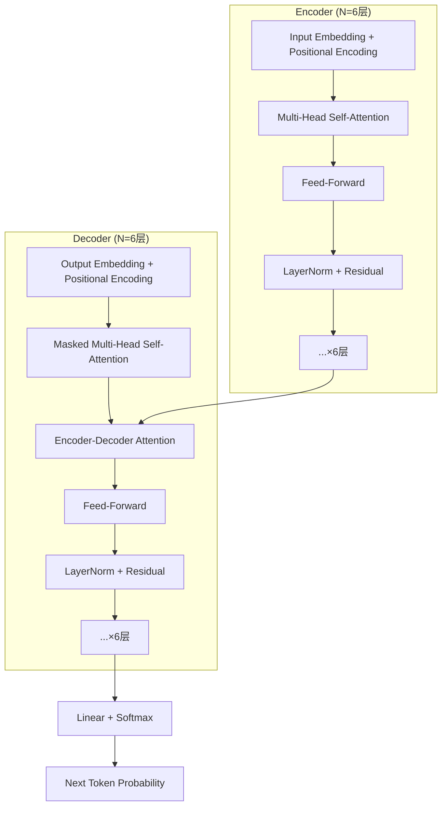

# Transformer 论文精读：《Attention Is All You Need》

> 论文：Attention Is All You Need
> 作者：Ashish Vaswani, Noam Shazeer, Niki Parmar, et al. (Google Brain/Research)
> arXiv：[1706.03762](https://arxiv.org/abs/1706.03762)
> 发表：NeurIPS 2017
> 
> 精读日期：2026-04-12

---

## 1. 论文核心贡献

### 1.1 主要成果

| 任务 | 数据集 | 模型 | 结果 |
|------|--------|------|------|
| 英译德 | WMT 2014 | Transformer (big) | **28.4 BLEU**，超最佳模型 2+ BLEU |
| 英译法 | WMT 2014 | Transformer (big) | **41.8 BLEU**（单模型 SOTA） |
| 句法分析 | WSJ | Transformer (4 layers) | **92.7 F1**（半监督） |

**训练成本**：8 GPU，3.5天（英译法），远低于竞品

### 1.2 核心创新

```
传统 Seq2Seq (RNN/CNN + Attention)
    ↓
Transformer: 完全基于 Attention 机制
    ↓
消除 recurrence 和 convolution
    ↓
实现 O(1) 路径长度的依赖建模
```

### 1.3 架构总览图



---

## 2. 模型架构详解

### 2.1 Encoder

**结构**（6层 identical）：
```
Input → [Multi-Head Self-Attention → Residual+LayerNorm → Feed-Forward → Residual+LayerNorm] × 6
```

**核心特点**：
- 全部位置并行计算（无 recurrence）
- 残差连接：$x + \text{Sublayer}(x)$
- 输出维度：$d_{\text{model}} = 512$

### 2.2 Decoder

**结构**（6层 identical）：
```
Output → [Masked Self-Attention → Encoder-Decoder Attention → Feed-Forward → Residual+LayerNorm] × 6
```

**Masked Self-Attention（因果掩码）**：
```python
# 确保位置 i 只能看到位置 <= i 的信息
# 通过在 softmax 前将非法连接设为 -∞ 实现
scores = Q @ K.transpose(-2, -1)
scores = scores.masked_fill(mask == 0, float('-inf'))
attn_weights = F.softmax(scores, dim=-1)
```

### 2.3 关键参数

| 参数 | Base 模型 | Big 模型 |
|------|-----------|----------|
| $N$（层数） | 6 | 6 |
| $d_{\text{model}}$ | 512 | 1024 |
| $d_{ff}$（FFN hidden） | 2048 | 4096 |
| $h$（注意力头数） | 8 | 16 |
| $d_k = d_v$ | 64 | 64 |
| 参数量 | 65M | 213M |

---

## 3. Attention 机制详解

### 3.1 Scaled Dot-Product Attention

**公式**：
$$\text{Attention}(Q, K, V) = \text{softmax}\left(\frac{QK^T}{\sqrt{d_k}}\right)V$$

**维度**：
- $Q \in \mathbb{R}^{n \times d_k}$（Query）
- $K \in \mathbb{R}^{m \times d_k}$（Key）
- $V \in \mathbb{R}^{m \times d_v}$（Value）
- 输出：$\mathbb{R}^{n \times d_v}$

### 3.2 为什么除以 $\sqrt{d_k}$？

**数学推导**：

假设 $q$ 和 $k$ 的各分量独立，均值0，方差1：
$$q \cdot k = \sum_{i=1}^{d_k} q_i k_i$$

则 $\text{Var}(q \cdot k) = d_k$

当 $d_k$ 大时，点积的方差会很大，softmax 会进入饱和区（梯度接近0）。

**解决**：缩放因子 $\frac{1}{\sqrt{d_k}}$，使方差恢复到1。

### 3.3 Multi-Head Attention

**核心思想**：在不同的表示子空间中并行学习注意力。

**公式**：
$$\text{MultiHead}(Q, K, V) = \text{Concat}(\text{head}_1, ..., \text{head}_h)W^O$$

其中：
$$\text{head}_i = \text{Attention}(QW_i^Q, KW_i^K, VW_i^V)$$

**参数**：
- $W_i^Q, W_i^K \in \mathbb{R}^{d_{\text{model}} \times d_k}$
- $W_i^V \in \mathbb{R}^{d_{\text{model}} \times d_v}$
- $W^O \in \mathbb{R}^{hd_v \times d_{\text{model}}}$

**计算量**：与单头全维度 attention 相同（因 $d_k = d_{\text{model}}/h$）

### 3.4 三种 Attention 用途

| 位置 | Attention 类型 | Query 来源 | Key/Value 来源 |
|------|---------------|-----------|----------------|
| Encoder | Self-Attention | 同一层 Encoder 输出 | 同一层 Encoder 输出 |
| Decoder | Masked Self-Attention | 同一层 Decoder 输出 | 同一层 Decoder 输出 |
| Decoder | Cross-Attention | Decoder 上一层的输出 | Encoder 最终输出 |

### 3.5 Attention 复杂度对比

```mermaid
flowchart LR
    subgraph "复杂度对比 (n=序列长度, d=维度, k=卷积核大小)"
        RNN[Recurrent] --> O1[O(n) 串行\n路径长度]
        CNN[Conv (ConvS2S)] --> O2[O(log_k(n)) 路径\nO(k·n) 计算]
        SELF[Self-Attention] --> O3[O(1) 路径长度\nO(n²·d) 计算]
    end
    
    SELF -->|"Transformer选择"| BEST[最优路径]
    
    style RNN fill:#ffcccc
    style CNN fill:#fff3cd
    style SELF fill:#d4edda
    style BEST fill:#cce5ff
```

---

## 4. Feed-Forward Network

**公式**：
$$\text{FFN}(x) = \max(0, xW_1 + b_1)W_2 + b_2$$

**维度**：
- 输入：$d_{\text{model}} = 512$
- 中间层：$d_{ff} = 2048$（ReLU）
- 输出：$d_{\text{model}} = 512$

**等价于**：两个 1×1 卷积

---

## 5. Positional Encoding

### 5.1 为什么需要位置编码？

Transformer 没有 recurrence，也没有 convolution，**无法区分词语顺序**。

### 5.2 正弦/余弦编码

$$PE_{(pos, 2i)} = \sin\left(\frac{pos}{10000^{2i/d_{\text{model}}}}\right)$$
$$PE_{(pos, 2i+1)} = \cos\left(\frac{pos}{10000^{2i/d_{\text{model}}}}\right)$$

### 5.3 位置编码的特性

```
维度 0,1   → 波长 2π      (频率最高)
维度 2,3   → 波长 4π
...
维度 i     → 波长 10000^{2i/d} · 2π  (频率最低)
```

**优点**：
- 可以表示任意相对位置（线性组合）
- 模型可泛化到训练时未见过的序列长度

### 5.4 与 Learned Position Embedding 对比

实验结果表明两者效果几乎相同（BLEU差异<0.1）。

论文选择正弦版本的原因：推理时可外推到更长序列。

---

## 6. 训练细节

### 6.1 学习率调度（Warmup + Inverse Square Root Decay）

$$lrate = d_{\text{model}}^{-0.5} \cdot \min\left(step\_num^{-0.5}, step\_num \cdot warmup\_steps^{-1.5}\right)$$

```python
# ▶ 学习率调度可视化
import numpy as np
import matplotlib.pyplot as plt

def lr_schedule(step, d_model=512, warmup_steps=4000):
    return d_model ** (-0.5) * min(step ** (-0.5), step * warmup_steps ** (-1.5))

steps = np.arange(1, 20001)
lrs = [lr_schedule(s) for s in steps]

plt.figure(figsize=(10, 4))
plt.plot(steps, lrs)
plt.xlabel('Step')
plt.ylabel('Learning Rate')
plt.title('Transformer Learning Rate Schedule (warmup=4000)')
plt.axvline(x=4000, color='r', linestyle='--', label='warmup end')
plt.legend()
plt.savefig('lr_schedule.png', dpi=100)
```

**特征**：
- 前 4000 步：线性增长（陡峭上升）
- 4000 步之后：按 $\frac{1}{\sqrt{step}}$ 衰减

### 6.2 正则化

| 技术 | 参数 |
|------|------|
| **Residual Dropout** | $P_{drop} = 0.1$（每个 sub-layer 输出 + embedding） |
| **Label Smoothing** | $\epsilon_{ls} = 0.1$ |

**Label Smoothing 的作用**：
- 降低模型对预测的自信度
- 提升 BLEU（虽然 perplexity 略降）
- 防止过拟合

### 6.3 优化器

使用 **Adam**：
- $\beta_1 = 0.9$
- $\beta_2 = 0.98$
- $\epsilon = 10^{-9}$

---

## 7. 实验结果

### 7.1 机器翻译

| 模型 | BLEU (En→De) | BLEU (En→Fr) | 训练成本 |
|------|-------------|-------------|----------|
| **Transformer (big)** | **28.4** | **41.8** | 8 GPU × 3.5天 |
| Transformer (base) | 25.8 | 38.1 | 8 GPU × 12小时 |
| ByteNet | 23.8 | 40.0 | — |
| ConvS2S | 26.3 | 41.5 | — |
| GNMT | 26.4 | 39.9 | 96 GPU × 6天 |

### 7.2 消融实验 (Ablation Study)

| 变体 | PPL | BLEU |
|------|-----|------|
| Base | 4.92 | 25.8 |
| (A) 单头 attention | 5.29 | 24.9 |
| (A) 4 头 | 5.00 | 25.5 |
| (A) 16 头 | 4.91 | 25.8 |
| (B) $d_k = 128$ | 5.16 | 25.1 |
| (C) $d_{ff}=1024$ | 6.11 | 23.7 |
| (C) $d_{ff}=4096$ | 4.88 | 25.5 |
| (D) dropout=0.0 | 5.77 | 24.6 |
| (D) dropout=0.2 | 4.95 | 25.5 |
| (E) 学习型位置编码 | 4.92 | 25.7 |

**关键发现**：
- **多头 > 单头**：多表示子空间很关键
- **$d_k$ 重要**：不能太小
- **大 $d_{ff}$ 有帮助**：更大的 FFN 层提升性能
- **Dropout 很重要**：无 dropout 掉点明显

### 7.3 泛化能力：句法分析

| 模型 | WSJ F1 |
|------|--------|
| RNN Grammar | 93.3 |
| **Transformer (4 layers, 半监督)** | **92.7** |
| Transformer (4 layers, 仅 WSJ) | 91.3 |

Transformer 在无任务特定调优情况下超越了大多数专用模型。

---

## 8. Attention 可视化分析

论文给出了几个有趣的 Attention 可视化例子：

### 8.1 长距离依赖

Figure 3：encoder 第5层的 attention heads 正确捕获了 "making...more difficult" 的远程依赖关系。

### 8.2 指代消解

Figure 4：某些 heads 学会了指代消解（如 "its" 指代正确的对象）。

### 8.3 句法结构

Figure 5：不同的 heads 学会了不同的句法子结构（如主语-动词关系、介词短语等）。

**启示**：Attention heads 自然地呈现了语言的句法和语义结构。

---

## 9. 代码实现

### 9.1 Scaled Dot-Product Attention

```python
# ▶ Transformer Attention 实现
import torch
import torch.nn.functional as F
import math

def scaled_dot_product_attention(Q, K, V, mask=None):
    """
    Q: (batch, heads, seq_len, d_k)
    K: (batch, heads, seq_len, d_k)
    V: (batch, heads, seq_len, d_v)
    mask: (batch, heads, seq_len, seq_len) 可选
    """
    d_k = Q.shape[-1]
    
    # 1. 计算点积
    scores = Q @ K.transpose(-2, -1)  # (batch, heads, n, m)
    
    # 2. 缩放
    scores = scores / math.sqrt(d_k)
    
    # 3. 应用掩码（如果有）
    if mask is not None:
        scores = scores.masked_fill(mask == 0, float('-inf'))
    
    # 4. Softmax
    attn_weights = F.softmax(scores, dim=-1)
    
    # 5. 加权求和
    output = attn_weights @ V
    
    return output, attn_weights

# 测试
batch, heads, seq_len, d_k, d_v = 2, 8, 10, 64, 64
Q = torch.randn(batch, heads, seq_len, d_k)
K = torch.randn(batch, heads, seq_len, d_k)
V = torch.randn(batch, heads, seq_len, d_v)

out, weights = scaled_dot_product_attention(Q, K, V)
print(f"输出 shape: {out.shape}")  # (2, 8, 10, 64)
print(f"Attention weights shape: {weights.shape}")  # (2, 8, 10, 10)
print(f"每行和为1: {weights[0, 0].sum(dim=-1)[:3]}")  # tensor([1., 1., 1.])
```

### 9.2 Multi-Head Attention

```python
# ▶ Multi-Head Attention 实现
import torch
import torch.nn as nn
import torch.nn.functional as F
import math

class MultiHeadAttention(nn.Module):
    def __init__(self, d_model, num_heads):
        super().__init__()
        self.h = num_heads
        self.d_k = d_model // num_heads
        self.d_v = d_model // num_heads
        
        # 线性投影
        self.W_Q = nn.Linear(d_model, num_heads * self.d_k)
        self.W_K = nn.Linear(d_model, num_heads * self.d_k)
        self.W_V = nn.Linear(d_model, num_heads * self.d_v)
        self.W_O = nn.Linear(num_heads * self.d_v, d_model)
    
    def split_heads(self, x):
        # (batch, seq, h*d) -> (batch, heads, seq, d)
        batch, seq, _ = x.shape
        x = x.view(batch, seq, self.h, self.d_k)
        return x.transpose(1, 2)
    
    def forward(self, Q, K, V, mask=None):
        batch = Q.shape[0]
        
        # 线性投影 + 分头
        Q = self.split_heads(self.W_Q(Q))
        K = self.split_heads(self.W_K(K))
        V = self.split_heads(self.W_V(V))
        
        # Scaled Dot-Product Attention
        attn_output, _ = scaled_dot_product_attention(Q, K, V, mask)
        
        # 合并多头
        attn_output = attn_output.transpose(1, 2).contiguous()
        attn_output = attn_output.view(batch, -1, self.h * self.d_v)
        
        # 最终线性投影
        output = self.W_O(attn_output)
        
        return output

# 测试
d_model, num_heads = 512, 8
mha = MultiHeadAttention(d_model, num_heads)
x = torch.randn(2, 10, d_model)  # (batch, seq_len, d_model)
out = mha(x, x, x)  # Self-Attention
print(f"输出 shape: {out.shape}")  # (2, 10, 512)
```

### 9.3 完整 Position Encoding

```python
# ▶ Positional Encoding 实现
import torch
import torch.nn as nn
import math

class PositionalEncoding(nn.Module):
    def __init__(self, d_model, max_len=5000):
        super().__init__()
        
        # 创建位置编码矩阵
        pe = torch.zeros(max_len, d_model)
        position = torch.arange(0, max_len).unsqueeze(1).float()
        
        # 计算频率
        div_term = torch.exp(
            torch.arange(0, d_model, 2).float() * 
            (-math.log(10000.0) / d_model)
        )
        
        # 偶数维度用 sin，奇数维度用 cos
        pe[:, 0::2] = torch.sin(position * div_term)
        pe[:, 1::2] = torch.cos(position * div_term)
        
        # 注册为 buffer（不参与训练）
        self.register_buffer('pe', pe.unsqueeze(0))
    
    def forward(self, x):
        # x: (batch, seq_len, d_model)
        return x + self.pe[:, :x.size(1)]

# 可视化
import matplotlib.pyplot as plt

d_model, max_len = 64, 200
pe = PositionalEncoding(d_model, max_len).pe[0].numpy()

plt.figure(figsize=(12, 6))
plt.imshow(pe.T, aspect='auto', cmap='RdBu_r')
plt.xlabel('Position')
plt.ylabel('Dimension')
plt.title('Positional Encoding (d_model=64, max_len=200)')
plt.colorbar()
plt.savefig('positional_encoding.png', dpi=100)
```

### 9.4 完整 Encoder Layer

```python
# ▶ Transformer Encoder Layer
class EncoderLayer(nn.Module):
    def __init__(self, d_model, num_heads, d_ff, dropout=0.1):
        super().__init__()
        self.self_attn = MultiHeadAttention(d_model, num_heads)
        self.ffn = nn.Sequential(
            nn.Linear(d_model, d_ff),
            nn.ReLU(),
            nn.Linear(d_ff, d_model)
        )
        self.norm1 = nn.LayerNorm(d_model)
        self.norm2 = nn.LayerNorm(d_model)
        self.dropout = nn.Dropout(dropout)
    
    def forward(self, x, mask=None):
        # Self-Attention + Residual
        attn_output = self.self_attn(x, x, x, mask)
        x = self.norm1(x + self.dropout(attn_output))
        
        # Feed-Forward + Residual
        ffn_output = self.ffn(x)
        x = self.norm2(x + self.dropout(ffn_output))
        
        return x

# 测试
encoder_layer = EncoderLayer(d_model=512, num_heads=8, d_ff=2048)
x = torch.randn(2, 10, 512)
out = encoder_layer(x)
print(f"Encoder Layer 输出 shape: {out.shape}")  # (2, 10, 512)
```

---

## 10. 论文核心要点总结

### 10.1 为什么 Attention 优于 RNN/CNN？

| 维度 | RNN | CNN | **Attention** |
|------|-----|-----|---------------|
| 路径长度 | O(n) | O(log n) | **O(1)** |
| 可并行化 | 低 | 中 | **高** |
| 长距离依赖 | 难 | 难 | **易** |

### 10.2 Transformer 的关键设计

```
1. ✓ Multi-Head Attention → 多表示子空间
2. ✓ Scaled Dot-Product → 数值稳定
3. ✓ Residual Connection → 梯度流畅
4. ✓ Layer Normalization → 训练稳定
5. ✓ Positional Encoding → 位置感知
6. ✓ Masked Attention → 因果解码
7. ✓ Warmup Learning Rate → 训练稳定
```

### 10.3 对后世的影响

```
Transformer (2017)
    ├── GPT (2018) → GPT-2/3/4 (2020-2023)
    ├── BERT (2018)
    ├── Transformer XL (2019)
    ├── T5 (2019)
    ├── GPT-2 (2019)
    ├── BART (2019)
    ├── ELECTRA (2020)
    ├── Vision Transformer (2020)
    ├── GPT-3 (2020)
    ├── AlphaFold2 (2021)
    ├── ChatGPT (2022)
    ├── LLaMA (2023)
    ├── GPT-4 (2023)
    └── Gemini, Claude, etc.
```

---

## 11. Wiki 对应章节

| 主题 | Wiki 链接 |
|------|----------|
| Attention 数学 | [[7_应用_Attention机制]] |
| Scaled Dot-Product | [[4_重要分布]] (Softmax) |
| LayerNorm | [[5_范数与距离]] |
| 梯度裁剪 | [[4_梯度下降]] |
| 矩阵分解(SVD) | [[4_矩阵分解]] |
| 鸢尾花书-矩阵 | [[鸢尾花书 (Visualize-ML)]] |

---

## Tags

#transformer #attention #nlp #seq2seq #paper-reading #gpt #bert #deep-learning
