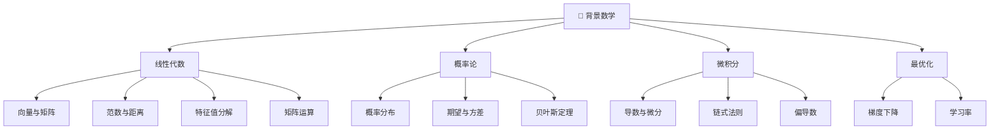
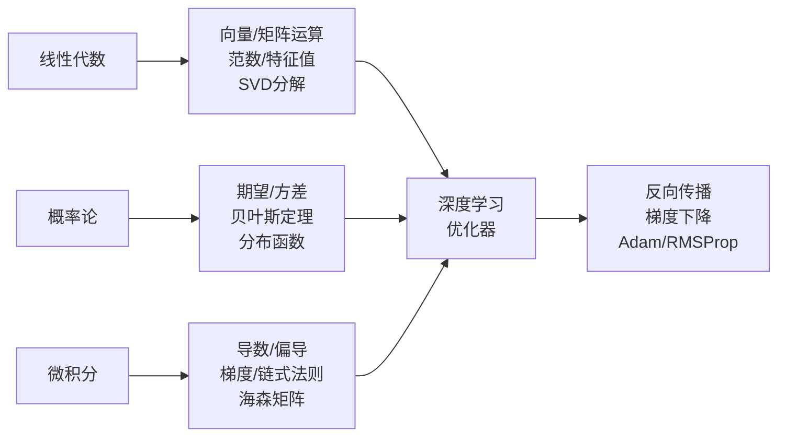

# Chap 1: 背景数学 (Background Mathematics)

> UDLbook Chapter 1 精读笔记
>
> **官方资源**: [GitHub Notebooks/Chap01](https://github.com/udlbook/udlbook/blob/main/Notebooks/Chap01/1_1_BackgroundMathematics.ipynb)

---

## 1. 概述

深度学习建立在数学基础之上。本章复习深度学习所需的**核心数学工具**：



---

## 2. 线性代数

### 2.1 向量 (Vector)

**定义**：有序的数列表，$n$ 维向量表示 $\mathbf{x} \in \mathbb{R}^n$

```python
# ▶ 向量表示
import numpy as np

# 列向量
x = np.array([1, 2, 3])
print(f"向量 x = {x}")
print(f"维度: {x.shape}")  # (3,)
print(f"转置: {x.T}")      #仍是(3,)，NumPy用reshape转为列向量
```

### 2.2 矩阵 (Matrix)

**定义**：$m \times n$ 的二维数组 $\mathbf{A} \in \mathbb{R}^{m \times n}$

```python
# ▶ 矩阵表示
A = np.array([[1, 2, 3],
              [4, 5, 6]])
print(f"矩阵 A:\n{A}")
print(f"形状: {A.shape}")  # (2, 3)
print(f"转置 A.T:\n{A.T}")
```

### 2.3 矩阵运算

| 运算 | 公式 | NumPy |
|------|------|-------|
| **加法** | $\mathbf{C} = \mathbf{A} + \mathbf{B}$ | `A + B` |
| **数乘** | $\mathbf{C} = c\mathbf{A}$ | `c * A` |
| **矩阵乘法** | $\mathbf{C} = \mathbf{AB}$ | `A @ B` 或 `np.dot(A, B)` |
| **逐元素乘法** | $\mathbf{C}_{ij} = \mathbf{A}_{ij} \cdot \mathbf{B}_{ij}$ | `A * B` |
| **转置** | $\mathbf{C} = \mathbf{A}^T$ | `A.T` |
| **逆矩阵** | $\mathbf{AA}^{-1} = \mathbf{I}$ | `np.linalg.inv(A)` |

```python
# ▶ 矩阵运算示例
A = np.array([[1, 2], [3, 4]])
B = np.array([[5, 6], [7, 8]])

print(f"A + B:\n{A + B}")
print(f"A @ B:\n{A @ B}")
print(f"A * B (逐元素):\n{A * B}")
print(f"转置 A.T:\n{A.T}")
print(f"行列式 |A|: {np.linalg.det(A):.2f}")
print(f"逆矩阵 A⁻¹:\n{np.linalg.inv(A)}")
```

### 2.4 特殊矩阵

| 矩阵类型 | 定义 | 性质 |
|---------|------|------|
| **单位矩阵** $\mathbf{I}$ | 对角线为1，其他为0 | $\mathbf{AI} = \mathbf{A}$ |
| **对角矩阵** | 仅对角线有值 | $\text{diag}(\mathbf{d})$ |
| **对称矩阵** | $\mathbf{A} = \mathbf{A}^T$ | 特征值为实数 |
| **正定矩阵** | $\mathbf{x}^T\mathbf{A}\mathbf{x} > 0$ | 特征值 > 0 |
| **正交矩阵** | $\mathbf{Q}^T\mathbf{Q} = \mathbf{I}$ | 保持长度 |

```python
# ▶ 特殊矩阵
I = np.eye(3)  # 3×3 单位矩阵
D = np.diag([1, 2, 3])  # 对角矩阵
print(f"单位矩阵 I:\n{I}")
print(f"对角矩阵 D:\n{D}")

# 正交矩阵示例（旋转矩阵）
theta = np.pi / 4
Q = np.array([[np.cos(theta), -np.sin(theta)],
              [np.sin(theta), np.cos(theta)]])
print(f"正交矩阵 Q (旋转45°):\n{Q}")
print(f"Q @ Q.T = I?:\n{Q @ Q.T}")  # 应接近单位矩阵
```

### 2.5 范数 (Norm)

**定义**：向量的"长度"度量

| 范数 | 公式 | NumPy | 含义 |
|------|------|-------|------|
| **L1 范数** | $\|\mathbf{x}\|_1 = \sum_i \|x_i\|$ | `np.linalg.norm(x, 1)` | 曼哈顿距离 |
| **L2 范数** | $\|\mathbf{x}\|_2 = \sqrt{\sum_i x_i^2}$ | `np.linalg.norm(x)` | 欧几里得距离 |
| **L∞ 范数** | $\|\mathbf{x}\|_\infty = \max_i \|x_i\|$ | `np.linalg.norm(x, np.inf)` | 最大绝对值 |
| **Frobenius** | $\|\mathbf{A}\|_F = \sqrt{\sum_{ij} A_{ij}^2}$ | `np.linalg.norm(A, 'fro')` | 矩阵L2范数 |

```python
# ▶ 范数计算
x = np.array([3, 4])

print(f"L1 范数: {np.linalg.norm(x, 1)}")     # 7.0
print(f"L2 范数: {np.linalg.norm(x)}")        # 5.0 (勾股定理 3-4-5)
print(f"L∞ 范数: {np.linalg.norm(x, np.inf)}")  # 4.0

# 深度学习中的应用
# - L2 范数：权重衰减 (Weight Decay)
# - L1 范数：稀疏正则化
```

### 2.6 特征值与特征向量

**定义**：$\mathbf{A}\mathbf{v} = \lambda\mathbf{v}$

- $\lambda$：特征值
- $\mathbf{v}$：特征向量

```python
# ▶ 特征值分解
A = np.array([[2, 1],
              [1, 2]])

eigenvalues, eigenvectors = np.linalg.eig(A)

print(f"矩阵 A:\n{A}")
print(f"特征值: {eigenvalues}")  # [3., 1.]
print(f"特征向量:\n{eigenvectors}")

# 验证 A @ v = λ @ v
for i in range(len(eigenvalues)):
    v = eigenvectors[:, i]
    lambda_val = eigenvalues[i]
    print(f"A @ v_{i} = {A @ v}")
    print(f"λ_{i} * v_{i} = {lambda_val * v}")
```

**几何意义**：特征向量指示变换后方向不变的轴，特征值表示拉伸倍数。

### 2.7 矩阵分解

| 分解方法 | 公式 | 用途 |
|---------|------|------|
| **SVD** | $\mathbf{A} = \mathbf{U}\mathbf{\Sigma}\mathbf{V}^T$ | 降维、PCA |
| **LU** | $\mathbf{A} = \mathbf{L}\mathbf{U}$ | 解线性方程 |
| **Cholesky** | $\mathbf{A} = \mathbf{L}\mathbf{L}^T$ | 正定矩阵求解 |

```python
# ▶ SVD 分解
A = np.array([[1, 2],
              [3, 4],
              [5, 6]])

U, S, Vt = np.linalg.svd(A)

print(f"A shape: {A.shape}")
print(f"U shape: {U.shape}")  # (3, 3)
print(f"S: {S}")              # 奇异值
print(f"Vt shape: {Vt.shape}")  # (2, 2)

# 重建
A_reconstructed = U @ np.diag(S) @ Vt
print(f"重建误差: {np.linalg.norm(A - A_reconstructed):.2e}")
```

---

## 3. 概率论

### 3.1 概率基础

- **概率**：$P(X)$，取值 $[0, 1]$
- **联合概率**：$P(X, Y) = P(X \cap Y)$
- **边缘概率**：$P(X) = \sum_Y P(X, Y)$
- **条件概率**：$P(X \mid Y) = \frac{P(X, Y)}{P(Y)}$

```python
# ▶ 概率计算
import numpy as np

# 假设有两枚硬币
# P(HH) = 0.25, P(HT) = 0.25, P(TH) = 0.25, P(TT) = 0.25

# 第一次正面，第二次任意的概率
# P(第一次=H) = P(HH) + P(HT) = 0.5
p_first_head = 0.25 + 0.25
print(f"P(第一次=H) = {p_first_head}")
```

### 3.2 贝叶斯定理

$$P(X \mid Y) = \frac{P(Y \mid X) \cdot P(X)}{P(Y)}$$

- $P(X \mid Y)$：**后验概率**
- $P(Y \mid X)$：**似然**
- $P(X)$：**先验概率**
- $P(Y)$：**边际似然**

```python
# ▶ 贝叶斯定理示例
# 假设：
# - 疾病D在总人口中发病率 P(D) = 0.01 (1%)
# - 检验准确率 P(+|D) = 0.99 (99%敏感性)
# - 检验误报率 P(+|~D) = 0.05 (5%假阳性)

P_D = 0.01       # 先验
P_plus_given_D = 0.99  # 似然（有病且阳性）
P_plus_given_not_D = 0.05  # 假阳性率

# 计算 P(+) = P(+|D)P(D) + P(+|~D)P(~D)
P_not_D = 1 - P_D
P_plus = P_plus_given_D * P_D + P_plus_given_not_D * P_not_D

# 贝叶斯：P(D|+) = P(+|D)P(D) / P(+)
P_D_given_plus = (P_plus_given_D * P_D) / P_plus

print(f"检验为阳性时，真正有病的概率: {P_D_given_plus:.4f}")
print(f"即约 {P_D_given_plus*100:.2f}%")
# 结果显示，即使检验为阳性，真正有病的概率也不到17%！
```

### 3.3 常用分布

| 分布 | 公式 | 应用 |
|------|------|------|
| **伯努利** | $P(x) = \mu^x(1-\mu)^{1-x}$ | 单次二分类 |
| **二项分布** | $P(k) = \binom{n}{k}p^k(1-p)^{n-k}$ | n次二分类 |
| **正态分布** | $\mathcal{N}(x;\mu,\sigma^2)$ | 连续值、噪声 |
| **softmax** | $P(k) = \frac{e^{z_k}}{\sum_i e^{z_i}}$ | 多分类概率 |

```python
# ▶ 概率分布可视化
import numpy as np
import matplotlib.pyplot as plt
from scipy import stats

# 1. 正态分布
mu, sigma = 0, 1
x = np.linspace(-4, 4, 100)
y = stats.norm.pdf(x, mu, sigma)

plt.figure(figsize=(10, 4))
plt.plot(x, y, 'b-', label=f'正态分布 N({mu}, {sigma}²)')
plt.fill_between(x, y, alpha=0.3)
plt.xlabel('x')
plt.ylabel('概率密度')
plt.title('正态分布 (高斯分布)')
plt.legend()
plt.savefig('normal_distribution.png', dpi=100)
```

### 3.4 期望与方差

| 统计量 | 定义 | 含义 |
|-------|------|------|
| **期望** $\mathbb{E}[X]$ | $\sum_x x \cdot P(x)$ | 平均值 |
| **方差** $\text{Var}(X)$ | $\mathbb{E}[(X - \mathbb{E}[X])^2]$ | 数据分散程度 |
| **标准差** $\sigma$ | $\sqrt{\text{Var}(X)}$ | 与均值的平均偏离 |

```python
# ▶ 期望与方差计算
x = np.array([1, 2, 3, 4, 5])

mean = np.mean(x)
variance = np.var(x)  # 默认除N
variance_unbiased = np.var(x, ddof=1)  # 样本方差（除N-1）

print(f"数据: {x}")
print(f"均值: {mean}")
print(f"方差 (总体): {variance}")
print(f"方差 (样本): {variance_unbiased:.2f}")

# 验证 Var(X) = E[X²] - E[X]²
print(f"E[X²] - E[X]² = {np.mean(x**2) - np.mean(x)**2:.2f}")
```

---

## 4. 微积分

### 4.1 导数基础

**定义**：函数在某点的瞬时变化率

$$f'(x) = \lim_{h \to 0} \frac{f(x+h) - f(x)}{h}$$

```python
# ▶ 数值导数
def f(x):
    return x**2

def derivative(f, x, h=1e-5):
    return (f(x + h) - f(x - h)) / (2 * h)

x = 3
print(f"f({x}) = {f(x)}")
print(f"f'({x}) ≈ {derivative(f, x):.6f}")
print(f"精确值 f'(x) = 2x = {2*x}")  # 解析导数
```

### 4.2 链式法则

**核心规则**：复合函数的导数

$$\frac{d}{dx}f(g(x)) = f'(g(x)) \cdot g'(x)$$

```python
# ▶ 链式法则示例
# 求 d/dx sin(x²) = cos(x²) · 2x

def composite_function(x):
    return np.sin(x**2)

def composite_derivative(x, h=1e-5):
    return (composite_function(x + h) - composite_function(x - h)) / (2 * h)

x = 1.0
numerical = composite_derivative(x)
analytic = np.cos(x**2) * 2*x  # cos(x²) · 2x

print(f"数值导数: {numerical:.6f}")
print(f"解析导数: {analytic:.6f}")
```

### 4.3 偏导数

**定义**：多元函数对其中一个变量的导数（其他变量视为常数）

$$\frac{\partial f}{\partial x}(x, y)$$

```python
# ▶ 偏导数
def f(x, y):
    return x**2 + 3*x*y + y**2

def partial_x(f, x, y, h=1e-5):
    return (f(x + h, y) - f(x - h, y)) / (2 * h)

def partial_y(f, x, y, h=1e-5):
    return (f(x, y + h) - f(x, y - h)) / (2 * h)

x, y = 2, 3
print(f"f({x}, {y}) = {f(x, y)}")
print(f"∂f/∂x = {partial_x(f, x, y):.4f}")  # 2x + 3y = 4 + 9 = 13
print(f"∂f/∂y = {partial_y(f, x, y):.4f}")  # 3x + 2y = 6 + 6 = 12
```

### 4.4 梯度

**定义**：偏导数向量，指向函数增长最快的方向

$$\nabla f = \left(\frac{\partial f}{\partial x_1}, \frac{\partial f}{\partial x_2}, ..., \frac{\partial f}{\partial x_n}\right)$$

```python
# ▶ 梯度计算
def gradient(f, x, h=1e-5):
    """计算数值梯度"""
    grad = np.zeros_like(x)
    for i in range(len(x)):
        x_plus = x.copy()
        x_minus = x.copy()
        x_plus[i] += h
        x_minus[i] -= h
        grad[i] = (f(x_plus) - f(x_minus)) / (2 * h)
    return grad

# 示例：f(x,y) = x² + y² 的梯度
def f(x):
    return np.sum(x**2)

x = np.array([3.0, 4.0])
print(f"点: {x}")
print(f"梯度: {gradient(f, x)}")  # 应该是 [6, 8] = 2 * [3, 4]
print(f"梯度方向是 (6, 8)，指向函数增大最快的方向")
```

### 4.5 雅可比矩阵与海森矩阵

| 矩阵 | 定义 | 维度 |
|------|------|------|
| **雅可比** $\mathbf{J}$ | 一阶偏导数矩阵 | $(m \times n)$ |
| **海森** $\mathbf{H}$ | 二阶偏导数矩阵 | $(n \times n)$ |

```python
# ▶ 雅可比矩阵
# 对于 f: ℝⁿ → ℝᵐ
# J[i,j] = ∂fᵢ/∂xⱼ

def jacobian(f, x, h=1e-5):
    n = len(x)
    # 假设 f 返回 m 维向量，这里以 f: ℝ² → ℝ² 为例
    m = len(f(x))
    J = np.zeros((m, n))
    for i in range(m):
        for j in range(n):
            x_plus = x.copy()
            x_minus = x.copy()
            x_plus[j] += h
            x_minus[j] -= h
            J[i, j] = (f(x_plus)[i] - f(x_minus)[i]) / (2 * h)
    return J

# 示例：f(x, y) = [x², xy]
def f(x):
    return np.array([x[0]**2, x[0]*x[1]])

x = np.array([2.0, 3.0])
print(f"f(x,y) = [x², xy]")
print(f"Jacobian at {x}:\n{jacobian(f, x)}")
```

---

## 5. 最优化基础

### 5.1 优化问题

$$\min_{\mathbf{x}} f(\mathbf{x})$$

**约束**：
- $\mathbf{x} \in \mathbb{R}^n$：决策变量
- $f(\mathbf{x})$：目标函数
- 约束条件（可选）

### 5.2 梯度下降法

$$\mathbf{x}_{t+1} = \mathbf{x}_t - \eta \nabla f(\mathbf{x}_t)$$

```python
# ▶ 梯度下降示例
def gradient_descent(f, grad_f, x0, lr=0.1, max_iters=100, tol=1e-6):
    """梯度下降法"""
    x = x0.copy()
    path = [x.copy()]
    
    for i in range(max_iters):
        gradient = grad_f(x)
        x = x - lr * gradient
        path.append(x.copy())
        
        if np.linalg.norm(gradient) < tol:
            print(f"在第 {i+1} 步收敛")
            break
    
    return x, np.array(path)

# 示例：min f(x,y) = x² + y²
def f(x):
    return np.sum(x**2)

def grad_f(x):
    return 2 * x

# 从点 (5, 5) 开始
x0 = np.array([5.0, 5.0])
x_opt, path = gradient_descent(f, grad_f, x0, lr=0.1, max_iters=50)

print(f"最优点: {x_opt}")
print(f"最优值: {f(x_opt):.6f}")
print(f"收敛路径长度: {len(path)}")
```

### 5.3 学习率的影响

```python
# ▶ 学习率选择
import matplotlib.pyplot as plt

def compare_learning_rates():
    f = lambda x: x**2
    grad_f = lambda x: 2 * x
    
    lr_values = [0.01, 0.1, 0.5, 0.9, 1.05]
    x0 = 5.0
    
    plt.figure(figsize=(12, 4))
    
    for i, lr in enumerate(lr_values):
        x = x0
        xs = [x]
        for _ in range(50):
            x = x - lr * grad_f(x)
            xs.append(x)
        
        plt.subplot(1, len(lr_values), i+1)
        plt.plot(xs)
        plt.title(f'lr={lr}')
        plt.xlabel('迭代')
        plt.ylabel('x')
    
    plt.tight_layout()
    plt.savefig('learning_rate_comparison.png', dpi=100)

# 观察：
# lr=0.01: 收敛慢
# lr=0.1: 合适
# lr=0.5: 震荡收敛
# lr=0.9: 剧烈震荡
# lr=1.05: 发散！
```

---

## 6. 深度学习中的数学应用

### 6.1 线性回归

$$y = \mathbf{w}^T\mathbf{x} + b$$

**损失函数**：MSE
$$\mathcal{L} = \frac{1}{N}\sum_{i=1}^N (y_i - \hat{y}_i)^2$$

```python
# ▶ 线性回归的闭式解
# w* = (XᵀX)⁻¹Xᵀy

X = np.array([[1, 1],
              [1, 2],
              [1, 3],
              [1, 4]])
y = np.array([2, 4, 6, 8])

# 添加偏置到X（已在第一列）
w = np.linalg.lstsq(X, y, rcond=None)[0]
print(f"最优权重: {w}")  # w[0]=0, w[1]=2，即 y = 0 + 2x
```

### 6.2 逻辑回归（分类）

$$P(y=1 \mid \mathbf{x}) = \sigma(\mathbf{w}^T\mathbf{x} + b)$$

其中 $\sigma(z) = \frac{1}{1 + e^{-z}}$ 是 sigmoid 函数。

```python
# ▶ Sigmoid 函数
def sigmoid(z):
    return 1 / (1 + np.exp(-z))

z = np.linspace(-10, 10, 100)
plt.figure(figsize=(8, 4))
plt.plot(z, sigmoid(z), 'b-', label='σ(z)')
plt.axhline(y=0.5, color='r', linestyle='--', label='决策边界')
plt.xlabel('z')
plt.ylabel('σ(z)')
plt.title('Sigmoid 函数')
plt.legend()
plt.savefig('sigmoid.png', dpi=100)
```

### 6.3 神经网络前向传播

```python
# ▶ 简单神经网络
class SimpleNN:
    def __init__(self, input_dim, hidden_dim, output_dim):
        # Xavier 初始化
        self.W1 = np.random.randn(input_dim, hidden_dim) * np.sqrt(2.0 / input_dim)
        self.b1 = np.zeros(hidden_dim)
        self.W2 = np.random.randn(hidden_dim, output_dim) * np.sqrt(2.0 / hidden_dim)
        self.b2 = np.zeros(output_dim)
    
    def relu(self, z):
        return np.maximum(0, z)
    
    def softmax(self, z):
        exp_z = np.exp(z - np.max(z, axis=-1, keepdims=True))
        return exp_z / np.sum(exp_z, axis=-1, keepdims=True)
    
    def forward(self, x):
        # 第一层
        z1 = x @ self.W1 + self.b1
        a1 = self.relu(z1)
        # 输出层
        z2 = a1 @ self.W2 + self.b2
        a2 = self.softmax(z2)
        return a2

# 测试
nn = SimpleNN(input_dim=784, hidden_dim=128, output_dim=10)
x = np.random.randn(32, 784)  # batch_size=32
output = nn.forward(x)
print(f"输出 shape: {output.shape}")  # (32, 10)
print(f"概率和: {output[0].sum():.4f}")  # 应为 1.0
```

---

## 7. 总结



---

## 8. Wiki 关联

| 主题 | 链接 |
|------|------|
| 线性代数 | [[数学基础/索引]] |
| 概率论 | [[数学基础/概率论索引]] |
| 导数与微分 | [[数学基础/微积分索引]] |
| 梯度下降 | [[数学基础/4_梯度下降]] |
| 自动微分 | [[数学基础/5_自动微分]] |

---

## Tags

#mathematics #linear-algebra #probability #calculus #optimization #deep-learning #background
