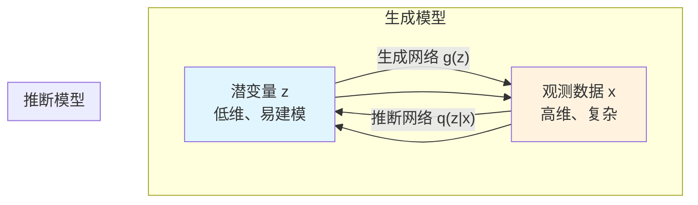
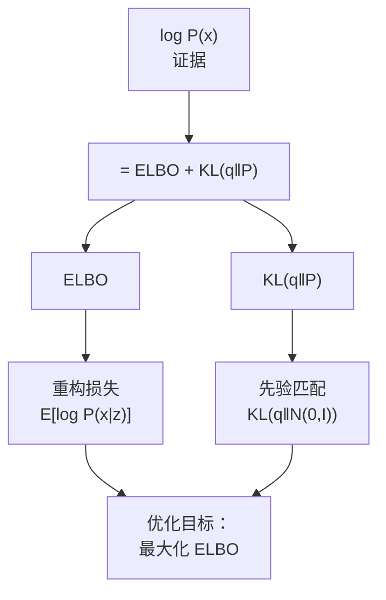
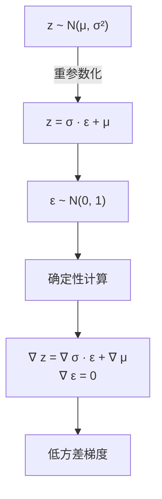
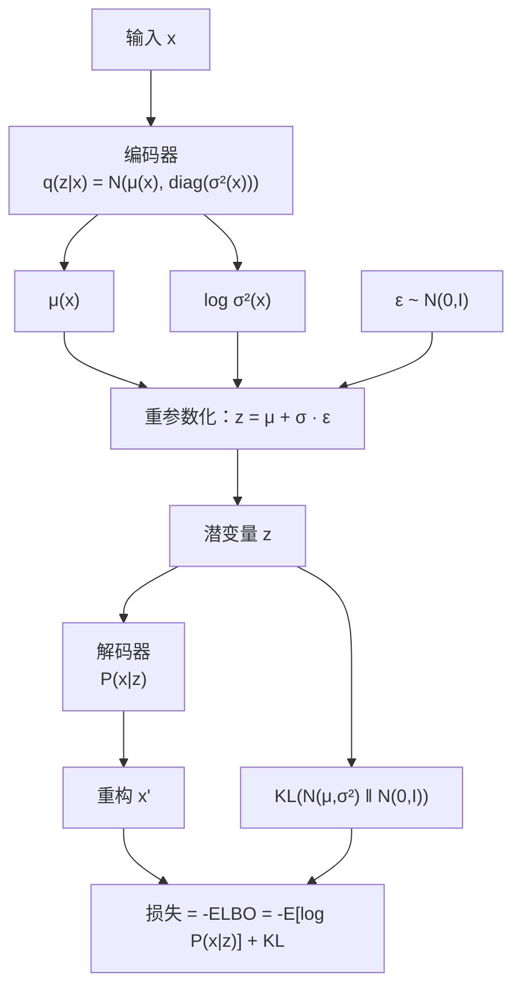
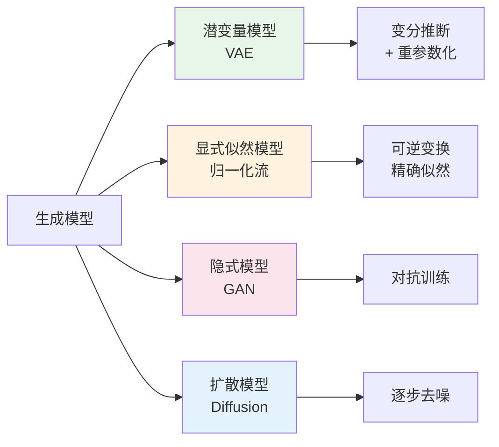

# Chap 17: 变分自编码器与潜变量模型（VAE & Latent Variable Models）

> UDLbook Chapter 17 精读笔记
>
> **官方资源**: [GitHub Notebooks/Chap17](https://github.com/udlbook/udlbook/tree/main/Notebooks/Chap17)
>
> **Notebook 列表**:
> - [17_1 Latent Variable Models](https://github.com/udlbook/udlbook/blob/main/Notebooks/Chap17/17_1_Latent_Variable_Models.ipynb) — 潜变量模型
> - [17_2 Reparameterization Trick](https://github.com/udlbook/udlbook/blob/main/Notebooks/Chap17/17_2_Reparameterization_Trick.ipynb) — 重参数化技巧
> - [17_3 Importance Sampling](https://github.com/udlbook/udlbook/blob/main/Notebooks/Chap17/17_3_Importance_Sampling.ipynb) — 重要性采样
>
> **📌 说明**：本书中 VAE 相关内容分布在 Chapter 17（潜变量模型 + 重参数化技巧），任务描述称之为"Chap 12 (VAE)"，但实际仓库中 VAE 不在第12章。第12章是 Transformers。

---

## 1. 潜变量模型概述

### 1.1 什么是潜变量？

**观测变量（Observed Variable）**：我们可以直接观测到的数据 $\mathbf{x}$（例如：图片、文本）

**潜变量（Latent Variable）**：我们无法直接观测，但被认为**导致**观测数据产生的隐含变量 $\mathbf{z}$

潜变量模型的核心思想：**复杂的高维数据 $\mathbf{x}$ 可以由低维潜变量 $\mathbf{z}$ 生成**



**为什么需要潜变量？**
- 直接对 $P(\mathbf{x})$ 建模非常困难（高维空间）
- 引入 $\mathbf{z}$ 后，$P(\mathbf{x}) = \int P(\mathbf{x} \mid \mathbf{z}) P(\mathbf{z}) d\mathbf{z}$，可以逐个击破
- $\mathbf{z}$ 通常具有**良好几何/语义结构**（如均匀分布或简单结构）

### 1.2 生成模型视角

潜变量模型本质上是一个**生成模型**。数据生成过程为：

1. 从先验分布中采样潜变量：$\mathbf{z} \sim P(\mathbf{z})$
2. 从条件分布中生成观测：$\mathbf{x} \sim P(\mathbf{x} \mid \mathbf{z})$

典型设定：
- $P(\mathbf{z}) = \text{Norm}(\mathbf{0}, \mathbf{I})$（标准高斯）
- $P(\mathbf{x} \mid \mathbf{z}) = \text{Norm}(\boldsymbol{\mu}_\theta(\mathbf{z}), \sigma^2 \mathbf{I})$（均值由神经网络参数化）

### 1.3 边缘似然（Marginal Likelihood）

给定模型参数 $\theta$，观测数据 $\mathbf{x}$ 的对数似然为：

$$\log P(\mathbf{x} \mid \theta) = \log \int P(\mathbf{x} \mid \mathbf{z}, \theta) \cdot P(\mathbf{z}) \, d\mathbf{z}$$

**问题**：这个积分通常**无法解析计算**（除非 $P(\mathbf{x} \mid \mathbf{z})$ 是极其简单的分布）

**解决思路**：引入变分推断（Variational Inference）

---

## 2. 变分推断（Variational Inference）

### 2.1 识别模型（Recognition Model）

我们引入一个**变分分布** $q(\mathbf{z} \mid \mathbf{x})$ 来近似真实后验 $P(\mathbf{z} \mid \mathbf{x})$：

$$q(\mathbf{z} \mid \mathbf{x}) \approx P(\mathbf{z} \mid \mathbf{x}) = \frac{P(\mathbf{x} \mid \mathbf{z}) P(\mathbf{z})}{P(\mathbf{x})}$$

$q$ 通常选择一个**易处理的分布族**（如对角高斯分布），其参数由神经网络预测。

### 2.2 证据下界（Evidence Lower Bound, ELBO）

利用琴生不等式（Jensen's Inequality），得到：

$$\log P(\mathbf{x}) \geq \mathbb{E}_{q(\mathbf{z} \mid \mathbf{x})}[\log P(\mathbf{x} \mid \mathbf{z})] - \text{KL}\big(q(\mathbf{z} \mid \mathbf{x}) \parallel P(\mathbf{z})\big)$$

**第一项：重构损失（Reconstruction Loss）**
$$\mathbb{E}_{q(\mathbf{z} \mid \mathbf{x})}[\log P(\mathbf{x} \mid \mathbf{z})]$$

鼓励 $q(\mathbf{z} \mid \mathbf{x})$ 产生的潜变量能生成接近 $\mathbf{x}$ 的样本。

**第二项：先验匹配损失（Prior Matching Loss）**
$$\text{KL}\big(q(\mathbf{z} \mid \mathbf{x}) \parallel P(\mathbf{z})\big)$$

鼓励后验 $q(\mathbf{z} \mid \mathbf{x})$ 接近先验 $P(\mathbf{z})$，即潜变量空间具有良好的结构。



### 2.3 Notebook 17.1 代码详解

Notebook 17.1 展示了一个**非线性潜变量模型**的可视化：

```python
# ▶ 潜变量到观测的映射函数
def f(z):
    x_1 = np.exp(np.sin(2 + z * 3.675)) * 0.5  # 非线性映射
    x_2 = np.cos(2 + z * 2.85)
    return x_1, x_2

# ▶ 先验分布：标准正态
def get_prior(z):
    return scipy.stats.multivariate_normal.pdf(z, mean=[0], cov=[[1]])

# ▶ 似然函数
def get_likelihood(x1_mesh, x2_mesh, z_val):
    x1, x2 = f(z_val)
    mn = scipy.stats.multivariate_normal([x1, x2], [[sigma_sq, 0], [0, sigma_sq]])
    return mn.pdf(np.dstack((x1_mesh, x2_mesh)))
```

**计算边缘密度（数据密度）**：
$$P(x_1, x_2) = \int P(x_1, x_2 \mid z) \cdot P(z) dz \approx \sum_z P(x_1, x_2 \mid z) \cdot P(z) \cdot \Delta z$$

```python
# ▶ 近似边缘密度（黎曼和）
pr_x1_x2 = np.zeros_like(x1_mesh)
for i, z_val in enumerate(z):
    pr_x1_x2 += get_likelihood(x1_mesh, x2_mesh, z_val) * get_prior(z_val) * 0.01
```

**计算后验分布**：
$$P(z \mid x_1, x_2) = \frac{P(x_1, x_2 \mid z) \cdot P(z)}{P(x_1, x_2)}$$

```python
# ▶ 后验分布计算
def get_posterior(x1, x2):
    z = np.arange(-3, 3, 0.01)
    numerator = get_likelihood(x1, x2, z) * get_prior(z)
    denominator = np.sum(numerator) * 0.01  # 归一化
    return z, numerator / denominator
```

**核心练习**：
1. 补全 `draw_samples`：从先验采样 $z$，再从似然采样 $\mathbf{x}$
2. 补全 `get_posterior`：计算 $P(z \mid \mathbf{x})$（归一化数值积分）

---

## 3. 重参数化技巧（Reparameterization Trick）

### 3.1 问题陈述

VAE 的训练需要计算 $\nabla_\theta \mathbb{E}_{q(\mathbf{z} \mid \mathbf{x})}[f(\mathbf{z})]$，但这个期望的分布本身**依赖于 $\theta$**，直接对期望求导会产生高方差估计。

更具体地：
- $q(\mathbf{z} \mid \mathbf{x}) = \text{Norm}(\boldsymbol{\mu}_\theta(\mathbf{x}), \boldsymbol{\sigma}_\theta^2(\mathbf{x}))$
- 参数 $\boldsymbol{\mu}, \boldsymbol{\sigma}$ 是 $\theta$ 的函数

### 3.2 Score Function 估计器（弱）

**Score Function 估计器**（也称 REINFORCE）：

$$\nabla_\theta \mathbb{E}_{q(\mathbf{z} \mid \theta)}[f(\mathbf{z})] = \mathbb{E}_{q(\mathbf{z} \mid \theta)}[f(\mathbf{z}) \nabla_\theta \log q(\mathbf{z} \mid \theta)]$$

问题：**方差极高**，因为 $f(\mathbf{z})$ 可能很大，而 $\nabla \log q$ 的尺度与 $f$ 无关。

### 3.3 重参数化技巧

**核心思想**：将随机性从参数中抽离出来！

将 $z \sim \text{Norm}(\mu, \sigma^2)$ 重写为：
$$z = \sigma \cdot \epsilon + \mu, \quad \text{其中 } \epsilon \sim \text{Norm}(0, 1)$$



**为什么有效？**
- 随机性全部转移到 $\epsilon$，而 $\epsilon$ **不依赖 $\theta$**
- $z$ 现在是 $\theta$ 的**确定性函数**
- 梯度可以直接反向传播

### 3.4 重参数化梯度

$$\nabla_\theta \mathbb{E}_{q(\mathbf{z} \mid \theta)}[f(\mathbf{z})] = \mathbb{E}_{p(\epsilon)}\left[f(\sigma_\theta \epsilon + \mu_\theta) \cdot \nabla_\theta (\sigma_\theta \epsilon + \mu_\theta)\right]$$

由于 $\nabla_\theta \epsilon = 0$，有效梯度为：
$$= \mathbb{E}_{p(\epsilon)}\left[f(\mathbf{z}(\theta, \epsilon)) \cdot \nabla_\theta \mathbf{z}(\theta, \epsilon)\right]$$

其中 $\nabla_\theta \mathbf{z}(\theta, \epsilon)$ 是确定性计算，可以直接求导。

### 3.5 Notebook 17.2 代码详解

```python
# ▶ 基础函数：f[x] = sin(2x) + x²
def f(x):
    return np.sin(2*x) + x**2

# ▶ 待优化的参数 phi（phi 控制均值和方差）
def compute_expectation(phi, n_samples):
    mu = phi
    sigma = np.sqrt(np.abs(phi) + 0.1)  # phi 可能为负，所以用 abs
    x_samples = np.random.normal(mu, sigma, size=(n_samples, 1))
    f_values = f(x_samples)
    return np.mean(f_values, axis=0)

# ▶ 重参数化版本
def compute_derivative_of_expectation(phi, n_samples):
    epsilon_star = np.random.normal(size=(n_samples, 1))
    mu = phi
    sigma = np.sqrt(np.abs(phi) + 0.1)
    
    x_star = sigma * epsilon_star + mu  # 重参数化
    df_dx_star = 2 * x_star * np.cos(2 * x_star) + 1  # df/dx
    dx_star_dphi = 1  # dx*/dphi
    
    # 梯度 = f(x*) * dx*/dphi（Monte Carlo 估计）
    gradient = np.mean(df_dx_star * dx_star_dphi)
    return gradient
```

**Score Function 对比**：
```python
# ▶ Score Function 估计器（高方差）
def compute_derivative_of_expectation_score_function(phi, n_samples):
    mu = phi
    sigma = np.sqrt(np.abs(phi) + 0.1)
    x_samples = np.random.normal(mu, sigma, size=(n_samples, 1))
    
    log_prob = -0.5 * ((x_samples - mu) / sigma)**2 - np.log(sigma)
    d_log_prob_dphi = (x_samples - mu) / sigma**2  # d/dphi log p(x|phi)
    
    f_values = f(x_samples)
    gradient = np.mean(f_values * d_log_prob_dphi, axis=0)
    return gradient
```

实验结果显示：**重参数化估计器的方差远小于 Score Function 估计器**（Notebook 展示的对比结果）。

---

## 4. VAE 的完整训练流程

### 4.1 VAE 架构

VAE 将重参数化技巧与变分推断结合，形成端到端可训练的生成模型：



### 4.2 损失函数

$$\mathcal{L}(\theta, \phi; \mathbf{x}) = - \mathbb{E}_{q_\phi(\mathbf{z} \mid \mathbf{x})}[\log P_\theta(\mathbf{x} \mid \mathbf{z})] + \text{KL}(q_\phi(\mathbf{z} \mid \mathbf{x}) \parallel P(\mathbf{z}))$$

**第一项：重构损失**——解码器需要从潜变量重建出与输入相似的样本

**第二项：KL 损失**——限制后验接近标准正态，使潜变量空间具有良好的结构性

### 4.3 重参数化的 VAE 实现

```python
# ▶ VAE 重参数化采样
def reparameterize(mu, log_var):
    """重参数化技巧：使梯度可以通过随机采样反向传播"""
    std = torch.exp(0.5 * log_var)  # σ = exp(log(σ²)/2) = exp(log_var/2)
    eps = torch.randn_like(std)      # ε ~ N(0, I)
    z = mu + eps * std               # z = μ + σ · ε
    return z

# ▶ 前向传播
def forward(self, x):
    # 编码
    h = F.relu(self.encoder(x))
    mu = self.mu_head(h)
    log_var = self.var_head(h)
    
    # 重参数化采样
    z = reparameterize(mu, log_var)
    
    # 解码
    h = F.relu(self.decoder(z))
    x_recon = torch.sigmoid(self.recon_head(h))
    
    # 计算损失（重构 + KL）
    recon_loss = F.binary_cross_entropy(x_recon, x, reduction='sum')
    kl_loss = -0.5 * torch.sum(1 + log_var - mu.pow(2) - log_var.exp())
    
    return x_recon, recon_loss + kl_loss
```

---

## 5. 重要性采样（Importance Sampling）

### 5.1 概念

重要性采样是另一种**估计期望**的 Monte Carlo 方法，特别是在需要从复杂分布中采样时非常有用。

**目标**：估计 $\mathbb{E}_p[f(\mathbf{x})] = \int f(\mathbf{x}) p(\mathbf{x}) d\mathbf{x}$

**方法**：引入一个易于采样的**提议分布** $q(\mathbf{x})$：

$$\mathbb{E}_p[f(\mathbf{x})] = \int f(\mathbf{x}) \frac{p(\mathbf{x})}{q(\mathbf{x})} q(\mathbf{x}) d\mathbf{x} \approx \frac{1}{N} \sum_{i=1}^N f(\mathbf{x}_i) \frac{p(\mathbf{x}_i)}{q(\mathbf{x}_i)}, \quad \mathbf{x}_i \sim q$$

其中 $p(\mathbf{x}_i)/q(\mathbf{x}_i)$ 是**重要性权重**。

### 5.2 与 VAE 的关系

在 VAE 中，我们需要从 $q(\mathbf{z} \mid \mathbf{x})$ 采样并计算期望。重要性采样可以用于：
- **改进 ELBO 的估计**（用重要性采样得到更紧的下界）
- **评估模型**（计算对数似然）

### 5.3 IS 的估计量

**加权重要性采样（Weighted IS）**：
$$\hat{\mathbb{E}}[f] = \frac{\sum_i w_i f(\mathbf{x}_i)}{\sum_i w_i}, \quad w_i = \frac{p(\mathbf{x}_i)}{q(\mathbf{x}_i)}$$

**自归一化 IS**（实践中更常用）：
$$\hat{\mathbb{E}}[f] = \sum_i \tilde{w}_i f(\mathbf{x}_i), \quad \tilde{w}_i = \frac{w_i}{\sum_j w_j}$$

---

## 6. 核心公式速查

| 公式 | 名称 |
|------|------|
| $P(\mathbf{x}) = \int P(\mathbf{x} \mid \mathbf{z}) P(\mathbf{z}) d\mathbf{z}$ | 边缘似然 |
| $q(\mathbf{z} \mid \mathbf{x}) \approx P(\mathbf{z} \mid \mathbf{x})$ | 变分近似 |
| $\log P(\mathbf{x}) \geq \mathbb{E}_q[\log P(\mathbf{x} \mid \mathbf{z})] - \text{KL}(q \parallel P)$ | ELBO |
| $z = \sigma \cdot \epsilon + \mu, \quad \epsilon \sim \mathcal{N}(0, I)$ | 重参数化 |
| $\nabla_\theta \mathbb{E}_q[f] = \mathbb{E}_p[\epsilon \cdot \nabla_\theta f(z(\theta))]$ | 重参数化梯度 |
| $\hat{\mathbb{E}}[f] = \sum_i \tilde{w}_i f(\mathbf{x}_i)$ | 重要性采样 |

---

## 7. 练习提示

### Notebook 17.1 练习
1. **补全 `draw_samples`**：先从标准正态采样 $z$，再用 $z$ 从条件分布 $P(\mathbf{x} \mid z)$ 采样
2. **补全 `get_posterior`**：计算 $P(z \mid \mathbf{x}) \propto P(\mathbf{x} \mid z) P(z)$，注意归一化
3. **观察后验**：当观测到特定 $(x_1, x_2)$ 时，后验分布在哪个 $z$ 处取峰值？

### Notebook 17.2 练习
1. **理解 Score Function 的高方差**：运行对比实验，观察两种估计器的方差差异
2. **调整 `n_samples`**：样本数量对方差的影响
3. **推广到多元**：思考如何将重参数化技巧推广到高维情况

---

## 8. VAE 与其他生成模型的对比



| 模型 | 似然 | 可逆性 | 采样速度 | 潜空间 |
|------|------|--------|----------|--------|
| **VAE** | ✅ 可计算（变分下界） | ❌ | ✅ 快（直接解码） | ✅ 结构化 |
| **归一化流** | ✅ 精确 | ✅ | ✅ 快 | ✅ |
| **GAN** | ❌ 隐式 | ❌ | ✅ 快 | ❌ 无 |
| **扩散模型** | ✅ 可计算 | ✅ | ❌ 慢（多步） | ✅ |

---

## 9. 与其他章节的关系

- **Chap 3（优化器）**：VAE 的训练使用梯度下降，需要优化器的支持
- **Chap 12（Transformers）**：虽然 Transformers 本身不是 VAE，但 Transformer 架构可作为 VAE 的编码器/解码器（如 DALL·E、Parti 等）
- **Chap 16（归一化流）**：与 VAE 同为潜变量模型，但归一化流使用可逆变换
- **Chap 15（GAN）**：另一种生成模型范式，隐式密度模型

---

## 参考文献

1. Kingma & Welling (2014). "Auto-Encoding Variational Bayes." *ICLR*.
2. Rezende et al. (2014). "Stochastic Backpropagation and Approximate Inference in Deep Generative Models." *ICML*.
3. UDLbook Chapter 17: Latent Variable Models — [https://udlbook.github.io/udlbook/](https://udlbook.github.io/udlbook/Chapter_17_Latent_Variable_Models.html)
