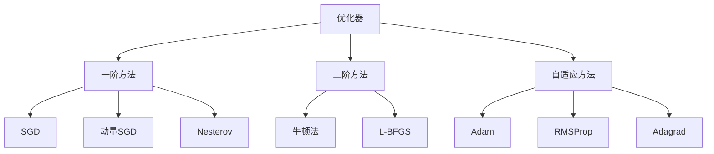

# Chap 3: 优化器 (Optimization)

> UDLbook Chapter 3 精读笔记
>
> **官方资源**: [GitHub Notebooks/Chap03](https://github.com/udlbook/udlbook/tree/main/Notebooks/Chap03)

---

## 1. 优化问题概述

### 1.1 深度学习中的优化

深度学习的训练本质上是一个优化问题：

$$\theta^* = \arg\min_\theta \mathcal{L}(\theta) = \arg\min_\theta \frac{1}{N} \sum_{i=1}^N \ell(x_i, y_i; \theta)$$

其中：
- $\theta$：模型参数
- $\mathcal{L}$：损失函数
- $\ell$：单个样本的损失
- $N$：样本数量

### 1.2 优化器的分类



---

## 2. 梯度下降法 (Gradient Descent)

### 2.1 批梯度下降 (Batch Gradient Descent)

$$\theta_{t+1} = \theta_t - \eta \cdot \nabla_\theta \mathcal{L}(\theta_t)$$

```python
# ▶ 批梯度下降
eta = 0.01  # 学习率
for t in range(num_epochs):
    gradients = compute_full_gradient(X, y, theta)
    theta = theta - eta * gradients
```

**优点**：收敛稳定
**缺点**：每次迭代需要计算整个数据集的梯度，速度慢

### 2.2 随机梯度下降 (SGD)

$$\theta_{t+1} = \theta_t - \eta \cdot \nabla_\theta \ell(x_{i_t}, y_{i_t}; \theta_t)$$

```python
# ▶ SGD
for t in range(num_epochs):
    for i in range(N):  # 随机遍历样本
        idx = np.random.randint(N)
        gradient = compute_gradient(X[idx], y[idx], theta)
        theta = theta - eta * gradient
```

**优点**：速度快，能逃离局部极小
**缺点**：收敛不稳定，震荡

### 2.3 小批量梯度下降 (Mini-batch SGD)

$$g_t = \frac{1}{B} \sum_{i \in \mathcal{B}_t} \nabla_\theta \ell(x_i, y_i; \theta_t)$$
$$\theta_{t+1} = \theta_t - \eta \cdot g_t$$

```python
# ▶ Mini-batch SGD
batch_size = 32
for t in range(num_epochs):
    # 打乱数据
    indices = np.random.permutation(N)
    for start in range(0, N, batch_size):
        end = min(start + batch_size, N)
        batch_idx = indices[start:end]
        
        gradients = compute_gradient(X[batch_idx], y[batch_idx], theta)
        theta = theta - eta * gradients
```

**优点**：平衡速度和稳定性
**缺点**：需要调节 batch_size

---

## 3. 动量法 (Momentum)

### 3.1 物理类比

动量法类似于一个有惯性的小球在损失曲面上滚动：


### 3.2 标准动量

$$v_t = \gamma v_{t-1} + \eta \nabla_\theta \mathcal{L}(\theta_t)$$
$$\theta_{t+1} = \theta_t - v_t$$

```python
# ▶ 动量法
v = np.zeros_like(theta)
gamma = 0.9  # 动量系数

for t in range(num_epochs):
    gradients = compute_gradient(X, y, theta)
    v = gamma * v + eta * gradients
    theta = theta - v
```

### 3.3 Nesterov 动量

**前瞻梯度**：先按惯性方向走一步，再计算梯度修正：

$$v_t = \gamma v_{t-1} + \eta \nabla_\theta \mathcal{L}(\theta_t - \gamma v_{t-1})$$
$$\theta_{t+1} = \theta_t - v_t$$

```python
# ▶ Nesterov 动量
v = np.zeros_like(theta)
gamma = 0.9

for t in range(num_epochs):
    # 先按惯性走一步
    gradients = compute_gradient(X, y, theta - gamma * v)
    v = gamma * v + eta * gradients
    theta = theta - v
```

**对比**：

| 方法 | 特点 |
|------|------|
| 标准动量 | 梯度方向累积，先更新后修正 |
| Nesterov | 先修正后更新，更精确的梯度估计 |

---

## 4. 自适应学习率方法

### 4.1 Adagrad

**原理**：对频繁更新的参数使用小学习率，稀疏参数使用大学习率。

$$g_{t,i} = \nabla_\theta \ell(\theta_{t,i})$$
$$G_{t,i} = G_{t-1,i} + g_{t,i}^2$$
$$\theta_{t+1,i} = \theta_{t,i} - \frac{\eta}{\sqrt{G_{t,i} + \epsilon}} g_{t,i}$$

```python
# ▶ Adagrad
G = np.zeros_like(theta)
epsilon = 1e-8

for t in range(num_epochs):
    gradients = compute_gradient(X, y, theta)
    G += gradients ** 2
    theta = theta - (eta / np.sqrt(G + epsilon)) * gradients
```

**优点**：适合稀疏数据
**缺点**：$G_t$ 累积导致学习率持续下降，最终过小

### 4.2 RMSProp

**改进**：使用指数移动平均替代累加

$$G_{t,i} = \gamma G_{t-1,i} + (1-\gamma) g_{t,i}^2$$
$$\theta_{t+1,i} = \theta_{t,i} - \frac{\eta}{\sqrt{G_{t,i} + \epsilon}} g_{t,i}$$

```python
# ▶ RMSProp
G = np.zeros_like(theta)
gamma = 0.9
epsilon = 1e-8

for t in range(num_epochs):
    gradients = compute_gradient(X, y, theta)
    G = gamma * G + (1 - gamma) * (gradients ** 2)
    theta = theta - (eta / np.sqrt(G + epsilon)) * gradients
```

### 4.3 Adam (Adaptive Moment Estimation)

**结合**：动量 + RMSProp

$$m_t = \beta_1 m_{t-1} + (1-\beta_1) g_t \quad \text{（一阶矩）}$$
$$v_t = \beta_2 v_{t-1} + (1-\beta_2) g_t^2 \quad \text{（二阶矩）}$$

**偏差修正**：
$$\hat{m}_t = \frac{m_t}{1-\beta_1^t}$$
$$\hat{v}_t = \frac{v_t}{1-\beta_2^t}$$

**参数更新**：
$$\theta_{t+1} = \theta_t - \frac{\eta}{\sqrt{\hat{v}_t} + \epsilon} \hat{m}_t$$

```python
# ▶ Adam 优化器
m = np.zeros_like(theta)  # 一阶矩
v = np.zeros_like(theta)  # 二阶矩
beta1 = 0.9
beta2 = 0.999
epsilon = 1e-8

for t in range(1, num_epochs + 1):
    gradients = compute_gradient(X, y, theta)
    
    # 一阶矩估计
    m = beta1 * m + (1 - beta1) * gradients
    # 二阶矩估计
    v = beta2 * v + (1 - beta2) * (gradients ** 2)
    
    # 偏差修正
    m_hat = m / (1 - beta1 ** t)
    v_hat = v / (1 - beta2 ** t)
    
    # 参数更新
    theta = theta - (eta / (np.sqrt(v_hat) + epsilon)) * m_hat
```

**PyTorch 实现**：
```python
optimizer = torch.optim.Adam(
    model.parameters(),
    lr=1e-3,
    betas=(0.9, 0.999),
    eps=1e-8
)
```

### 4.4 AdamW (Weight Decay Fix)

**问题**：原始 Adam 的 L2 正则化不等同于权重衰减

**改进**：
$$\theta_{t+1} = \theta_t - \frac{\eta}{\sqrt{\hat{v}_t} + \epsilon} \hat{m}_t - \eta \cdot w_d \cdot \theta_t$$

```python
# ▶ AdamW
optimizer = torch.optim.AdamW(
    model.parameters(),
    lr=1e-3,
    weight_decay=0.01  # 独立的权重衰减
)
```

---

## 5. 学习率调度 (Learning Rate Scheduling)

### 5.1 学习率衰减策略

```python
# ▶ 学习率调度示例
import torch.optim as optim

optimizer = optim.SGD(model.parameters(), lr=0.1)

# 策略1：阶梯衰减
scheduler = optim.lr_scheduler.StepLR(optimizer, step_size=30, gamma=0.1)

# 策略2：余弦退火
scheduler = optim.lr_scheduler.CosineAnnealingLR(optimizer, T_max=100)

# 策略3：指数衰减
scheduler = optim.lr_scheduler.ExponentialLR(optimizer, gamma=0.95)

# 策略4：Warmup + 余弦
# （需要自定义或使用 transformers 库的调度器）
```

### 5.2 Warmup 策略

Transformer 论文中使用的调度：

$$lrate = d_{\text{model}}^{-0.5} \cdot \min\left(step\_num^{-0.5}, step\_num \cdot warmup\_steps^{-1.5}\right)$$

```python
# ▶ 学习率变化曲线
import numpy as np
import matplotlib.pyplot as plt

def lr_schedule(step, d_model=512, warmup_steps=4000):
    return d_model ** (-0.5) * min(step ** (-0.5), step * warmup_steps ** (-1.5))

steps = np.arange(1, 20001)
lrs = [lr_schedule(s) for s in steps]

plt.figure(figsize=(10, 4))
plt.plot(steps, lrs)
plt.xlabel('Step')
plt.ylabel('Learning Rate')
plt.title('Transformer Learning Rate Schedule')
plt.axvline(x=4000, color='r', linestyle='--', label='warmup end')
plt.legend()
plt.show()
```

---

## 6. 优化算法对比

### 6.1 各算法在损失曲面上的表现

```
        SGD with momentum          Adam
    ━━━━━━━━━━━━━━━━━━━━━━    ━━━━━━━━━━━━━━━━━━━━━━
    
         steep descent           smooth convergence
              ↓                       ↓
         ╭───────╮               ╭─────────────╮
        ╱         ╲             ╱               ╲
       ╱           ╲           ╱                 ╲
      ╱             ╲         ╱                   ╲
     ╱               ╲       ╱                     ╲
    ╱                 ╲     ╱                       ╲
   ─┴──────────────────╲───╱─────────────────────────
                        ╲
```

### 6.2 各算法优缺点总结

| 算法 | 优点 | 缺点 | 适用场景 |
|------|------|------|----------|
| **SGD** | 简单，泛化好 | 收敛慢，需调参 | 图像分类 |
| **Momentum** | 加速收敛 | 需调参 | 一般场景 |
| **Nesterov** | 更好的收敛 | 实现稍复杂 | RNN/LSTM |
| **Adagrad** | 自适应学习率 | 学习率单调下降 | 稀疏数据 |
| **RMSProp** | 解决 Adagrad 饱和 | 效果一般 | RNN |
| **Adam** | 综合最优 | 可能泛化差 | 默认首选 |
| **AdamW** | 更好的权重衰减 | — | Transformer |

### 6.3 实证建议

> **fast.ai 创始人 Jeremy Howard 的建议**：
> 
> 1. 使用 **AdamW** + **余弦退火**作为默认
> 2. 如果过拟合，使用 **SGD + Momentum**
> 3. 学习率：用 **LR Finder** 找最优值
> 4. Batch Size：越大越好（受限于显存）

---

## 7. 梯度裁剪 (Gradient Clipping)

### 7.1 为什么要梯度裁剪？

防止梯度爆炸，特别是在 RNN/LSTM/Transformer 中。

### 7.2 L2 范数裁剪

```python
# ▶ 梯度裁剪
max_norm = 1.0

for t in range(num_epochs):
    gradients = compute_gradient(X, y, theta)
    
    # 计算 L2 范数
    total_norm = np.linalg.norm(gradients)
    
    # 如果超过阈值，缩放
    if total_norm > max_norm:
        gradients = gradients * (max_norm / total_norm)
    
    theta = theta - eta * gradients
```

### 7.3 PyTorch 实现

```python
# ▶ PyTorch 梯度裁剪
optimizer.zero_grad()
loss.backward()

# 裁剪梯度
torch.nn.utils.clip_grad_norm_(model.parameters(), max_norm=1.0)

optimizer.step()
```

---

## 8. 实战：完整训练循环

```python
# ▶ 完整训练循环
import torch
import torch.nn as nn
import torch.optim as optim

model = MyModel()
criterion = nn.CrossEntropyLoss()
optimizer = optim.AdamW(model.parameters(), lr=1e-3, weight_decay=0.01)
scheduler = optim.lr_scheduler.CosineAnnealingLR(optimizer, T_max=100)

for epoch in range(num_epochs):
    model.train()
    for batch_idx, (data, target) in enumerate(train_loader):
        optimizer.zero_grad()
        output = model(data)
        loss = criterion(output, target)
        loss.backward()
        
        # 梯度裁剪
        torch.nn.utils.clip_grad_norm_(model.parameters(), max_norm=1.0)
        
        optimizer.step()
    
    scheduler.step()
    
    # 验证
    model.eval()
    with torch.no_grad():
        val_loss = sum(criterion(model(x), y) for x, y in val_loader) / len(val_loader)
    
    print(f"Epoch {epoch}: loss={loss.item():.4f}, val_loss={val_loss:.4f}, lr={scheduler.get_last_lr()[0]:.6f}")
```

---

## 9. Wiki 关联

| 主题 | 链接 |
|------|------|
| 自动微分 | [[5_自动微分]] |
| 神经网络优化 | [[6_应用_神经网络优化]] |
| 反向传播 | [[2_链式法则]] |
| Transformer | [[transformer-paper-deep-read]] |

---

## Tags

#optimization #gradient-descent #adam #sgd #momentum #learning-rate #deep-learning
