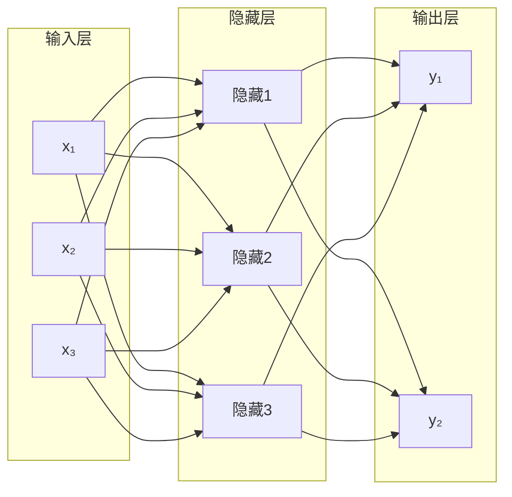
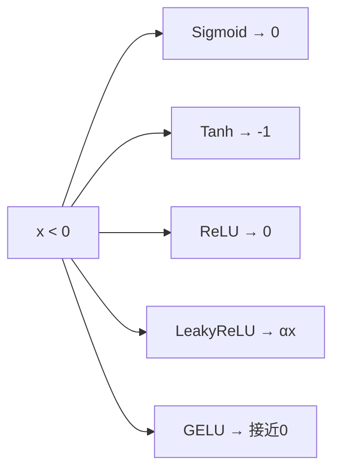

# Chap 4: 神经网络 (Neural Networks)

> UDLbook Chapter 4 精读笔记
>
> **官方资源**: [GitHub Notebooks/Chap04](https://github.com/udlbook/udlbook/tree/main/Notebooks/Chap04)

---

## 1. 神经网络的生物学启发

### 1.1 生物神经元

```
       Dendrites（树突）
              ↓
    ┌─────────────────┐
    │     Cell Body    │
    │   (Soma/细胞体)   │
    └────────┬────────┘
              ↓
         Axon（轴突）
              ↓
    ┌─────────────────┐
    │   Synapses       │  ← 突触（权重）
    │  (突触连接)       │
    └────────┬────────┘
              ↓
     → 传递到其他神经元
```

### 1.2 人工神经元模型

$$y = f(\mathbf{w} \cdot \mathbf{x} + b)$$

- $\mathbf{x}$：输入向量
- $\mathbf{w}$：权重向量
- $b$：偏置
- $f(\cdot)$：激活函数

---

## 2. 单层神经网络

### 2.1 感知机 (Perceptron)

**激活函数**：符号函数
$$f(z) = \begin{cases} 1 & \text{if } z \geq 0 \\ 0 & \text{if } z < 0 \end{cases}$$

```python
# ▶ 感知机实现
class Perceptron:
    def __init__(self, input_dim):
        self.w = np.random.randn(input_dim) * 0.01
        self.b = 0
    
    def forward(self, x):
        z = np.dot(x, self.w) + self.b
        return 1 if z >= 0 else 0
    
    def train(self, X, y, lr=0.1, epochs=100):
        for _ in range(epochs):
            for xi, yi in zip(X, y):
                pred = self.forward(xi)
                error = yi - pred
                # 权重更新
                self.w += lr * error * xi
                self.b += lr * error
```

### 2.2 感知机的局限性

**异或问题 (XOR Problem)**：

| $x_1$ | $x_2$ | XOR |
|--------|--------|-----|
| 0 | 0 | 0 |
| 0 | 1 | 1 |
| 1 | 0 | 1 |
| 1 | 1 | 0 |

**证明**：感知机无法学习 XOR，因为它是线性不可分的。

> **这个发现导致了第一次 AI 寒冬**，直到多层感知机（MLP）的出现。

---

## 3. 多层感知机 (MLP)

### 3.1 结构



### 3.2 前向传播

$$\mathbf{h} = f_1(\mathbf{W}^{(1)} \mathbf{x} + \mathbf{b}^{(1)})$$
$$\mathbf{y} = f_2(\mathbf{W}^{(2)} \mathbf{h} + \mathbf{b}^{(2)})$$

```python
# ▶ MLP 前向传播
class MLP:
    def __init__(self, input_dim, hidden_dim, output_dim):
        # 第一层
        self.W1 = np.random.randn(input_dim, hidden_dim) * 0.01
        self.b1 = np.zeros(hidden_dim)
        # 第二层
        self.W2 = np.random.randn(hidden_dim, output_dim) * 0.01
        self.b2 = np.zeros(output_dim)
    
    def forward(self, x):
        # 隐藏层
        z1 = x @ self.W1 + self.b1
        h = np.maximum(0, z1)  # ReLU
        
        # 输出层
        z2 = h @ self.W2 + self.b2
        return z2
    
    def softmax(self, x):
        exp_x = np.exp(x - np.max(x, axis=-1, keepdims=True))
        return exp_x / np.sum(exp_x, axis=-1, keepdims=True)
```

### 3.3 PyTorch 实现

```python
# ▶ PyTorch MLP
import torch
import torch.nn as nn

class MLP(nn.Module):
    def __init__(self, input_dim, hidden_dim, output_dim):
        super().__init__()
        self.network = nn.Sequential(
            nn.Linear(input_dim, hidden_dim),
            nn.ReLU(),
            nn.Linear(hidden_dim, hidden_dim),
            nn.ReLU(),
            nn.Linear(hidden_dim, output_dim)
        )
    
    def forward(self, x):
        return self.network(x)

model = MLP(input_dim=784, hidden_dim=256, output_dim=10)
x = torch.randn(32, 784)  # batch_size=32
output = model(x)
print(f"输出 shape: {output.shape}")  # torch.Size([32, 10])
```

---

## 4. 激活函数

### 4.1 Sigmoid

$$\sigma(x) = \frac{1}{1 + e^{-x}}$$

```python
# ▶ Sigmoid
def sigmoid(x):
    return 1 / (1 + np.exp(-x))

# PyTorch
F.sigmoid(x)
```

**特点**：
- 输出范围：(0, 1)
- 梯度：$\sigma'(x) = \sigma(x)(1-\sigma(x))$
- **问题**：梯度消失（x很大或很小时，梯度接近0）

### 4.2 Tanh

$$\tanh(x) = \frac{e^x - e^{-x}}{e^x + e^{-x}}$$

```python
# ▶ Tanh
def tanh(x):
    return np.tanh(x)

# PyTorch
torch.tanh(x)
```

**特点**：
- 输出范围：(-1, 1)
- 梯度：$1 - \tanh^2(x)$
- 比 sigmoid 收敛更快

### 4.3 ReLU (Rectified Linear Unit)

$$\text{ReLU}(x) = \max(0, x)$$

```python
# ▶ ReLU
def relu(x):
    return np.maximum(0, x)

# PyTorch
F.relu(x)
# 或
torch.nn.functional.relu(x)
```

**特点**：
- 计算简单，速度快
- 稀疏激活
- **问题**：Dying ReLU（负区间梯度为0）

### 4.4 Leaky ReLU

$$\text{LeakyReLU}(x) = \begin{cases} x & \text{if } x > 0 \\ \alpha x & \text{if } x \leq 0 \end{cases}$$

```python
# ▶ Leaky ReLU
def leaky_relu(x, alpha=0.01):
    return np.where(x > 0, x, alpha * x)

# PyTorch
F.leaky_relu(x, negative_slope=0.01)
```

### 4.5 GELU (Gaussian Error Linear Unit)

$$\text{GELU}(x) = x \cdot \Phi(x)$$

其中 $\Phi(x)$ 是标准正态分布的 CDF。

```python
# ▶ GELU
def gelu(x):
    import scipy.stats as stats
    return x * stats.norm.cdf(x)

# PyTorch
F.gelu(x)  # Transformer 中常用
```

### 4.6 激活函数对比



---

## 5. 输出层设计

### 5.1 回归问题：恒等输出

```python
# 输出层：无激活
output = linear(x)  # y = Wx + b
```

### 5.2 二分类：Sigmoid

```python
# ▶ 二分类
output = torch.sigmoid(linear(x))  # (0, 1)
loss = nn.BCEWithLogitsLoss()  # 数值稳定
```

### 5.3 多分类：Softmax

$$P(y=k \mid \mathbf{x}) = \frac{e^{z_k}}{\sum_{j=1}^K e^{z_j}}$$

```python
# ▶ 多分类
logits = linear(x)  # (batch, num_classes)
output = F.softmax(logits, dim=-1)
loss = nn.CrossEntropyLoss()  # 内部已包含 log softmax + NLL
```

---

## 6. 损失函数

### 6.1 均方误差 (MSE)

$$\mathcal{L}_{\text{MSE}} = \frac{1}{N} \sum_{i=1}^N \|y_i - \hat{y}_i\|^2$$

```python
# ▶ MSE Loss
criterion = nn.MSELoss()
loss = criterion(predictions, targets)
```

**适用**：回归问题

### 6.2 交叉熵 (Cross-Entropy)

$$\mathcal{L}_{\text{CE}} = -\sum_{i} y_i \log(\hat{y}_i)$$

```python
# ▶ Cross Entropy
criterion = nn.CrossEntropyLoss()
loss = criterion(logits, targets)  # logits 是 raw scores
```

**适用**：分类问题

### 6.3 二元交叉熵 (BCE)

$$\mathcal{L}_{\text{BCE}} = -\left[ y \log(\hat{y}) + (1-y) \log(1-\hat{y}) \right]$$

```python
# ▶ BCE
criterion = nn.BCELoss()
loss = criterion(torch.sigmoid(x), targets)
# 或使用数值稳定的版本
criterion = nn.BCEWithLogitsLoss()
loss = criterion(x, targets)
```

---

## 7. 反向传播 (Backpropagation)

### 7.1 链式法则

$$\frac{\partial \mathcal{L}}{\partial w_{ij}^{(l)}} = \frac{\partial \mathcal{L}}{\partial z_j^{(l)}} \cdot \frac{\partial z_j^{(l)}}{\partial w_{ij}^{(l)}}$$

### 7.2 反向传播计算图

```mermaid
flowchart TB
    A[Input x] --> B[z¹ = W¹x + b¹]
    B --> C[h = f(z¹)]
    C --> D[z² = W²h + b²]
    D --> E[ŷ = softmax(z²)]
    E --> F[Loss]
    
    F --> G[∂L/∂z²]
    G --> H[∂L/∂W² = h · ∂L/∂z²]
    G --> I[∂L/∂h = W² · ∂L/∂z²]
    I --> J[∂L/∂z¹ = ∂L/∂h · f'(z¹)]
    J --> K[∂L/∂W¹ = x · ∂L/∂z¹]
```

### 7.3 PyTorch 自动微分

```python
# ▶ PyTorch 自动微分
x = torch.randn(32, 784, requires_grad=True)
y = torch.randint(0, 10, (32,))

model = MLP(784, 256, 10)
logits = model(x)
loss = F.cross_entropy(logits, y)

# 反向传播
loss.backward()

# 查看梯度
print(model.W1.grad)
```

---

## 8. 正则化

### 8.1 L2 正则化 (Weight Decay)

$$\mathcal{L}_{\text{reg}} = \mathcal{L} + \frac{\lambda}{2} \sum_w w^2$$

```python
# ▶ L2 正则化
optimizer = optim.Adam(
    model.parameters(),
    lr=1e-3,
    weight_decay=0.01  # λ
)
```

### 8.2 Dropout

```python
# ▶ Dropout
class MLPWithDropout(nn.Module):
    def __init__(self):
        super().__init__()
        self.fc1 = nn.Linear(784, 256)
        self.dropout1 = nn.Dropout(0.5)  # 50% 丢弃
        self.fc2 = nn.Linear(256, 10)
    
    def forward(self, x):
        x = F.relu(self.fc1(x))
        x = self.dropout1(x)  # 训练时生效
        x = self.fc2(x)
        return x
```

### 8.3 Early Stopping

```python
# ▶ Early Stopping
best_val_loss = float('inf')
patience = 5
counter = 0

for epoch in range(num_epochs):
    train_loss = train_epoch(model, train_loader)
    val_loss = evaluate(model, val_loader)
    
    if val_loss < best_val_loss:
        best_val_loss = val_loss
        counter = 0
        # 保存最佳模型
        torch.save(model.state_dict(), 'best_model.pth')
    else:
        counter += 1
        if counter >= patience:
            print("Early stopping!")
            break
```

---

## 9. 神经网络的万能逼近定理

### 9.1 定理

> **万能逼近定理 (Universal Approximation Theorem)**
> 
> 一个具有足够多隐藏层神经元的前馈神经网络，可以以任意精度逼近任意连续函数。

### 9.2 直观理解

```
                    /
                   /
        Complex   /
        Function /
                 /
                /
        ─────────────────
                
        = 多个简单函数的叠加=
        
                    ┌───┐
     ╱╲           │ ReLU │
    /  \    ≈     │网络  │
   /    \         └───┘
  /      \
 /        \
────────────────────
```

---

## 10. Wiki 关联

| 主题 | 链接 |
|------|------|
| 自动微分 | [[5_自动微分]] |
| 链式法则 | [[2_链式法则]] |
| 梯度下降 | [[udlbook-chap3-optimization]] |
| CNN | [[udlbook-chap6-convnets]] |
| Transformer | [[transformer-paper-deep-read]] |

---

## Tags

#neural-networks #mlp #perceptron #activation-function #backpropagation #deep-learning
