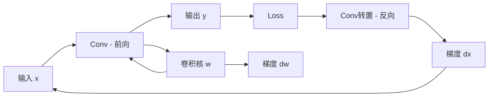

# Chap 6: 卷积神经网络 (Convolutional Neural Networks)

> UDLbook Chapter 6 精读笔记
> 
> **官方资源**: [GitHub Notebooks/Chap06](https://github.com/udlbook/udlbook/tree/main/Notebooks/Chap06)

---

## 1. 卷积神经网络概述

### 1.1 为什么需要卷积？

**全连接网络的问题**：
- 参数量巨大：$100 \times 100$ 图像 → 10,000 个输入神经元
- 忽视图像的空间结构
- 无法捕捉局部特征

**卷积的优势**：
- **局部连接**（Local Connectivity）：每个神经元只连接局部区域
- **参数共享**（Parameter Sharing）：同一个卷积核在整个图像上共享
- **平移不变性**（Translation Invariance）：对图像的平移不敏感

### 1.2 卷积操作的数学定义

**二维离散卷积**：
$$(I * K)_{ij} = \sum_m \sum_n I_{i+m, j+n} \cdot K_{m,n}$$

其中：
- $I$：输入图像（高 × 宽）
- $K$：卷积核/滤波器（高 × 宽）
- $*$：卷积运算符

**互相关（Cross-Correlation）**（深度学习中常用）：
$$(I \star K)_{ij} = \sum_m \sum_n I_{i+m, j+n} \cdot K_{m,n}$$

> 注意：PyTorch 和 TensorFlow 中的 `conv2d` 实际是互相关，不是数学意义上的卷积。

---

## 2. 卷积层的核心概念

### 2.1 卷积核（Kernel/Filter）

**定义**：一个小矩阵（如 3×3、5×5），包含可学习的权重参数。

```python
# ▶ 卷积操作示例
import torch
import torch.nn.functional as F

# 输入: (batch=1, channels=1, height=5, width=5)
x = torch.randn(1, 1, 5, 5)

# 卷积核: (out_channels=1, in_channels=1, height=3, width=3)
kernel = torch.randn(1, 1, 3, 3)

# 步长=1, padding=0
output = F.conv2d(x, kernel, stride=1, padding=0)
print(f"输入 shape: {x.shape}")      # torch.Size([1, 1, 5, 5])
print(f"输出 shape: {output.shape}")  # torch.Size([1, 1, 3, 3])
```

### 2.2 步长（Stride）

**定义**：卷积核在输入上滑动的步长。

```python
# ▶ 步长为2的卷积
output_stride2 = F.conv2d(x, kernel, stride=2, padding=0)
print(f"步长2输出 shape: {output_stride2.shape}")  # torch.Size([1, 1, 2, 2])
```

**输出尺寸计算**：
$$H_{out} = \left\lfloor \frac{H_{in} - K_h + 2 \times P}{S} \right\rfloor + 1$$
$$W_{out} = \left\lfloor \frac{W_{in} - K_w + 2 \times P}{S} \right\rfloor + 1$$

其中 $P$ 是 padding，$S$ 是 stride。

### 2.3 填充（Padding）

**目的**：保持空间尺寸、控制输出尺寸

```python
# ▶ Padding=1（保持尺寸）
output_pad1 = F.conv2d(x, kernel, stride=1, padding=1)
print(f"Padding=1 输出: {output_pad1.shape}")  # torch.Size([1, 1, 5, 5])
```

**常见填充**：
- `padding=0`：无填充
- `padding=1`：3×3 卷积核保持尺寸
- `padding=2`：5×5 卷积核保持尺寸

### 2.4 通道（Channels）

**输入通道**：彩色图像有 RGB 三个通道

```python
# ▶ 多通道输入
x_rgb = torch.randn(1, 3, 224, 224)  # 3通道彩色图

# 输出通道数=64的卷积
conv = torch.nn.Conv2d(in_channels=3, out_channels=64, kernel_size=3, padding=1)
output = conv(x_rgb)
print(f"输出 shape: {output.shape}")  # torch.Size([1, 64, 224, 224])
```

---

## 3. 池化层（Pooling Layer）

### 3.1 最大池化（Max Pooling）

取邻域内的最大值：

```python
# ▶ Max Pooling
x = torch.randn(1, 1, 4, 4)
pool = torch.nn.MaxPool2d(kernel_size=2, stride=2)
output = pool(x)
print(f"输入: {x.shape}, 输出: {output.shape}")  # (1,1,4,4) -> (1,1,2,2)
```

### 3.2 平均池化（Average Pooling）

取邻域内的平均值：

```python
# ▶ Average Pooling
avg_pool = torch.nn.AvgPool2d(kernel_size=2, stride=2)
output = avg_pool(x)
```

### 3.3 全局池化（Global Pooling）

整个特征图求平均/最大：

```python
# ▶ Global Average Pooling
gap = torch.nn.AdaptiveAvgPool2d((1, 1))
output = gap(output)  # (batch, channels, H, W) -> (batch, channels, 1, 1)
print(f"GAP 输出: {output.shape}")  # torch.Size([1, 64, 1, 1])
```

**优势**：无参数，防止过拟合，常用于迁移学习

---

## 4. 完整的卷积网络结构

### 4.1 LeNet-5 结构（1998）

```
Input (1×32×32)
  ↓
Conv1 (6@28×28, kernel=5×5, stride=1)
  ↓
AvgPool1 (2×2, stride=2)
  ↓
Conv2 (16@10×10, kernel=5×5, stride=1)
  ↓
AvgPool2 (2×2, stride=2)
  ↓
Flatten (256)
  ↓
FC1 (120)
  ↓
FC2 (84)
  ↓
Output (10)
```

### 4.2 AlexNet 结构（2012）

```
Input (3@224×224)
  ↓
Conv1 (96@55×55, kernel=11×11, stride=4, padding=0)
  ↓
MaxPool1 (3×3, stride=2)
  ↓
Conv2 (256@27×27, kernel=5×5, padding=2)
  ↓
MaxPool2 (3×3, stride=2)
  ↓
Conv3 (384@13×13, kernel=3×3, padding=1)
  ↓
Conv4 (384@13×13, kernel=3×3, padding=1)
  ↓
Conv5 (256@13×13, kernel=3×3, padding=1)
  ↓
MaxPool3 (3×3, stride=2)
  ↓
Flatten (9216)
  ↓
FC1 (4096) + Dropout
  ↓
FC2 (4096) + Dropout
  ↓
FC3 (1000)
  ↓
Output (1000-class softmax)
```

### 4.3 代码实现 LeNet-5

```python
# ▶ LeNet-5 实现
import torch
import torch.nn as nn

class LeNet5(nn.Module):
    def __init__(self, num_classes=10):
        super().__init__()
        # 特征提取
        self.conv1 = nn.Conv2d(1, 6, kernel_size=5, padding=0)  # 1@32→6@28
        self.pool1 = nn.AvgPool2d(kernel_size=2, stride=2)       # 6@28→6@14
        self.conv2 = nn.Conv2d(6, 16, kernel_size=5, padding=0)  # 6@14→16@10
        self.pool2 = nn.AvgPool2d(kernel_size=2, stride=2)       # 16@10→16@5
        # 分类器
        self.fc1 = nn.Linear(16 * 5 * 5, 120)
        self.fc2 = nn.Linear(120, 84)
        self.fc3 = nn.Linear(84, num_classes)
    
    def forward(self, x):
        x = torch.relu(self.conv1(x))
        x = self.pool1(x)
        x = torch.relu(self.conv2(x))
        x = self.pool2(x)
        x = x.view(x.size(0), -1)  # Flatten
        x = torch.relu(self.fc1(x))
        x = torch.relu(self.fc2(x))
        x = self.fc3(x)
        return x

# 测试
model = LeNet5(num_classes=10)
x = torch.randn(1, 1, 32, 32)
output = model(x)
print(f"输出 shape: {output.shape}")  # torch.Size([1, 10])

# 统计参数量
total_params = sum(p.numel() for p in model.parameters())
print(f"总参数量: {total_params:,}")  # ~60,000
```

---

## 5. 卷积层的梯度

### 5.1 反向传播中的卷积

**转置卷积（Transposed Convolution）**：也称为"反卷积"，用于上采样。

```python
# ▶ 转置卷积（反卷积）
x = torch.randn(1, 16, 8, 8)
trans_conv = nn.ConvTranspose2d(16, 1, kernel_size=3, stride=2, padding=1, output_padding=1)
output = trans_conv(x)
print(f"输入: {x.shape}, 输出: {output.shape}")  # torch.Size([1, 1, 16, 16])
```

### 5.2 梯度计算可视化



---

## 6. 经典卷积网络架构

### 6.1 VGGNet（2014）

**特点**：使用 3×3 小卷积核的堆叠

```
VGG-16:
- Conv3-64 × 2  →  →  
- Conv3-128 × 2  →  →  
- Conv3-256 × 3  →  →  
- Conv3-512 × 3  →  →  
- Conv3-512 × 3  →  →  
- FC-4096 × 3
- Output-1000
```

**核心洞察**：两个 3×3 卷积堆叠 = 一个 5×5 卷积的感受野
- 参数量：$2 \times (3 \times 3 \times C \times C) = 18C^2$ vs $(5 \times 5 \times C \times C) = 25C^2$
- 更少的参数 + 更多的非线性层

### 6.2 GoogleNet / Inception（2014）

**Inception 模块**：并行多尺度卷积

```python
# ▶ Inception 模块概念
class InceptionModule(nn.Module):
    def __init__(self, in_channels, ch1x1, ch3x3red, ch3x3, ch5x5red, ch5x5, pool_proj):
        super().__init__()
        # 1x1 卷积
        self.branch1 = nn.Sequential(
            nn.Conv2d(in_channels, ch1x1, 1),
            nn.ReLU()
        )
        # 1x1 → 3x3
        self.branch2 = nn.Sequential(
            nn.Conv2d(in_channels, ch3x3red, 1),
            nn.ReLU(),
            nn.Conv2d(ch3x3red, ch3x3, 3, padding=1),
            nn.ReLU()
        )
        # 1x1 → 5x5
        self.branch3 = nn.Sequential(
            nn.Conv2d(in_channels, ch5x5red, 1),
            nn.ReLU(),
            nn.Conv2d(ch5x5red, ch5x5, 5, padding=2),
            nn.ReLU()
        )
        # Pool → 1x1
        self.branch4 = nn.Sequential(
            nn.MaxPool2d(3, stride=1, padding=1),
            nn.Conv2d(in_channels, pool_proj, 1),
            nn.ReLU()
        )
    
    def forward(self, x):
        return torch.cat([
            self.branch1(x),
            self.branch2(x),
            self.branch3(x),
            self.branch4(x)
        ], dim=1)
```

### 6.3 ResNet（2015）

**残差连接**：$y = F(x) + x$

```python
# ▶ Residual Block
class ResidualBlock(nn.Module):
    def __init__(self, channels):
        super().__init__()
        self.conv1 = nn.Conv2d(channels, channels, 3, padding=1)
        self.conv2 = nn.Conv2d(channels, channels, 3, padding=1)
        self.norm1 = nn.BatchNorm2d(channels)
        self.norm2 = nn.BatchNorm2d(channels)
    
    def forward(self, x):
        residual = x
        out = torch.relu(self.norm1(self.conv1(x)))
        out = self.norm2(self.conv2(out))
        out = out + residual  # 残差连接
        return torch.relu(out)
```

---

## 7. CNN 可视化分析

### 7.1 卷积核可视化

```python
# ▶ 可视化卷积核
import matplotlib.pyplot as plt

# 假设第一个卷积层有 64 个 3x3 卷积核
conv1_weights = model.conv1.weight.data

fig, axes = plt.subplots(8, 8, figsize=(12, 12))
for i, ax in enumerate(axes.flat):
    if i < conv1_weights.shape[0]:
        ax.imshow(conv1_weights[i, 0].numpy(), cmap='gray')
    ax.axis('off')
plt.savefig('conv1_kernels.png', dpi=100)
```

### 7.2 特征图可视化

```python
# ▶ 可视化特征图
def visualize_feature_maps(model, x):
    activations = []
    
    def hook(module, input, output):
        activations.append(output)
    
    # 注册 hook
    handle = model.layer1.register_forward_hook(hook)
    
    model.eval()
    with torch.no_grad():
        output = model(x)
    
    handle.remove()
    
    return activations[0]
```

---

## 8. 卷积网络的训练技巧

### 8.1 批量归一化（Batch Normalization）

```python
# ▶ 带 BN 的卷积网络
class ConvNetWithBN(nn.Module):
    def __init__(self):
        super().__init__()
        self.conv1 = nn.Conv2d(1, 32, 3, padding=1)
        self.bn1 = nn.BatchNorm2d(32)
        self.conv2 = nn.Conv2d(32, 64, 3, padding=1)
        self.bn2 = nn.BatchNorm2d(64)
        self.fc = nn.Linear(64 * 7 * 7, 10)
    
    def forward(self, x):
        x = torch.relu(self.bn1(self.conv1(x)))
        x = torch.relu(self.bn2(self.conv2(x)))
        x = F.max_pool2d(x, 2)
        x = x.view(x.size(0), -1)
        x = self.fc(x)
        return x
```

### 8.2 Dropout 正则化

```python
# ▶ Dropout 防止过拟合
class ConvNetWithDropout(nn.Module):
    def __init__(self):
        super().__init__()
        self.features = nn.Sequential(
            nn.Conv2d(1, 32, 3),
            nn.ReLU(),
            nn.MaxPool2d(2),
            nn.Dropout(0.25)  # 随机丢弃 25% 的特征
        )
        self.classifier = nn.Sequential(
            nn.Linear(32 * 13 * 13, 128),
            nn.ReLU(),
            nn.Dropout(0.5),  # 随机丢弃 50% 的神经元
            nn.Linear(128, 10)
        )
```

---

## 9. CNN 在各领域的应用

| 领域 | 经典模型 | 创新点 |
|------|---------|--------|
| **图像分类** | AlexNet, VGG, ResNet | 深度、残差连接 |
| **目标检测** | R-CNN, YOLO, SSD | 区域提议、端到端检测 |
| **语义分割** | FCN, U-Net, DeepLab | 全卷积、空洞卷积 |
| **人脸识别** | FaceNet, ArcFace | 度量学习、角度间隔 |
| **姿态估计** | OpenPose, HRNet | 多尺度融合 |
| **图像生成** | DCGAN, StyleGAN | 条件生成、风格迁移 |

---

## 10. 总结：卷积神经网络的核心设计原则

```
┌─────────────────────────────────────────────────────────────┐
│                     CNN 设计原则                              │
├─────────────────────────────────────────────────────────────┤
│ 1. 局部连接 → 捕捉局部特征                                     │
│ 2. 参数共享 → 减少参数量、增强平移不变性                         │
│ 3. 层级结构 → 从局部到全局、从低级到高级特征                      │
│ 4. 空间降采样 → 减少计算量、增加感受野                           │
│ 5. 跳层连接 → 缓解梯度消失（ResNet）                           │
│ 6. 通道增加 → 从浅层到深层逐渐增加通道数                         │
└─────────────────────────────────────────────────────────────┘
```

---

## 11. Wiki 关联

| 主题 | 链接 |
|------|------|
| 深度学习基础 | [[数学基础/索引]] |
| 梯度下降 | [[4_梯度下降]] |
| 残差网络 | *(待补充)* |
| 注意力机制 | [[7_应用_Attention机制]] |
| Transformer | [[transformer-paper-deep-read]] |

---

## Tags

#cnn #convolutional-neural-networks #deep-learning #computer-vision #lenet #alexnet #vgg #resnet
