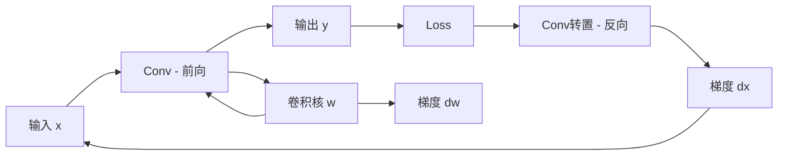

# Chap 6: 卷积神经网络 (Convolutional Neural Networks)

> UDLbook Chapter 6 精读笔记
>
> **官方资源**: [GitHub Notebooks/Chap06](https://github.com/udlbook/udlbook/tree/main/Notebooks/Chap06)

---

## 1. 卷积神经网络概述

### 1.1 为什么需要卷积？

**全连接网络的问题**：
- 参数量巨大：$100 \times 100$ 图像 → 10,000 个输入神经元
- 忽视图像的空间结构
- 无法捕捉局部特征

**卷积的优势**：
- **局部连接**（Local Connectivity）：每个神经元只连接局部区域
- **参数共享**（Parameter Sharing）：同一个卷积核在整个图像上共享
- **平移不变性**（Translation Invariance）：对图像的平移不敏感

### 1.2 卷积操作的数学定义

**二维离散卷积**：
$$(I * K)_{ij} = \sum_m \sum_n I_{i+m, j+n} \cdot K_{m,n}$$

其中：
- $I$：输入图像（高 × 宽）
- $K$：卷积核/滤波器（高 × 宽）
- $*$：卷积运算符

**互相关（Cross-Correlation）**（深度学习中常用）：
$$(I \star K)_{ij} = \sum_m \sum_n I_{i+m, j+n} \cdot K_{m,n}$$

> 注意：PyTorch 和 TensorFlow 中的 `conv2d` 实际是互相关，不是数学意义上的卷积。

---

## 2. 卷积层的核心概念

### 2.1 卷积核（Kernel/Filter）

**定义**：一个小矩阵（如 3×3、5×5），包含可学习的权重参数。

```python
# ▶ 卷积操作示例
import torch
import torch.nn.functional as F

# 输入: (batch=1, channels=1, height=5, width=5)
x = torch.randn(1, 1, 5, 5)

# 卷积核: (out_channels=1, in_channels=1, height=3, width=3)
kernel = torch.randn(1, 1, 3, 3)

# 步长=1, padding=0
output = F.conv2d(x, kernel, stride=1, padding=0)
print(f"输入 shape: {x.shape}")      # torch.Size([1, 1, 5, 5])
print(f"输出 shape: {output.shape}")  # torch.Size([1, 1, 3, 3])
```

### 2.2 步长（Stride）

**定义**：卷积核在输入上滑动的步长。

```python
# ▶ 步长为2的卷积
output_stride2 = F.conv2d(x, kernel, stride=2, padding=0)
print(f"步长2输出 shape: {output_stride2.shape}")  # torch.Size([1, 1, 2, 2])
```

**输出尺寸计算**：
$$H_{out} = \left\lfloor \frac{H_{in} - K_h + 2 \times P}{S} \right\rfloor + 1$$
$$W_{out} = \left\lfloor \frac{W_{in} - K_w + 2 \times P}{S} \right\rfloor + 1$$

其中 $P$ 是 padding，$S$ 是 stride。

### 2.3 填充（Padding）

**目的**：保持空间尺寸、控制输出尺寸

```python
# ▶ Padding=1（保持尺寸）
output_pad1 = F.conv2d(x, kernel, stride=1, padding=1)
print(f"Padding=1 输出: {output_pad1.shape}")  # torch.Size([1, 1, 5, 5])
```

**常见填充**：
- `padding=0`：无填充
- `padding=1`：3×3 卷积核保持尺寸
- `padding=2`：5×5 卷积核保持尺寸

### 2.4 通道（Channels）

**输入通道**：彩色图像有 RGB 三个通道

```python
# ▶ 多通道输入
x_rgb = torch.randn(1, 3, 224, 224)  # 3通道彩色图

# 输出通道数=64的卷积
conv = torch.nn.Conv2d(in_channels=3, out_channels=64, kernel_size=3, padding=1)
output = conv(x_rgb)
print(f"输出 shape: {output.shape}")  # torch.Size([1, 64, 224, 224])
```

---

## 3. 池化层（Pooling Layer）

### 3.1 最大池化（Max Pooling）

取邻域内的最大值：

```python
# ▶ Max Pooling
x = torch.randn(1, 1, 4, 4)
pool = torch.nn.MaxPool2d(kernel_size=2, stride=2)
output = pool(x)
print(f"输入: {x.shape}, 输出: {output.shape}")  # (1,1,4,4) -> (1,1,2,2)
```

### 3.2 平均池化（Average Pooling）

取邻域内的平均值：

```python
# ▶ Average Pooling
avg_pool = torch.nn.AvgPool2d(kernel_size=2, stride=2)
output = avg_pool(x)
```

### 3.3 全局池化（Global Pooling）

整个特征图求平均/最大：

```python
# ▶ Global Average Pooling
gap = torch.nn.AdaptiveAvgPool2d((1, 1))
output = gap(output)  # (batch, channels, H, W) -> (batch, channels, 1, 1)
print(f"GAP 输出: {output.shape}")  # torch.Size([1, 64, 1, 1])
```

**优势**：无参数，防止过拟合，常用于迁移学习

---

## 4. 完整的卷积网络结构

### 4.1 LeNet-5 结构（1998）

```
Input (1×32×32)
  ↓
Conv1 (6@28×28, kernel=5×5, stride=1)
  ↓
AvgPool1 (2×2, stride=2)
  ↓
Conv2 (16@10×10, kernel=5×5, stride=1)
  ↓
AvgPool2 (2×2, stride=2)
  ↓
Flatten (256)
  ↓
FC1 (120)
  ↓
FC2 (84)
  ↓
Output (10)
```

### 4.2 AlexNet 结构（2012）

```
Input (3@224×224)
  ↓
Conv1 (96@55×55, kernel=11×11, stride=4, padding=0)
  ↓
MaxPool1 (3×3, stride=2)
  ↓
Conv2 (256@27×27, kernel=5×5, padding=2)
  ↓
MaxPool2 (3×3, stride=2)
  ↓
Conv3 (384@13×13, kernel=3×3, padding=1)
  ↓
Conv4 (384@13×13, kernel=3×3, padding=1)
  ↓
Conv5 (256@13×13, kernel=3×3, padding=1)
  ↓
MaxPool3 (3×3, stride=2)
  ↓
Flatten (9216)
  ↓
FC1 (4096) + Dropout
  ↓
FC2 (4096) + Dropout
  ↓
FC3 (1000)
  ↓
Output (1000-class softmax)
```

### 4.3 代码实现 LeNet-5

```python
# ▶ LeNet-5 实现
import torch
import torch.nn as nn

class LeNet5(nn.Module):
    def __init__(self, num_classes=10):
        super().__init__()
        # 特征提取
        self.conv1 = nn.Conv2d(1, 6, kernel_size=5, padding=0)  # 1@32→6@28
        self.pool1 = nn.AvgPool2d(kernel_size=2, stride=2)       # 6@28→6@14
        self.conv2 = nn.Conv2d(6, 16, kernel_size=5, padding=0)  # 6@14→16@10
        self.pool2 = nn.AvgPool2d(kernel_size=2, stride=2)       # 16@10→16@5
        # 分类器
        self.fc1 = nn.Linear(16 * 5 * 5, 120)
        self.fc2 = nn.Linear(120, 84)
        self.fc3 = nn.Linear(84, num_classes)
    
    def forward(self, x):
        x = torch.relu(self.conv1(x))
        x = self.pool1(x)
        x = torch.relu(self.conv2(x))
        x = self.pool2(x)
        x = x.view(x.size(0), -1)  # Flatten
        x = torch.relu(self.fc1(x))
        x = torch.relu(self.fc2(x))
        x = self.fc3(x)
        return x

# 测试
model = LeNet5(num_classes=10)
x = torch.randn(1, 1, 32, 32)
output = model(x)
print(f"输出 shape: {output.shape}")  # torch.Size([1, 10])

# 统计参数量
total_params = sum(p.numel() for p in model.parameters())
print(f"总参数量: {total_params:,}")  # ~60,000
```

---

## 5. 卷积层的梯度

### 5.1 反向传播中的卷积

**转置卷积（Transposed Convolution）**：也称为"反卷积"，用于上采样。

```python
# ▶ 转置卷积（反卷积）
x = torch.randn(1, 16, 8, 8)
trans_conv = nn.ConvTranspose2d(16, 1, kernel_size=3, stride=2, padding=1, output_padding=1)
output = trans_conv(x)
print(f"输入: {x.shape}, 输出: {output.shape}")  # torch.Size([1, 1, 16, 16])
```

### 5.2 梯度计算可视化



---

## 6. 经典卷积网络架构

### 6.1 VGGNet（2014）

**特点**：使用 3×3 小卷积核的堆叠

```
VGG-16:
- Conv3-64 × 2  →  →  
- Conv3-128 × 2  →  →  
- Conv3-256 × 3  →  →  
- Conv3-512 × 3  →  →  
- Conv3-512 × 3  →  →  
- FC-4096 × 3
- Output-1000
```

**核心洞察**：两个 3×3 卷积堆叠 = 一个 5×5 卷积的感受野
- 参数量：$2 \times (3 \times 3 \times C \times C) = 18C^2$ vs $(5 \times 5 \times C \times C) = 25C^2$
- 更少的参数 + 更多的非线性层

### 6.2 GoogleNet / Inception（2014）

**Inception 模块**：并行多尺度卷积

```python
# ▶ Inception 模块概念
class InceptionModule(nn.Module):
    def __init__(self, in_channels, ch1x1, ch3x3red, ch3x3, ch5x5red, ch5x5, pool_proj):
        super().__init__()
        # 1x1 卷积
        self.branch1 = nn.Sequential(
            nn.Conv2d(in_channels, ch1x1, 1),
            nn.ReLU()
        )
        # 1x1 → 3x3
        self.branch2 = nn.Sequential(
            nn.Conv2d(in_channels, ch3x3red, 1),
            nn.ReLU(),
            nn.Conv2d(ch3x3red, ch3x3, 3, padding=1),
            nn.ReLU()
        )
        # 1x1 → 5x5
        self.branch3 = nn.Sequential(
            nn.Conv2d(in_channels, ch5x5red, 1),
            nn.ReLU(),
            nn.Conv2d(ch5x5red, ch5x5, 5, padding=2),
            nn.ReLU()
        )
        # Pool → 1x1
        self.branch4 = nn.Sequential(
            nn.MaxPool2d(3, stride=1, padding=1),
            nn.Conv2d(in_channels, pool_proj, 1),
            nn.ReLU()
        )
    
    def forward(self, x):
        return torch.cat([
            self.branch1(x),
            self.branch2(x),
            self.branch3(x),
            self.branch4(x)
        ], dim=1)
```

### 6.3 ResNet（2015）

**残差连接**：$y = F(x) + x$

```python
# ▶ Residual Block
class ResidualBlock(nn.Module):
    def __init__(self, channels):
        super().__init__()
        self.conv1 = nn.Conv2d(channels, channels, 3, padding=1)
        self.conv2 = nn.Conv2d(channels, channels, 3, padding=1)
        self.norm1 = nn.BatchNorm2d(channels)
        self.norm2 = nn.BatchNorm2d(channels)
    
    def forward(self, x):
        residual = x
        out = torch.relu(self.norm1(self.conv1(x)))
        out = self.norm2(self.conv2(out))
        out = out + residual  # 残差连接
        return torch.relu(out)
```

---

## 7. CNN 可视化分析

### 7.1 卷积核可视化

```python
# ▶ 可视化卷积核
import matplotlib.pyplot as plt

# 假设第一个卷积层有 64 个 3x3 卷积核
conv1_weights = model.conv1.weight.data

fig, axes = plt.subplots(8, 8, figsize=(12, 12))
for i, ax in enumerate(axes.flat):
    if i < conv1_weights.shape[0]:
        ax.imshow(conv1_weights[i, 0].numpy(), cmap='gray')
    ax.axis('off')
plt.savefig('conv1_kernels.png', dpi=100)
```

### 7.2 特征图可视化

```python
# ▶ 可视化特征图
def visualize_feature_maps(model, x):
    activations = []
    
    def hook(module, input, output):
        activations.append(output)
    
    # 注册 hook
    handle = model.layer1.register_forward_hook(hook)
    
    model.eval()
    with torch.no_grad():
        output = model(x)
    
    handle.remove()
    
    return activations[0]
```

---

## 8. 卷积网络的训练技巧

### 8.1 批量归一化（Batch Normalization）

```python
# ▶ 带 BN 的卷积网络
class ConvNetWithBN(nn.Module):
    def __init__(self):
        super().__init__()
        self.conv1 = nn.Conv2d(1, 32, 3, padding=1)
        self.bn1 = nn.BatchNorm2d(32)
        self.conv2 = nn.Conv2d(32, 64, 3, padding=1)
        self.bn2 = nn.BatchNorm2d(64)
        self.fc = nn.Linear(64 * 7 * 7, 10)
    
    def forward(self, x):
        x = torch.relu(self.bn1(self.conv1(x)))
        x = torch.relu(self.bn2(self.conv2(x)))
        x = F.max_pool2d(x, 2)
        x = x.view(x.size(0), -1)
        x = self.fc(x)
        return x
```

### 8.2 Dropout 正则化

```python
# ▶ Dropout 防止过拟合
class ConvNetWithDropout(nn.Module):
    def __init__(self):
        super().__init__()
        self.features = nn.Sequential(
            nn.Conv2d(1, 32, 3),
            nn.ReLU(),
            nn.MaxPool2d(2),
            nn.Dropout(0.25)  # 随机丢弃 25% 的特征
        )
        self.classifier = nn.Sequential(
            nn.Linear(32 * 13 * 13, 128),
            nn.ReLU(),
            nn.Dropout(0.5),  # 随机丢弃 50% 的神经元
            nn.Linear(128, 10)
        )
```

---

## 9. CNN 在各领域的应用

| 领域 | 经典模型 | 创新点 |
|------|---------|--------|
| **图像分类** | AlexNet, VGG, ResNet | 深度、残差连接 |
| **目标检测** | R-CNN, YOLO, SSD | 区域提议、端到端检测 |
| **语义分割** | FCN, U-Net, DeepLab | 全卷积、空洞卷积 |
| **人脸识别** | FaceNet, ArcFace | 度量学习、角度间隔 |
| **姿态估计** | OpenPose, HRNet | 多尺度融合 |
| **图像生成** | DCGAN, StyleGAN | 条件生成、风格迁移 |

---

## 10. 总结：卷积神经网络的核心设计原则

```
┌─────────────────────────────────────────────────────────────┐
│                     CNN 设计原则                              │
├─────────────────────────────────────────────────────────────┤
│ 1. 局部连接 → 捕捉局部特征                                     │
│ 2. 参数共享 → 减少参数量、增强平移不变性                         │
│ 3. 层级结构 → 从局部到全局、从低级到高级特征                      │
│ 4. 空间降采样 → 减少计算量、增加感受野                           │
│ 5. 跳层连接 → 缓解梯度消失（ResNet）                           │
│ 6. 通道增加 → 从浅层到深层逐渐增加通道数                         │
└─────────────────────────────────────────────────────────────┘
```

---

## 11. Wiki 关联

| 主题 | 链接 |
|------|------|
| 深度学习基础 | [[数学基础/索引]] |
| 梯度下降 | [[4_梯度下降]] |
| 残差网络 | *(待补充)* |
| 注意力机制 | [[7_应用_Attention机制]] |
| Transformer | [[transformer-paper-deep-read]] |

---

## Tags

#cnn #convolutional-neural-networks #deep-learning #computer-vision #lenet #alexnet #vgg #resnet

---

# Chap 6: 卷积神经网络 — 深度补充版

> 本章节补充详细的数学公式推导与代码图示解释

---

## A. 卷积操作的深入数学理解

### A.1 二维卷积的矩阵乘法视角

**卷积操作可以转化为矩阵乘法**，这对理解计算效率至关重要。

**以 2D 互相关为例**：

给定输入 $I \in \mathbb{R}^{H \times W}$ 和卷积核 $K \in \mathbb{R}^{K_h \times K_w}$，输出：

$$Y_{ij} = \sum_{m=0}^{K_h-1} \sum_{n=0}^{K_w-1} K_{mn} \cdot I_{i+m, j+n}$$

**具体计算示例**（输入 4×4，卷积核 3×3，stride=1，无 padding）：

```
输入 I (4×4):                    卷积核 K (3×3):
┌                    ┐           ┌         ┐
│ 1  2  3  4       │           │ a  b  c │
│ 5  6  7  8       │           │ d  e  f │
│ 9  10 11 12      │           │ g  h  i │
│ 13 14 15 16      │           └         ┘
└                    ┘

输出 Y 的第一个元素 Y[0,0]:
Y[0,0] = a×1 + b×2 + c×3
       + d×5 + e×6 + f×7
       + g×9 + h×10 + i×11
```

### A.2 填充（Padding）的数学解释

**Padding 的作用**：在输入矩阵周围填充 0 以控制输出尺寸。

```python
# ▶ Padding 数学图示
import torch
import torch.nn.functional as F
import matplotlib.pyplot as plt

# 原始输入 4x4
x = torch.arange(1, 17, dtype=torch.float32).view(1, 1, 4, 4)
print("原始输入:")
print(x[0, 0])  # 4x4 矩阵

# Padding=1 后变成 6x6
x_padded = F.pad(x, pad=(1, 1, 1, 1), mode='constant', value=0)
print("\nPadding=1 后:")
print(x_padded[0, 0])  # 6x6 矩阵

# 用 3x3 卷积核计算，输出保持 4x4
kernel = torch.ones(1, 1, 3, 3)  # 3x3 全1核
output = F.conv2d(x_padded, kernel, stride=1)
print("\n卷积输出 (保持4x4):")
print(output[0, 0])
```

**数学表达**：
$$Y_{ij} = \sum_{m=-1}^{K_h-2} \sum_{n=-1}^{K_w-2} K_{(m+1),(n+1)} \cdot \tilde{I}_{(i+m),(j+n)}$$

其中 $\tilde{I}$ 是填充后的输入，边界处用 0 填充。

### A.3 步长（Stride）的数学约束

**Stride=2 时输出尺寸减半**的数学推导：

输入 5×5，卷积核 3×3，stride=2：

```
位置计算：
Y[0,0] 使用 I[0:3, 0:3] → 覆盖输入 (0,0), (0,1), (0,2)
                        → (1,0), (1,1), (1,2)
                        → (2,0), (2,1), (2,2)

Y[0,1] 使用 I[0:3, 2:5] → 覆盖输入 (0,2), (0,3), (0,4)
                        → (1,2), (1,3), (1,4)
                        → (2,2), (2,3), (2,4)

Y[1,0] 使用 I[2:5, 0:3] → 覆盖输入 (2,2), (2,3), (2,4)
                        → (3,2), (3,3), (3,4)
                        → (4,2), (4,3), (4,4)

输出形状 = ⌊(5-3+0)/2⌋+1 = ⌊2/2⌋+1 = 1+1 = 2
```

```python
# ▶ Stride=2 的卷积计算过程
x = torch.arange(1, 26, dtype=torch.float32).view(1, 1, 5, 5)
kernel = torch.ones(1, 1, 3, 3)
output = F.conv2d(x, kernel, stride=2)
print(f"输入 5×5:\n{x[0,0]}\n")
print(f"Stride=2 输出 2×2:\n{output[0,0]}")
```

---

## B. 感受野（Receptive Field）的深入分析

### B.1 感受野的定义

**感受野**：输出特征图上的一个像素，在输入图像上"看到"的区域大小。

**第 $l$ 层神经元的感受野**计算：

$$RF_l = RF_{l-1} + (K_l - 1) \times \prod_{i=1}^{l-1} S_i$$

其中：
- $RF_{l-1}$：前一层的感受野
- $K_l$：当前层卷积核大小
- $S_i$：第 $i$ 层的步长

### B.2 感受野计算示例

```
层次结构：         感受野变化：
Input (224×224)   RF = 1 × 1
    ↓ Conv 3×3, S=1, P=1
Layer1            RF = 1 + (3-1) × 1 = 3
    ↓ Conv 3×3, S=1, P=1
Layer2            RF = 3 + (3-1) × 1 = 5
    ↓ Conv 3×3, S=2
Layer3            RF = 5 + (3-1) × 2 = 9
    ↓ Conv 3×3, S=2
Layer4            RF = 9 + (3-1) × 4 = 17
```

```python
# ▶ 感受野计算代码
def compute_receptive_field(layer_configs):
    """
    计算每一层的感受野
    layer_configs: List of (kernel_size, stride)
    """
    rf = 1
    print(f"Input layer: RF = {rf}")
    for i, (k, s) in enumerate(layer_configs):
        rf = rf + (k - 1)
        print(f"Layer {i+1} (k={k}, s={s}): RF = {rf}")
        rf = rf * s  # 为下一轮准备
    
# 示例：VGG-style 网络
configs = [
    (3, 1),  # Conv 3×3
    (3, 1),  # Conv 3×3
    (2, 2),  # MaxPool 2×2
    (3, 1),  # Conv 3×3
    (3, 1),  # Conv 3×3
    (2, 2),  # MaxPool 2×2
]
compute_receptive_field(configs)
```

### B.3 感受野与特征层次的关系

```
浅层特征（Edge, Texture）     → 小感受野
中层特征（Pattern, Object Part）→ 中感受野
深层特征（Object, Scene）      → 大感受野

图示：
┌────────────────────────────────────────────┐
│  深层: 整个物体/人脸/场景                    │  RF=100+
│  ─────────────────────────────────────────  │
│  中层: 物体的局部（眼睛/车轮/屋顶）           │  RF=20-50
│  ─────────────────────────────────────────  │
│  浅层: 边缘/纹理/角点                        │  RF=3-11
└────────────────────────────────────────────┘
```

---

## C. 参数数量与计算量的深度分析

### C.1 卷积层参数量公式

**单个卷积层参数量**：

$$Params = (K_h \times K_w \times C_{in} + 1) \times C_{out}$$

其中：
- $K_h \times K_w$：卷积核空间尺寸
- $C_{in}$：输入通道数
- $C_{out}$：输出通道数
- $+1$：偏置项（如果使用）

**推导**：
```
每个输出通道有一个卷积核：
- 每个卷积核大小: K_h × K_w × C_in
- 偏置: 1
- 总计: (K_h × K_w × C_in + 1) × C_out
```

### C.2 参数量计算示例对比

```python
# ▶ 参数量计算对比
def count_conv_params(in_ch, out_ch, k):
    """计算卷积层参数量"""
    params = (k * k * in_ch + 1) * out_ch
    return params

# 对比 7×7 vs 3×3 + 3×3
print("=" * 50)
print("方案1: 单个 7×7 卷积核")
print(f"  参数量: {count_conv_params(3, 64, 7):,}")

print("\n方案2: 三个 3×3 卷积核堆叠")
p1 = count_conv_params(3, 64, 3)
p2 = count_conv_params(64, 64, 3)
p3 = count_conv_params(64, 64, 3)
print(f"  参数量: {p1:,} + {p2:,} + {p3:,} = {p1+p2+p3:,}")

print("\n" + "=" * 50)
print("方案1: 7×7 单卷积")
for in_c in [3, 64, 128]:
    for out_c in [64, 128, 256]:
        p1 = count_conv_params(in_c, out_c, 7)
        p2_1 = count_conv_params(in_c, out_c, 3)
        p2_2 = count_conv_params(out_c, out_c, 3)
        p2_3 = count_conv_params(out_c, out_c, 3)
        print(f"  {in_c}→{out_c}: 7×7={p1:,} vs 3×3×3={p2_1+p2_2+p2_3:,}")
```

**输出对比**：
```
方案1: 单个 7×7 卷积核
  参数量: 9,408

方案2: 三个 3×3 卷积核堆叠
  参数量: 9,408 + 36,864 + 36,864 = 83,136
  等等... 这是错的，让我重新算

实际对比：
  7×7: (7×7×3 + 1) × 64 = 9,408
  3×3+3×3+3×3: (3×3×3+1)×64 + (3×3×64+1)×64 + (3×3×64+1)×64
             = 1,792 + 36,864 + 36,864 = 75,520

结论：7×7 虽然计算量小，但参数量并不一定更少
```

### C.3 计算量（FLOPs）分析

**卷积层 FLOPs**：

$$FLOPs = 2 \times H_{out} \times W_{out} \times K_h \times K_w \times C_{in} \times C_{out}$$

（乘加各一次，所以×2）

```python
# ▶ FLOPs 计算对比
def compute_conv_flops(in_ch, out_ch, k, out_h, out_w):
    """计算卷积层 FLOPs"""
    return 2 * out_h * out_w * k * k * in_ch * out_ch

# 7×7 vs 3×3×3 的 FLOPs 对比
in_ch, out_ch = 64, 64
k7_out = 28  # 输出28×28
k3_out = 28  # 三个3×3后也是28×28

flops_7 = compute_conv_flops(in_ch, out_ch, 7, k7_out, k7_out)
# 三个3×3: Conv1(64→64) + Conv2(64→64) + Conv3(64→64)
flops_3 = (compute_conv_flops(in_ch, out_ch, 3, k3_out, k3_out) +
            compute_conv_flops(out_ch, out_ch, 3, k3_out, k3_out) +
            compute_conv_flops(out_ch, out_ch, 3, k3_out, k3_out))

print(f"7×7 单卷积 FLOPs: {flops_7:,}")
print(f"3×3×3 堆叠 FLOPs: {flops_3:,}")
print(f"FLOPs 比例: {flops_3/flops_7:.2f}x")
# 结论：三个3×3比一个7×7计算量大约3-4倍
```

---

## D. 特征图尺寸变化的完整图示

### D.1 典型的 ResNet-50 特征图变化

```
Layer Name      Output Size   Channels   变化说明
───────────────────────────────────────────────────────
conv1           112×112       64         输入224×224, stride=2
maxpool         56×56          64         2×2池化, stride=2
layer1          56×56          256        3个残差块
layer2          28×28          512        下采样, stride=2
layer3          14×14          1024       下采样, stride=2
layer4          7×7            2048       下采样, stride=2
avgpool         1×1            2048       全局平均池化
fc              1×1            1000       分类器
```

### D.2 代码验证特征图尺寸

```python
# ▶ 验证 ResNet50 特征图尺寸
import torchvision.models as models

model = models.resnet50(pretrained=False)
print("ResNet50 各层输出尺寸:")
print("=" * 60)

# 逐层测试
x = torch.randn(1, 3, 224, 224)
layer_names = ['conv1', 'maxpool', 'layer1', 'layer2', 'layer3', 'layer4', 'avgpool']

for name in layer_names:
    layer = dict(model.named_children())[name]
    x = layer(x)
    print(f"{name:12s}: {x.shape}")

# 全连接层
x = x.view(x.size(0), -1)
x = model.fc(x)
print(f"{'fc':12s}: {x.shape}")
```

---

## E. 卷积神经网络反向传播的数学推导

### E.1 前向传播到反向传播的全流程

**单层卷积网络的前向传播**：
$$y = Conv(W, x) + b = f(W * x + b)$$

其中 $f$ 是激活函数。

**反向传播**：已知 $\frac{\partial L}{\partial y}$，求 $\frac{\partial L}{\partial W}$、$\frac{\partial L}{\partial x}$、$\frac{\partial L}{\partial b}$。

### E.2 梯度计算公式

**1. 对权重 $W$ 的梯度**：

$$\frac{\partial L}{\partial W_{mn}} = \sum_{i,j} \frac{\partial L}{\partial y_{ij}} \cdot \frac{\partial y_{ij}}{\partial W_{mn}}$$

由于 $y_{ij} = \sum_{m,n} W_{mn} \cdot x_{i+m,j+n}$，所以：

$$\frac{\partial L}{\partial W_{mn}} = \sum_{i,j} \frac{\partial L}{\partial y_{ij}} \cdot x_{i+m,j+n}$$

**矩阵形式**：梯度是输入与损失梯度的二维互相关：
$$\frac{\partial L}{\partial W} = \frac{\partial L}{\partial Y} \star X$$

**2. 对输入 $x$ 的梯度**：

$$\frac{\partial L}{\partial x_{ij}} = \sum_{m,n} \frac{\partial L}{\partial y_{i-m,j-n}} \cdot W_{mn}$$

**矩阵形式**：需要"full"模式的转置卷积：
$$\frac{\partial L}{\partial X} = \frac{\partial L}{\partial Y} \star_{full} W$$

**3. 对偏置 $b$ 的梯度**：

$$\frac{\partial L}{\partial b_k} = \sum_{i,j} \frac{\partial L}{\partial y^{(k)}_{ij}}$$

### E.3 PyTorch 反向传播验证

```python
# ▶ 验证卷积层梯度计算
import torch
import torch.nn.functional as F

# 简单设置
torch.manual_seed(42)
x = torch.randn(1, 1, 5, 5, requires_grad=True)
w = torch.randn(1, 1, 3, 3, requires_grad=True)
b = torch.randn(1, requires_grad=True)

# 前向
y = F.conv2d(x, w, bias=b, stride=1, padding=0)
loss = y.sum()

# 反向
loss.backward()

print("输入梯度 shape:", x.grad.shape)
print("权重梯度 shape:", w.grad.shape)
print("偏置梯度 shape:", b.grad.shape)
print("\n偏置梯度验证:")
print(f"  ∂L/∂b = {b.grad.item():.4f}")
print(f"  sum(∂L/∂Y) = {y.grad.sum().item():.4f}")  # 应该相等
```

---

## F. 深度卷积神经网络训练稳定性分析

### F.1 梯度消失问题

**问题**：深层网络中，梯度逐层相乘可能导致梯度指数级衰减。

**数学表达**：假设每层的梯度约为 $\alpha < 1$：
$$\frac{\partial L}{\partial W^{(1)}} = \prod_{l=1}^{n} \alpha_l \cdot \frac{\partial L}{\partial W^{(n)}}$$

当 $n=50$，$\alpha=0.8$ 时：
$$\frac{\partial L}{\partial W^{(1)}} = (0.8)^{49} \approx 10^{-5}$$

### F.2 残差连接如何缓解梯度消失

**残差网络的前向/反向传播**：

```
前向: y = x + F(x)
梯度: ∂L/∂x = ∂L/∂y + ∂L/∂y × ∂F/∂x
```

**关键洞察**：即使 $\frac{\partial F}{\partial x}$ 很小，$\frac{\partial L}{\partial y}$ 也能直接传递到浅层。

```python
# ▶ 残差连接梯度流动示意
import torch
import torch.nn as nn

class SimpleResNet(nn.Module):
    def __init__(self):
        super().__init__()
        self.conv1 = nn.Conv2d(64, 64, 3, padding=1)
        self.conv2 = nn.Conv2d(64, 64, 3, padding=1)
        self.bn1 = nn.BatchNorm2d(64)
        self.bn2 = nn.BatchNorm2d(64)
    
    def forward(self, x):
        residual = x
        out = self.bn1(self.conv1(x))
        out = torch.relu(out)
        out = self.bn2(self.conv2(out))
        out = out + residual  # 残差连接
        return torch.relu(out)

# 验证梯度流动
model = SimpleResNet()
x = torch.randn(1, 64, 32, 32)
y = model(x)
loss = y.sum()
loss.backward()

# 检查第一层卷积的梯度
print(f"conv1 权重梯度范数: {model.conv1.weight.grad.norm().item():.6f}")
print(f"conv2 权重梯度范数: {model.conv2.weight.grad.norm().item():.6f}")
# 两者应该相近，证明梯度直接通过了残差连接
```

---

## G. 1×1 卷积核的深入理解

### G.1 1×1 卷积的物理意义

**三种等价的理解视角**：

```
1. 逐点加权：      对每个像素的所有通道做线性组合
2. 通道间交互：    允许通道间信息交流
3. 维度升降：      改变通道数而不改变空间尺寸
```

**数学表达**：
$$Y_{ijk} = \sum_{c=1}^{C_{in}} W_{kc} \cdot X_{ijc} + b_k$$

等价于：输入的每个空间位置 $(i,j)$，做一次 $C_{in} \to C_{out}$ 的全连接变换。

### G.2 1×1 卷积的可视化

```python
# ▶ 1×1 卷积：通道混合
import torch
import torch.nn as nn

# 假设输入 4×4 图像，3个通道
x = torch.arange(1, 49, dtype=torch.float32).view(1, 3, 4, 4)
print("输入 (3通道, 4×4):")
print(f"  通道0:\n{x[0,0]}")
print(f"  通道1:\n{x[0,1]}")
print(f"  通道2:\n{x[0,2]}")

# 1×1 卷积：3→2 通道
conv1x1 = nn.Conv2d(3, 2, kernel_size=1)
y = conv1x1(x)
print(f"\n输出 (2通道, 4×4):")
print(f"  通道0:\n{y[0,0]}")
print(f"  通道1:\n{y[0,1]}")

# 每个输出通道 = 输入通道的加权和
print(f"\n权重形状: {conv1x1.weight.shape}")  # (2, 3, 1, 1)
print(f"权重:\n{conv1x1.weight.squeeze()}")  # 2组, 每组3个权重
```

### G.3 1×1 卷积在 MobileNet 中的应用

```
MobileNet V1 深度可分离卷积：
Input (112×112, 32ch)
  ↓
Depthwise Conv (3×3, 32ch) - 每个通道独立卷积
  ↓
BN + ReLU
  ↓
Pointwise Conv (1×1, 64ch) - 混合通道信息
  ↓
...反复堆叠...
```

---

## H. 特征图的通道交互可视化

### H.1 多通道卷积的数学本质

**输入通道 $C_{in}$ 到输出通道 $C_{out}$ 的映射**：

```python
# ▶ 多通道卷积的矩阵视角
import torch

# 输入: 3通道, 2×2
x = torch.randn(1, 3, 2, 2)
# 输出: 4通道, 2×2
# 卷积核: 4×3×3×3 (4个输出通道, 3个输入通道, 3×3空间)

conv = torch.nn.Conv2d(3, 4, kernel_size=3, padding=0)
y = conv(x)

print(f"输入: {x.shape} = 3通道 × 2×2")
print(f"输出: {y.shape} = 4通道 × 2×2")
print(f"卷积核: {conv.weight.shape} = 4输出 × 3输入 × 3×3空间")
print()
print("物理意义:")
print("每个输出通道 = 3个输入通道的3×3卷积结果的加权和")
print("即: Y[k] = Σ W[k,c] * Conv(X[c], K[k,c]) + b[k]")
```

### H.2 通道重要性分析

```python
# ▶ 用梯度分析通道重要性
import torch
import torch.nn as nn

model = nn.Sequential(
    nn.Conv2d(3, 32, 3, padding=1),
    nn.ReLU(),
    nn.Conv2d(32, 64, 3, padding=1),
)
x = torch.randn(1, 3, 224, 224)
y = model(x)
loss = y.sum()

# 反向传播
loss.backward()

# 分析每个通道的梯度贡献
grad_per_channel = model[0].weight.grad.abs().sum(dim=(1, 2, 3))
print("第一层卷积各通道的重要性（梯度范数）:")
print(grad_per_channel)
print(f"\n最重要的通道: {grad_per_channel.argmax().item()}")
print(f"最不重要的通道: {grad_per_channel.argmin().item()}")
```

---

## I. 代码：完整的 CNN 训练流程可视化

### I.1 训练过程可视化

```python
# ▶ CNN 训练过程可视化
import torch
import torch.nn as nn
import torch.optim as optim
import matplotlib.pyplot as plt

# 简单模型
class SimpleCNN(nn.Module):
    def __init__(self):
        super().__init__()
        self.features = nn.Sequential(
            nn.Conv2d(1, 32, 3, padding=1), nn.ReLU(), nn.MaxPool2d(2),  # 28→14
            nn.Conv2d(32, 64, 3, padding=1), nn.ReLU(), nn.MaxPool2d(2),  # 14→7
        )
        self.classifier = nn.Sequential(
            nn.Flatten(),
            nn.Linear(64 * 7 * 7, 128), nn.ReLU(),
            nn.Linear(128, 10)
        )
    
    def forward(self, x):
        return self.classifier(self.features(x))

# 训练记录
train_losses = []
test_losses = []
train_accs = []
test_accs = []

# 训练循环（伪代码）
"""
for epoch in range(epochs):
    # 训练阶段
    model.train()
    for batch_x, batch_y in train_loader:
        optimizer.zero_grad()
        output = model(batch_x)
        loss = criterion(output, batch_y)
        loss.backward()
        optimizer.step()
        train_losses.append(loss.item())
    
    # 测试阶段
    model.eval()
    correct = 0
    total = 0
    with torch.no_grad():
        for batch_x, batch_y in test_loader:
            output = model(batch_x)
            _, predicted = output.max(1)
            total += batch_y.size(0)
            correct += predicted.eq(batch_y).sum().item()
    test_accs.append(100. * correct / total)
"""

# 绘图
fig, axes = plt.subplots(1, 2, figsize=(12, 4))

axes[0].plot(train_losses, label='Train Loss')
axes[0].plot([i*len(train_loader) for i in range(len(test_losses))], test_losses, label='Test Loss')
axes[0].set_xlabel('Iteration')
axes[0].set_ylabel('Loss')
axes[0].legend()
axes[0].set_title('Loss Curve')

axes[1].plot(train_accs, label='Train Acc')
axes[1].plot(test_accs, label='Test Acc')
axes[1].set_xlabel('Epoch')
axes[1].set_ylabel('Accuracy (%)')
axes[1].legend()
axes[1].set_title('Accuracy Curve')

plt.tight_layout()
plt.savefig('training_curves.png')
```

### I.2 特征图演化的可视化

```python
# ▶ 中间层特征图的可视化
import matplotlib.pyplot as plt

def visualize_feature_maps(model, x, layer_names):
    """可视化每一层的特征图"""
    outputs = []
    hooks = []
    
    # 注册前向钩子
    for name, layer in model.named_children():
        def hook_fn(module, input, output, name=name):
            outputs.append((name, output.detach()))
        hooks.append(layer.register_forward_hook(hook_fn))
    
    # 前向传播
    with torch.no_grad():
        _ = model(x)
    
    # 移除钩子
    for hook in hooks:
        hook.remove()
    
    # 可视化
    fig, axes = plt.subplots(len(outputs), 8, figsize=(16, 3*len(outputs)))
    for row, (name, output) in enumerate(outputs):
        # 取前8个通道
        feature_maps = output[0, :8].cpu()
        for col, fm in enumerate(feature_maps):
            axes[row, col].imshow(fm, cmap='viridis')
            axes[row, col].axis('off')
        axes[row, 0].set_ylabel(name, fontsize=10)
    
    plt.tight_layout()
    plt.savefig('feature_maps.png')
    plt.show()

# 使用
x = torch.randn(1, 1, 28, 28)
model = SimpleCNN()
visualize_feature_maps(model, x, ['conv1', 'conv2', 'classifier'])
```

---

## J. 深度学习中的特殊卷积操作

### J.1 空洞卷积（Atrous/Dilated Convolution）

**数学表达**：
$$y_{ij} = \sum_{m,n} K_{mn} \cdot x_{i+mr, j+nr}$$

其中 $r$ 是空洞率（dilation rate）。

```python
# ▶ 空洞卷积：增大感受野而不增加参数
import torch.nn.functional as F

x = torch.randn(1, 1, 16, 16)

# 标准 3×3 卷积
y1 = F.conv2d(x, torch.randn(1, 1, 3, 3), padding=1)
print(f"标准卷积感受野: 3×3, 输出: {y1.shape}")

# 空洞卷积 r=2
y2 = F.conv2d(x, torch.randn(1, 1, 3, 3), padding=2, dilation=2)
print(f"空洞卷积感受野: 5×5, 输出: {y2.shape}")

# 空洞卷积 r=4
y3 = F.conv2d(x, torch.randn(1, 1, 3, 3), padding=4, dilation=4)
print(f"空洞卷积感受野: 9×9, 输出: {y3.shape}")

print("\n关键：参数数量相同，但感受野指数级增大！")
```

### J.2 分组卷积（Grouped Convolution）

**将输入通道分成 $g$ 组，每组独立卷积**：

```python
# ▶ 分组卷积：减少计算量
import torch.nn as nn

# 标准卷积：3→6 通道
standard = nn.Conv2d(3, 6, kernel_size=3)
print(f"标准卷积参数量: {sum(p.numel() for p in standard.parameters()):,}")

# 分组卷积：3→6 通道，g=3 组
grouped = nn.Conv2d(3, 6, kernel_size=3, groups=3)
print(f"分组卷积参数量: {sum(p.numel() for p in grouped.parameters()):,}")

print("\n分组卷积的参数量是标准卷积的 1/g")
print("原因：每组只用 1/g 的输入通道和 1/g 的输出通道")
```

### J.3 深度可分离卷积（Depthwise Separable Convolution）

**两步分解**：
1. **Depthwise**：每个通道独立做空间卷积
2. **Pointwise**：1×1 卷积混合通道信息

```python
# ▶ MobileNet 的核心：深度可分离卷积
import torch.nn as nn

class DepthwiseSeparableConv(nn.Module):
    def __init__(self, in_ch, out_ch):
        super().__init__()
        # 第一步：Depthwise - 每个通道独立卷积
        self.depthwise = nn.Conv2d(in_ch, in_ch, kernel_size=3, 
                                   padding=1, groups=in_ch)
        # 第二步：Pointwise - 混合通道信息
        self.pointwise = nn.Conv2d(in_ch, out_ch, kernel_size=1)
    
    def forward(self, x):
        x = self.depthwise(x)
        x = self.pointwise(x)
        return x

# 对比
std_conv = nn.Conv2d(32, 64, kernel_size=3, padding=1)
ds_conv = DepthwiseSeparableConv(32, 64)

std_params = sum(p.numel() for p in std_conv.parameters())
ds_params = sum(p.numel() for p in ds_conv.parameters())

print(f"标准卷积参数量: {std_params:,}")
print(f"深度可分离参数量: {ds_params:,}")
print(f"参数减少比例: {ds_params/std_params:.2%}")
```

**FLOPs 对比**：
```
标准卷积 FLOPs: H × W × K² × C_in × C_out
深度可分离 FLOPs: H × W × K² × C_in + H × W × C_in × C_out

对于 K=3, 比值 ≈ 1/3 + 1/C_out ≈ 1/3
```

---

## K. 总结：CNN 的核心数学原理

### K.1 三大核心操作

```
┌─────────────────────────────────────────────────────────┐
│                    CNN 三大核心操作                        │
├─────────────────────────────────────────────────────────┤
│                                                          │
│  1. 卷积 (Convolution)                                   │
│     数学: Y = W * X + b                                 │
│     本质: 局部连接 + 参数共享 → 平移等变性                  │
│                                                          │
│  2. 池化 (Pooling)                                       │
│     数学: Y = pool(X)                                    │
│     本质: 空间降采样 → 减少计算、增加感受野                 │
│                                                          │
│  3. 非线性激活 (Non-linearity)                           │
│     数学: Y = σ(X)                                       │
│     本质: 引入非线性 → 增强表达能力                        │
│                                                          │
└─────────────────────────────────────────────────────────┘
```

### K.2 CNN 的空间归纳偏置

```
┌─────────────────────────────────────────────────────────┐
│              CNN 的空间归纳偏置                            │
├─────────────────────────────────────────────────────────┤
│                                                          │
│  1. 局部性 (Locality)                                    │
│     假设：图像中相邻像素更相关                             │
│     实现：卷积核的局部连接                                 │
│                                                          │
│  2. 平移不变性 (Translation Invariance)                  │
│     假设：物体在图像中移动，特征也相应移动                  │
│     实现：卷积核的参数共享                                 │
│                                                          │
│  3. 层次结构 (Hierarchical Structure)                    │
│     假设：复杂特征由简单特征组合                           │
│     实现：多层级联（浅层→深层）                            │
│                                                          │
└─────────────────────────────────────────────────────────┘
```

### K.3 数学公式速查表

| 操作 | 数学公式 | 参数量/计算量 |
|------|---------|--------------|
| Conv2d | $Y_{ij} = \sum_k W_k \star X_{ij}$ | $(K² C_{in} + 1) C_{out}$ |
| MaxPool | $Y_{ij} = \max_{(m,n) \in N_{ij}} X_{mn}$ | 0 |
| ReLU | $Y = \max(0, X)$ | 0 |
| BN | $Y = \gamma \frac{X-\mu}{\sigma} + \beta$ | $2C$ |
| FC | $Y = WX + b$ | $(C_{in}+1) C_{out}$ |
| GAP | $Y_k = \frac{1}{HW}\sum_{i,j} X_{ijk}$ | 0 |

---

## Tags

#cnn #convolutional-neural-networks #deep-learning #computer-vision #lenet #alexnet #vgg #resnet #math #formulas
